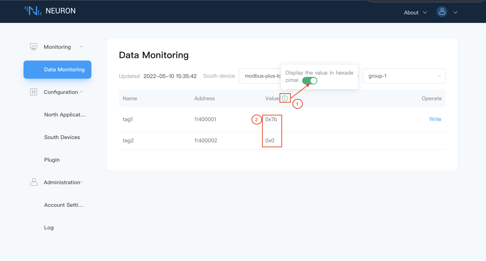

# Monitoring

## Data Monitoring

This interface displays the monitoring status of the data. Users can pull down the dropdown box of device and group, selecting the device and the group to view according to their needs. (Generally, a group can be understood as a certain type of sensor connected under the device, such as a temperature sensor. Of course, users can also define groups according to their own needs).

The interface displays the update time of the data, all the tag information under the group, selected by the user, including the name of each tag, the driver address, the value and whether the write operation is possible, as shown in the following figure.

The data monitoring interface also provides the function of displaying the value in hexadecimal. User can place the mouse on the green prompt sign next to `value`, and the word `display value in hexadecimal` will pop up. Slide button to right, the data will be displayed in hexadecimal as shown in the figure below.

The operation bar shows whether the tag has the function of write operation. When the attribute of a tag is set to the write attribute, the write operation button of `Write` will appear in the operation bar. The value of the tag is shown in the figure below.

