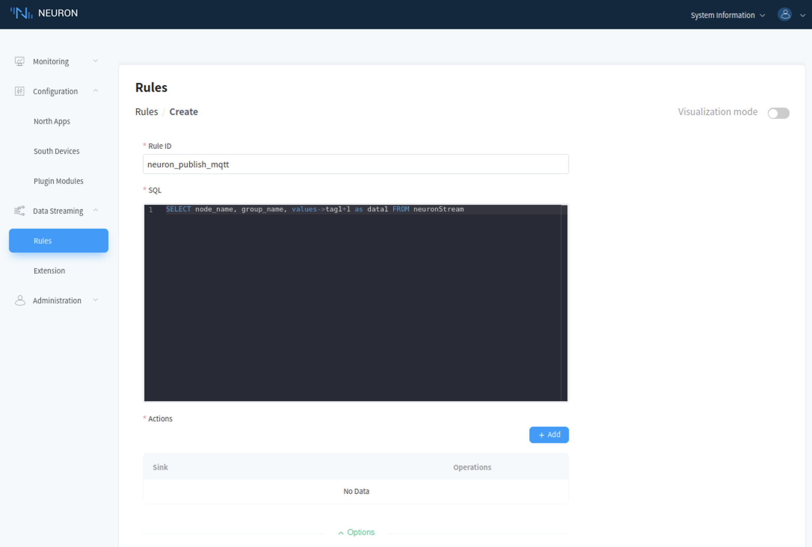
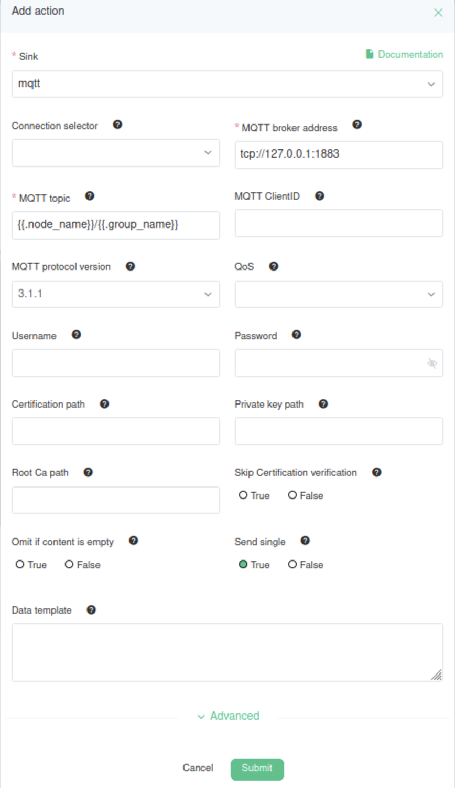
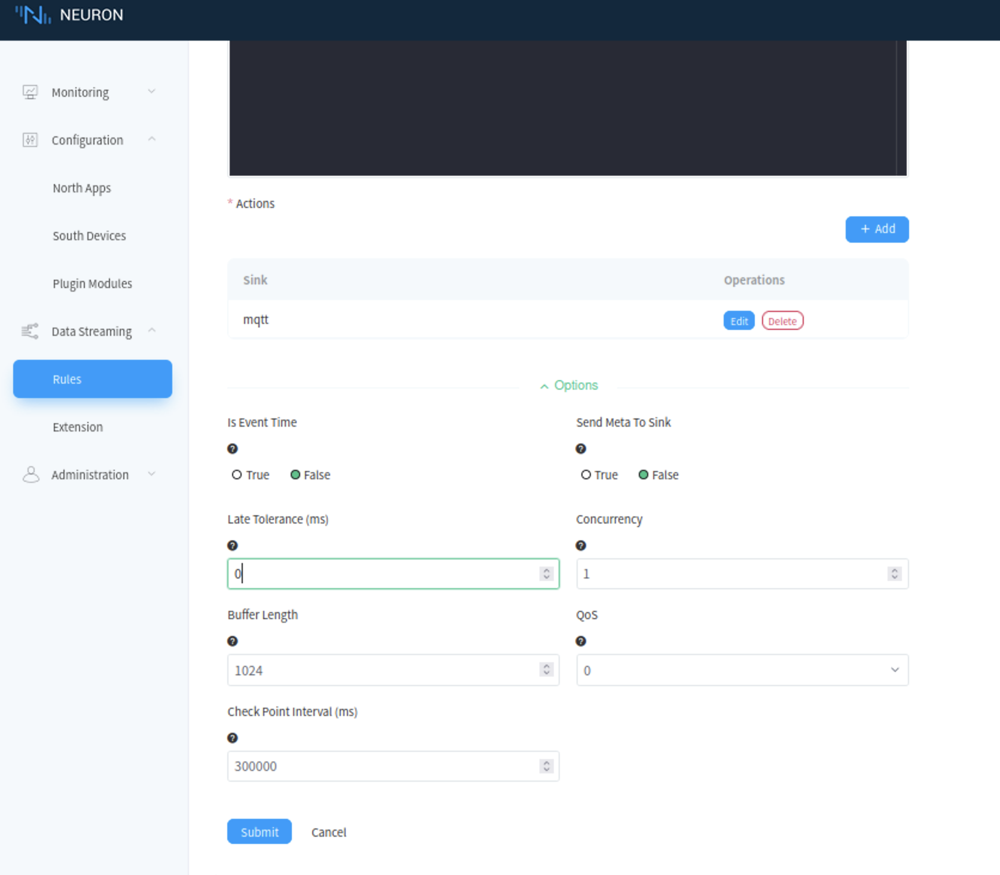
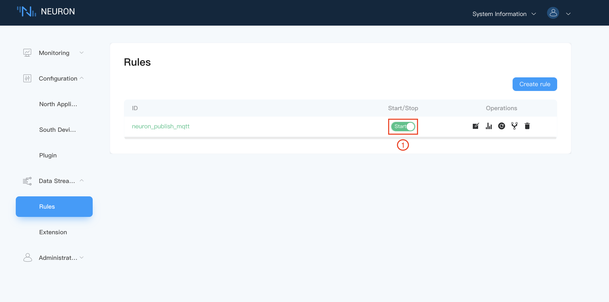

# Data Cleansing

This rule implements +1 processing of the data collected by the neuron from the device, renames it to a meaningful name, and sends the result to the MQTT dynamic topic `${node_name}/${group_name}` in the cloud.

## Step 1 Add a new rule

Click `New Rule` to create a new rule in the rule page, as shown below.

## Step 2 Setup rule details

In the rule editing interface, fill in the rule information, as shown below.

* Fill in the `Rule ID` and `SQL` statement.
* Click on `Add` button to add sink action for the rule, you may add more than one sink action for each rule, see step 3 for details.
* Click on `Submit` button to complete the rule definition.

## Step 3 Setup sink details

Set sink details in the pop-up window for adding actions, as shown below.

::: v-pre

1. Drop down to select sink, e.g select mqtt.
2. Fill in the MQTT broker address.
3. Fill in the MQTT topic, in this case, we have `{{.node_name}}/{{.group_name}}`.
4. Select the `True` for send single.
5. Click on `Submit` button to complete the sink action.
:::

After the action is added, as shown below.

## Step 4 Start rule execution

Start the rule, as shown below.

## Step 5 Check over the payload in MQTT broker

::: v-pre

Start MQTTX client, subscribe the topic `{{.node_name}}/{{.group_name}}`, the result is shown below.
:::

::: tip
The node_name used in this example is **modbus-tcp-1** and the group_name is **group-1**, that is, the subscription topic is modbus-tcp-1/group-1.
:::

