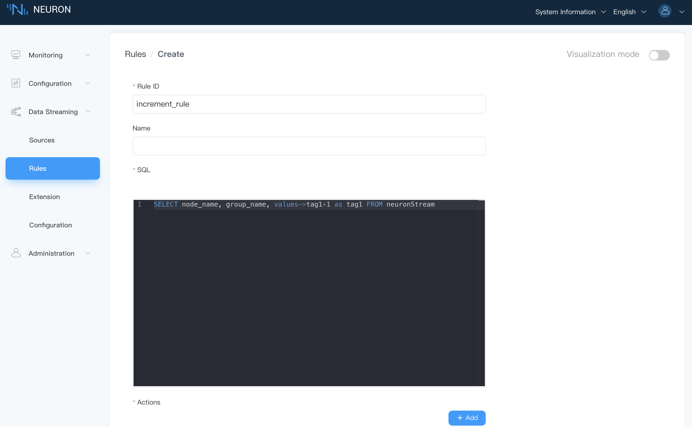
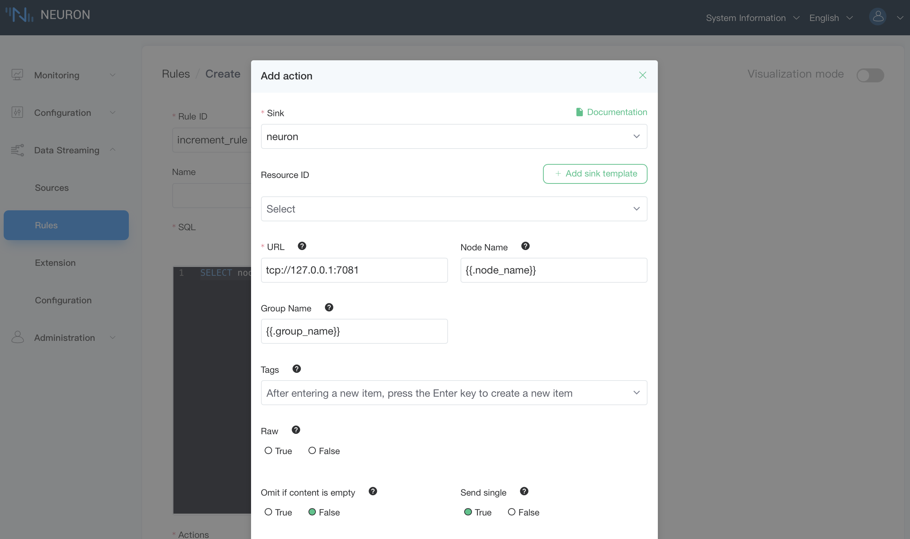
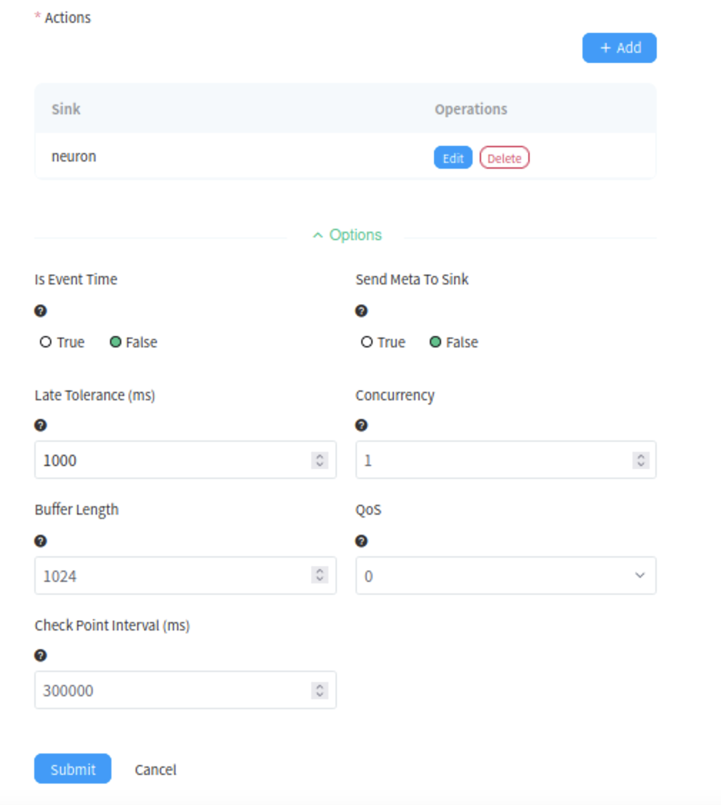

# Device control

This rule implements +1 processing of the data collected by neuron from the device, and writes the result back to the device. At this time, the tag attribute must be a write attribute, otherwise it cannot be written successfully.

## Step 1 Add a new rule

Click `New Rule` to create a new rule in **Rules** page.

## Step 2 Setup rule details

In the **Rules Create** interface, fill in the rule information, as shown below.

* Fill in the `Rule ID` and `SQL` statement.
* Click on `Add` button to add sink action for the rule, you may add more than one sink action for each rule.
* Click on `Submit` button to complete the rule definition.

## Step 3 Setup sink details

Set sink details in the pop-up window for adding actions, as shown below.

1. Drop down to select sink.
2. Fill in the node name.
3. Fill in the group name.
4. Fill in the tag name.
5. Click on `Submit` button to complete the sink action.

After the action is added, as shown below.

## Step 4 Start rule execution

Start the rule in **Rules** page.

## Step 5 Check over the data in Modbus simulator

Start neuron data monitoring, check data.
