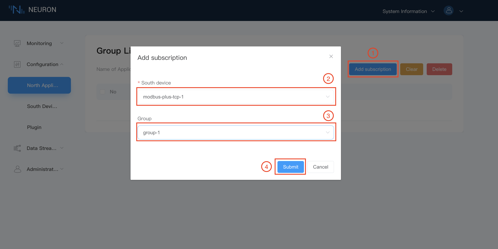

# Prerequisite Setup

There is a pre-defined a data stream named `neuronStream` with type attribute `neuron` in data stream engine. Users are required to subscribe the desired data Groups of southbound devices. The subscribed data Groups will be the data stream for stream engine. All rules in stream engine would share this data stream.

## Step 1 Check over the data stream processing application node

When you install a .deb or .rpm Neuron package, there is a default `data-stream-processing` application node in the northbound application management screen, as shown below.

The data stream processing node contains the following information

* Application Name - **data-stream-processing**
* Node Status - **Init**
* State Change Button - OFF
* Connection Status - **Disconnected**
* Plugin Module Name - **ekuiper**

## Step 2 Subscribe to data groups of southbound devices

Click on any blank space of the `data-stream-processing` application node to enter the Group list screen for subscribing to the group, as shown below.

To subscribe the data Groups of southbound device,

1. Click on the `Add subscription` button in the top right corner.
2. Click on the drop down box to select the southbound device, in this case, we select the modbus-plus-tcp-1 device built above.
3. Select the Group you want to subscribe to in the drop-down box, in this case, we select the group-1 created above.
4. Click on `Submit` button to complete the subscription.
