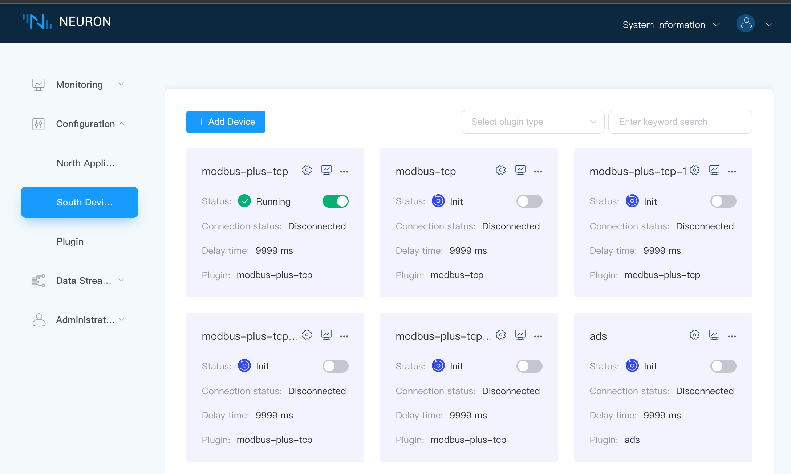
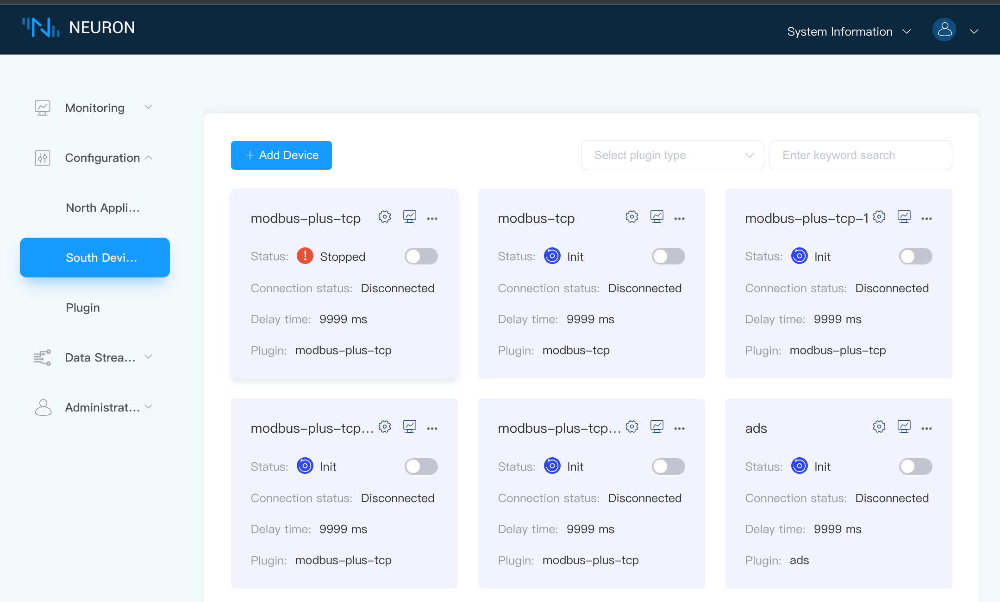
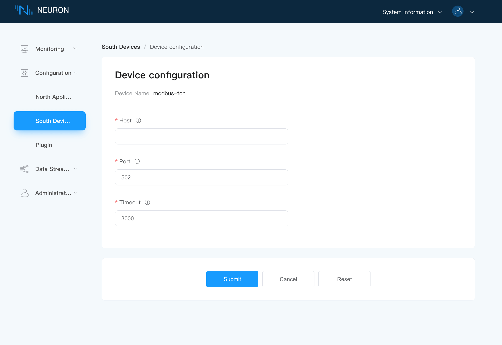

# Modbus plugin development example

The southbound driver development mainly includes the following parts, the bottom layer is the protocol layer development, and the outermost layer is the driver layer development.
| Modules                     | Documentation                             | Instructions                                                                          |
| --------------------------- | ----------------------------------------- | ------------------------------------------------------------------------------------- |
| Protocol layer development  | modbus.c modbus.h                         | Packing and unpacking of device protocol packets connected by plugins                 |
| Protocol stack analysis     | modbus_stack.c modbus_stack.h             | Mainly used for protocol stack analysis                                               |
| Point processing            | modbus_point.c modbus_point.h             | The tag type in Neuron is converted to a more specific type required by the plugin    |
| Driver layer development    | modbus_tcp.c modbus_req.c modbus_req.h    | Implementation of plugin theme framework                                              |
| Plugin Settings File        | modbus-tcp.json                           | Definition of Plugin Settings File                                                    |

## Constant description

The main constants in Neuron are defined in the header file <define.h>.

| Constant                           | Description           |
| --------------------------------- | --------------------------------------------------- |
| NEU_TAG_NAME_LEN                   | Maximum length of point name, 32                   |
| NEU_TAG_ADDRESS_LEN                | Maximum length of point address, 64                |
| NEU_TAG_DESCRIPTION_LEN            | Maximum length of point description string, 128    |
| NEU_GROUP_NAME_LEN                 | Maximum length of group name, 32                   |
| NEU_GROUP_INTERVAL_LIMIT           | Minimum interval for the group, 100                |
| NEU_NODE_NAME_LEN                  | Node name maximum length, 32                       |
| NEU_PLUGIN_NAME_LEN                | plugin name maximum length, 32                        |
| NEU_PLUGIN_LIBRARY_LEN             | Plug-in dynamic library file name maximum length, 32  |
| NEU_PLUGIN_DESCRIPTION_LEN         | Plugin description string maximum length, 512         |
| NEU_DRIVER_TAG_CACHE_EXPIRE_TIME   | Driving point cache expiration time, 30               |
| NEU_APP_SUBSCRIBE_MSG_SIZE         | size of northbound subscription message, 4            |
|NEU_TAG_FLOAG_PRECISION_MAX         | Maximum value of floating point type precision, 17    |

```c
typedef enum neu_plugin_kind {
    NEU_PLUGIN_KIND_STATIC = 0,
    NEU_PLUGIN_KIND_SYSTEM = 1,
    NEU_PLUGIN_KIND_CUSTOM = 2,
} neu_plugin_kind_e;
```

Plugin type:

* NEU_PLUGIN_KIND_STATIC, Neuron built-in plugin, no dynamic library file required;
* NEU_PLUGIN_KIND_SYSTEM, system plugin, needs to be stored as a dynamic library file, which can be loaded by Neuron;
* NEU_PLUGIN_KIND_CUSTOM, custom plugin, needs to be stored as a dynamic library file, which can be loaded by Neuron;

```c
typedef enum {
    NEU_NA_TYPE_DRIVER = 1,
    NEU_NA_TYPE_APP    = 2,
} neu_adapter_type_e,
    neu_node_type_e;
```

Node type, NEU_NA_TYPE_DRIVER represents the southbound node, NEU_NA_TYPE_APP represents the northbound node.

```c
typedef enum {
    NEU_NODE_LINK_STATE_DISCONNECTED = 0,
    NEU_NODE_LINK_STATE_CONNECTED    = 1,
} neu_node_link_state_e;
```

Node connection status, NEU_NODE_LINK_STATE_DISCONNECTED means disconnected, NEU_NODE_LINK_STATE_CONNECTED means connected.

```c
typedef enum {
    NEU_NODE_RUNNING_STATE_IDLE    = 0,
    NEU_NODE_RUNNING_STATE_INIT    = 1,
    NEU_NODE_RUNNING_STATE_READY   = 2,
    NEU_NODE_RUNNING_STATE_RUNNING = 3,
    NEU_NODE_RUNNING_STATE_STOPPED = 4,
} neu_node_running_state_e;
```

Node running status:

* NEU_NODE_RUNNING_STATE_IDLE, in the driver configuration, enter the configuration;
* NEU_NODE_RUNNING_STATE_INIT, after the node is created successfully, enter the initialization;
* NEU_NODE_RUNNING_STATE_READY, after the driver configuration is completed, enter ready;
* NEU_NODE_RUNNING_STATE_RUNNING, open the node working state and enter the running;
* NEU_NODE_RUNNING_STATE_STOPPED, close the node working state and enter stop;

## Step 1 Protocol layer development

This part mainly implements the implementation of the grouping and unpacking of the device protocol connected by the plug-in, and also includes the implementation of some structure definitions and related functions, among which modbus.h defines the basic message of the modbus protocol and the grouping of the message. Packing and unpacking functions, modbus.c implements the functions of packing and unpacking.

When the Modbus protocol is transmitted through TCP, the format of the read and write request message is shown in the table below.

| Message Format            | Data Length | Description               |
| ------------------------- | ------- | ----------------------------------------------------------------------------------------------- |
| Header                    | 6 bytes | Application header, including transport ID, protocol ID, and byte length                        |
| Address code              | 1 byte  | Device address, also site number                                                                |
| Function code             | 1 byte  | Notify which operation to perform, different function codes correspond to different operations  |
| Register start address    | 2 bytes | Specify the start address of the register to be read, high byte first, low byte last            |
| Number of registers       | 2 bytes | Specify the number of registers to read, high byte first, low byte last                         |
| Data field                | N bytes | Used in the write instruction, the value to be written to the register                          |

### Enumeration Description

| Enumeration     | Description                     |
| --------------- | ------------------------------- |
| modbus_function | Modbus different function codes |
| modbus_area     | Different register types        |

### modbus_code code analysis

modbus_header, modbus_code, modbus_address, modbus_data code implementation is similar, take modbus_header as an example for code analysis.

```c
// Pack modbus_header into protocol_pack_buf
void modbus_header_wrap(neu_protocol_pack_buf_t *buf, uint16_t seq)
{
    // Check if there is enough space in protocol_pack_buf to store the structure of modbus_header
    assert(neu_protocol_pack_buf_unused_size(buf) >=
           sizeof(struct modbus_header));

    // Allocate memory for modbus_header in protocol_pack_buf and return the starting address of modbus_header
    struct modbus_header *header =
        (struct modbus_header *) neu_protocol_pack_buf(
            buf, sizeof(struct modbus_header));

    // Assign value to header
    header->seq      = htons(seq);
    header->protocol = 0x0;
    header->len      = htons(neu_protocol_pack_buf_used_size(buf) -
                        sizeof(struct modbus_header));
}

// Parse modbus_header from received protocol_unpack_buf
int modbus_header_unwrap(neu_protocol_unpack_buf_t *buf,
                         struct modbus_header *     out_header)
{
    // Get the start address of modbus_header from protocol_unpack_buf
    struct modbus_header *header =
        (struct modbus_header *) neu_protocol_unpack_buf(
            buf, sizeof(struct modbus_header));
    
    // When the data size in protocol_unpack_buf is less than the size of modbus_header, return 0
    if (header == NULL ||
        ntohs(header->len) > neu_protocol_unpack_buf_unused_size(buf)) {
        return 0;
    }

    // When the parsed packet does not conform to the protocol specification, return -1
    if (header->protocol != 0x0) {
        return -1;
    }

    *out_header     = *header;
    out_header->len = ntohs(out_header->len);
    out_header->seq = ntohs(out_header->seq);

    // When parsing mmmodbus_header is successful, return the parsed data size
    return sizeof(struct modbus_header);
}
```

## Step 2 Protocol stack analysis

This part is mainly used for the analysis of the protocol stack, including the initialization of the protocol stack analysis and the release of resources, the generation of read and write request messages, the analysis of received read and write response messages, and data processing.

| function name          | description              |
| ---------------------- | --------------------------------------------------------- |
| modbus_stack_create    | Mainly used for protocol stack parsing initialization.    |
| modbus_stack_destroy   | Mainly used to release protocol stack parsing resources.  |
| modbus_stack_recv      | Mainly used to pass the data received from tcp/udp/serial port to the protocol stack parser, and process and analyze the data.     |
| modbus_stack_read      | Mainly used to generate the protocol message of the point to be read through the protocol parser.             |
| modbus_stack_write     | Mainly used to generate the protocol message to be written to the point value through the protocol parser.    |

## Step 3 Point processing

This part is mainly used to convert the tag information set in Neuron into the more specific information needed.

* The address configured by the point in Neuron can be further parsed into the device address Slave ID, register type and register start address, and can check whether the address conforms to the plug-in specification.
* Different registers support different data types. Here, you can judge whether the configured address supports this attribute according to the parsed register type and the attributes configured in Neuron.
* Modbus supports batch reading of data. Neuron can aggregate and classify user-configured points. According to the classification results, the function of reading data in batches can be realized.

## Step 4 Driver layer development

The modbus_req.c and modbus_req.h files define the specific function implementation and structure used in the modbus_tcp.c file.The modbus_tcp.c file is mainly the interface exported by the plugin, which is defined by plugin.h in neuron. The description of plugin_intf_funs is as follows.

### open

Call the driver_open function, and create a structure struct neu_plugin defined by the plugin itself based on the first function called by neuron when the plugin creates a node. This structure is defined in modbus_req.h. It should be noted that the first member of the structure must be neu_plugin_common_t common, and other members can be added according to the specific implementation of the driver.

```c
static neu_plugin_t *driver_open(void)
{
    neu_plugin_t *plugin = calloc(1, sizeof(neu_plugin_t));

    neu_plugin_common_init(&plugin->common);

    return plugin;
}
```

### close

Call the driver_close function, the last function called by neuron when a node is removed to free the neu_plugin_t created by open.

```c
static int driver_close(neu_plugin_t *plugin)
{
    free(plugin);

    return 0;
}
```

### init

Call the driver_init function, when creating a node, the function that neuron calls immediately after open is called. This function is mainly used for some resources that need to be initialized in the plugin. The modbus plugin mainly initializes the modbus protocol stack analysis.The callback functions are implemented in the modbus_req file.

```c
static int driver_init(neu_plugin_t *plugin)
{
    plog_info(plugin, "node: modbus init");

    return 0;
}
```

### uninit

Call the driver_uninit function, when deleting a node, the first function called by neuron, this function mainly releases some resources applied and initialized in init.

```c
static int driver_uninit(neu_plugin_t *plugin)
{

    plog_info(plugin, "node: modbus uninit");

    return 0;
}
```

### start

Call the driver_start function, when the user clicks on the neuron node page, neuron will call this function, start does not do any processing, only returns 0, notifies the plugin to start running, and starts to connect to the device, etc. The processing of the connection status is placed in the tcp connection Processed in an asynchronous callback function.



### stop

Call the driver_stop function, when the user clicks stop on the neuron node page, neuron will call this function, stop notifies the plug-in to stop running, close the connection with the device, and the driver.group_timer will not be triggered again.



### setting

Call the driver_config function, it is used by the user when setting on the neuron node setting page. The parameters set by the node will be presented in json mode, and neuron will notify the plugin to set through this function.The driver_config function first parses and saves the configuration information, and then establishes a tcp connection. The two callback functions modbus_conn_connected and modbus_conn_disconnected will be called when tcp establishes and closes the connection respectively, and the corresponding two functions will update the connection status of the plugin.



```c
static int driver_config(neu_plugin_t *plugin, const char *config)
{
    plog_info(plugin, "config: %s", config);

    return 0;
}
```

### request

Call the driver_request function, the function is not used in the southbound driver.

### driver.validate_tag

Call the driver_validate_tag function, when adding a tag to a node or updating a tag, neuron will use this function to notify the plug-in of the tag-related parameters. The plug-in checks whether the tag parameter meets the requirements of the plug-in according to their respective implementations. The function returns 0, which means success.

```c
static int driver_validate_tag(neu_plugin_t *plugin, neu_datatag_t *tag)
{
    plog_info(plugin, "validate tag: %s", tag->name);

    return 0;
}
```

### driver.group_timer

Call the driver_group_timer function, after adding a group to the node and setting the node state to running, this function will be called regularly with the interval parameter of the group, mainly used to interact with the device and read device data.

neu_plugin_group_t structure parameter description.

| Parameters     | Description                            |
| -------------- | ------------------------------------------- |
| group_name     | The name of the group that triggered the timer |
| tags           | array of type neu_datatag_t |
| user_data      | User-defined information |
| group_free     | When this group is deleted, the callback function used to release user-defined information |

```c
static int driver_group_timer(neu_plugin_t *plugin, neu_plugin_group_t *group)
{
    (void) plugin;
    (void) group;

    plog_info(plugin, "timer....");

    return 0;
}
```

### driver.write_tag

Call the driver_write function, when using the write api, neuron will call this function to notify the plugin to write a specific value to the point tag.

```c
static int driver_write(neu_plugin_t *plugin, void *req, neu_datatag_t *tag,
                        neu_value_u value)
{
    (void) plugin;
    (void) req;
    (void) tag;
    (void) value;

    return 0;
}
```

## Step 5 Plugin settings file

The modbus-tcp.json file configures the plugin settings, among which tag_type and timeout are required items. Other parameters can be added according to the plugin configuration. The parameter descriptions are shown in the following table.

| Parameters   | Description                                       |
| ------------ | ------------------------------------------------------------------------------- |
| tag_regex    | Regex for address configuration for drivers that support different data types   |
| description  | A detailed description of the field                                             |
| attribute    | The attribute of the field, there are only two optional and required options, namely required and optional |
| type         | The type of the field, currently int and string are commonly used               |
| default      | The default value to fill in                                                    |
| valid        | The range that this field can be filled in                                      |
