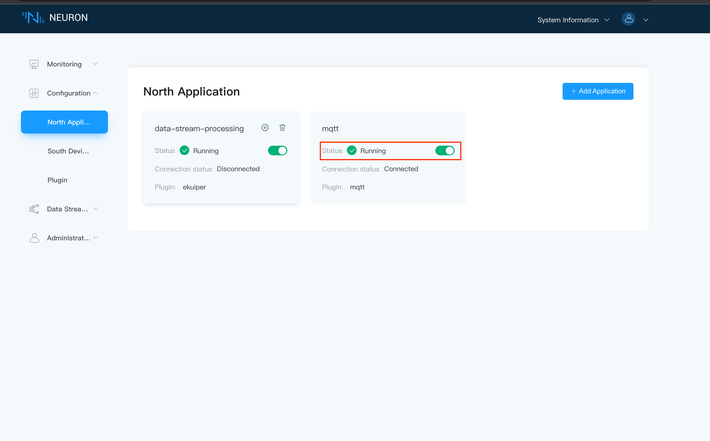
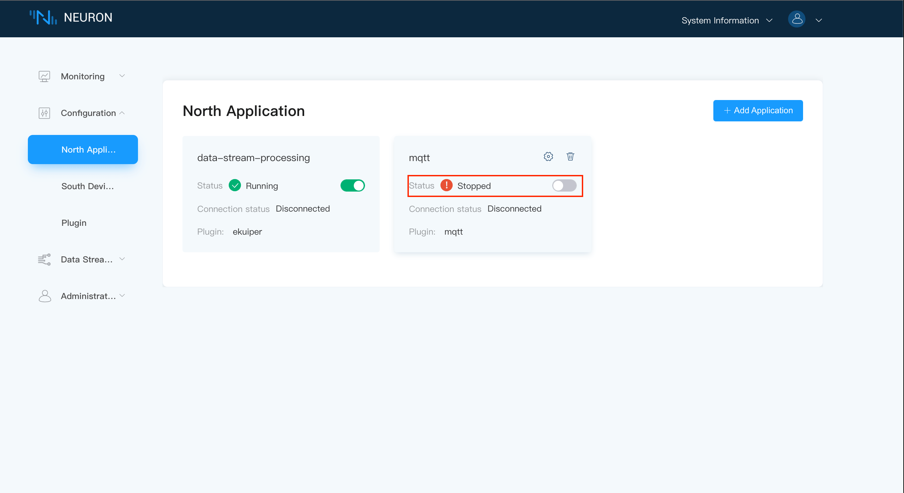
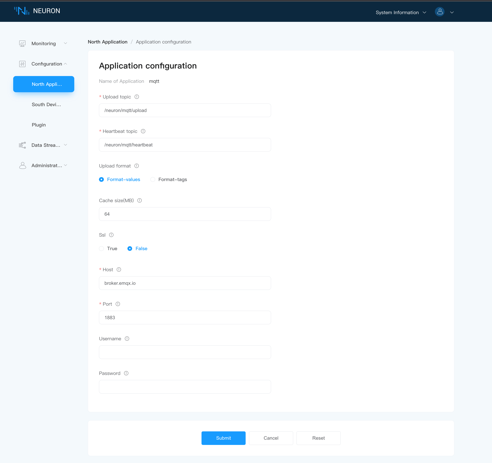

# MQTT Application Development Example

Northbound application development mainly includes the following parts. The bottom layer is the development of the instruction processing layer, and the outermost layer is the development of the application layer.

| Modules        | Documentation                      | Instructions                       |
| ---------- | ------------------------ | ------------------------- |
| Instruction processing layer development   | command.c command.h common.h heartbeat.c heartbeat.h read_write.c read_write.h | Plugin parsing of directives  |
| Application layer development              | mqtt_plugin.c mqtt_plugin.h mqtt_util.c mqtt_util.h  | Implementation of plugin theme framework  |
| Plugin Settings File                       | mqtt.json                                             | Definition of Plugin Settings File  |

## Constant Description

| Constant              | Description              |
| --------------------- | ------------------------ |
| TOPIC_TYPE_READ       | Topic type is read       |
| TOPIC_TYPE_WRITE      | Topic type is write      |
| TOPIC_TYPE_UPLOAD     | Topic type is upload     |
| TOPIC_TYPE_HEARTBEAT  | Topic type is heartbeat  |

## Step 1 Instruction Processing Layer Development

MQTT currently implements the interfaces for uploading data, heartbeat data, reading Tags and writing Tags. The specific processing of the response corresponding to the mqtt request is defined in command.c, and heartbeat.c and read_write.c provide the required function implementation for command.c.

| Function                         | Description                 |
| -------------------------------- | ------------------- |
| command_response_handle          | MQTT response processing        |
| command_read_once_response       | Response handling for read topics      |
| command_read_periodic_response   | Response handling for uploading topics    |
| command_write_response           | Response handling fot write topics      |
| command_heartbeat_response       | Response processing of heartbeat data    |

## Step 2 Driver Layer Development

The mqtt_util.c and mqtt_util.h files define the specific function implementations used in the mqtt.c file.

In the development of the north-south driver layer,it is necessary to constrict the structure of neu_plugin_intf_funs_t first, and realize the function of each element in the structure.

```c
static const neu_plugin_intf_funs_t plugin_intf_funs = {
    .open    = mqtt_plugin_open,
    .close   = mqtt_plugin_close,
    .init    = mqtt_plugin_init,
    .uninit  = mqtt_plugin_uninit,
    .start   = mqtt_plugin_start,
    .stop    = mqtt_plugin_stop,
    .setting = mqtt_plugin_config,
    .request = mqtt_plugin_request,
};
```

### .open

Call the mqtt_plugin_open function, and create a structure struct neu_plugin defined by the plugin itself based on the first function called by neuron when the plugin creates a node. The structure is defined in mqtt_plugin.h. It should be noted that the first member of the structure must be neu_plugin_common_t common, and other members can be added according to the specific implementation of the driver.

```c
static neu_plugin_t *mqtt_plugin_open(void)
{
    neu_plugin_t *plugin = (neu_plugin_t *) calloc(1, sizeof(neu_plugin_t));

    neu_plugin_common_init(&plugin->common);
	
    return plugin;
}
```

### .close

The mqtt_plugin_close function is called, the last function called by neuron when the node is deleted, to release the neu_plugin_t created by open.

```c
static int mqtt_plugin_close(neu_plugin_t *plugin)
{
    free(plugin);

    return NEU_ERR_SUCCESS;
}
```

### .init

Call the mqtt_plugin_init function, which is called immediately after neuron calls open when creating a node. This function is mainly used for some resources that need to be initialized in the plug-in. The mqtt plug-in mainly initializes the running status and configuration of mqtt.

```c
static int mqtt_plugin_init(neu_plugin_t *plugin)
{
    assert(NULL != plugin);

    plugin->routine = NULL;
    plugin->running = false;
    plugin->config  = NULL;
    plugin_cache_init(plugin);

    const char *name = neu_plugin_module.module_name;
    plog_info(plugin, "initialize plugin: %s", name);

    return NEU_ERR_SUCCESS;
}
```

### .uninit

Call the mqtt_plugin_uninit function, the first function called by neuron when the node is deleted. This function mainly releases some resources applied and initialized in init.

```c
static int mqtt_plugin_uninit(neu_plugin_t *plugin)
{
    assert(NULL != plugin);

    plugin_stop_running(plugin);
    plugin_cache_uninit(plugin);
    plugin_config_free(plugin);

    const char *name = neu_plugin_module.module_name;
    plog_info(plugin, "uninitialize plugin: %s", name);
    return NEU_ERR_SUCCESS;
}
```

### .start

Call the mqtt_plugin_start function. When the user clicks start on the neuron node page, neuron will call this function to notify the plug-in to start running and start connecting to the device. If the configuration is incorrect, it will return the node setting invalid error.



```c
static int mqtt_plugin_start(neu_plugin_t *plugin)
{
    assert(NULL != plugin);

    int rc = plguin_start_running(plugin);
    if (0 != rc) {
        return NEU_ERR_NODE_SETTING_INVALID;
    }

    return NEU_ERR_SUCCESS;
}
```

### .stop

Call the mqtt_plugin_stop function, when the user clicks stop on the neuron node page, neuron will call this function, stop notifies the plug-in to stop running, and closes the connection between the plug-in and neuron.



```c
static int mqtt_plugin_stop(neu_plugin_t *plugin)
{
    assert(NULL != plugin);

    plugin_stop_running(plugin);
    return NEU_ERR_SUCCESS;
}
```

### .setting

Call the mqtt_plugin_config function, which is used by the user when making settings on the neuron node setting page. The parameters set by the node will be presented in json (for the configuration of the json file, please refer to **Plugin Setting File** ), and neuron will notify the plugin to set through this function. The mqtt_plugin_config function first parses and saves the configuration information, and then establishes the connection.



```c
static int mqtt_plugin_config(neu_plugin_t *plugin, const char *config)
{
	plog_info(plugin, "config: %s", config);

    return NEU_ERR_SUCCESS;
}
```

### .request

Call the mqtt_plugin_request function to handle the response according to the request type.

```c
static int mqtt_plugin_request(neu_plugin_t *plugin, neu_reqresp_head_t *head,
                               void *data)
{
    assert(NULL != plugin);
    assert(NULL != head);
    assert(NULL != data);

    neu_err_code_e error = NEU_ERR_SUCCESS;

    switch (head->type) {
    case NEU_RESP_ERROR:
        error = write_response(plugin, head, data);
        break;
    case NEU_RESP_READ_GROUP:
        error = read_response(plugin, head, data);
        break;
    case NEU_REQRESP_TRANS_DATA:
        error = trans_data(plugin, data);
        break;
    case NEU_REQRESP_NODES_STATE: {
        error = node_state_send(plugin, head, data);
        break;
    }
    case NEU_REQRESP_NODE_DELETED:
        break;
    default:
        error = NEU_ERR_MQTT_FAILURE;
        break;
    }

    return error;
}
```

## Step 3 Plugin Setting File

The mqtt.json file sets the application configuration parameters. The field descriptions for each parameter of the mqtt plugin are as follows.

| Parameters   | Description                                                |
| ------------ | ------------------------------------------------------------ |
| name         | The page displays the name of the parameter                  |
| description  | The specific description of this parameter                   |
| type         | The type of the parameter, currently commonly used two types: int and string                 |
| attribute    | The attributes of this parameter, there are only two optional and required, namely required and optional         |
| default      | Set the default value of this parameter                                              |
| valid        | The range that this parameter can fill in, use length for string type, max and min for int type |
| map          | 用于设置选项框                                                 |

```json
{
	"upload-topic": {
		"name": "upload topic",
		"description": "User defined upload topic",
		"type": "string",
		"attribute": "required",
		"default": "/neuron/${node-name}/upload",
		"valid": {
			"length": 255
		}
	},
	"heartbeat-topic": {
		"name": "heartbeat topic",
		"description": "User defined heartbeat topic",
		"type": "string",
		"attribute": "required",
		"default": "/neuron/${node-name}/heartbeat",
		"valid": {
			"length": 255
		}
	},
	"format": {
		"name": "upload format",
		"description": "The json format of the data reported in the upload topic. In the values mode, all items are contained in the values object or the errors object, respectively. In tags mode, all items are contained in an array",
		"attribute": "optional",
		"type": "map",
		"default": 0,
		"valid": {
			"map": [
				{
					"key": "format-values",
					"value": 0
				},
				{
					"key": "format-tags",
					"value": 1
				}
			]
		}
	},
	"cache": {
		"name": "cache size(MB)",
		"description": "The maximum byte limit in MB for the data backlog when an MQTT connection exception occurs",
		"type": "int",
		"attribute": "optional",
		"default": 64,
		"valid": {
			"min": 1,
			"max": 256 
		}
	},
	"ssl": {
		"name": "ssl",
		"description": "Enable SSL connection",
		"attribute": "optional",
		"type": "bool",
		"default": false,
		"valid": {}
	},
	"host": {
		"name": "host",
		"description": "MQTT broker host",
		"attribute": "required",
		"type": "string",
		"default": "broker.emqx.io",
		"valid": {
			"length": 255
		}
	},
	"port": {
		"name": "port",
		"description": "MQTT broker port",
		"attribute": "required",
		"type": "int",
		"default": 1883,
		"valid": {
			"min": 1024,
			"max": 65535
		}
	},
	"username": {
		"name": "username",
		"description": "User name",
		"attribute": "optional",
		"type": "string",
		"default": "",
		"valid": {
			"length": 255
		}
	},
	"password": {
		"name": "password",
		"description": "Password",
		"attribute": "optional",
		"type": "string",
		"default": "",
		"valid": {
			"length":255 
		}
	},
	"ca": {
		"name": "CA",
		"description": "CA certificate file",
		"attribute": "required",
		"type": "file",
		"condition": {
			"field": "ssl",
			"value": true
		},
		"default": "",
		"valid": {
			"length": 81960
		}
	},
	"cert": {
		"name": "client cert",
		"description": "client x509 certificate file",
		"attribute": "optional",
		"type": "file",
		"condition": {
			"field": "ssl",
			"value": true
		},
		"default": "",
		"valid": {
			"length": 81960
		}
	},
	"key": {
		"name": "client key",
		"description": "client key file",
		"attribute": "optional",
		"type": "file",
		"condition": {
			"field": "ssl",
			"value": true
		},
		"default": "",
		"valid": {
			"length": 81960
		}
	},
	"keypass": {
		"name": "keypass",
		"description": "key password",
		"attribute": "optional",
		"type": "string",
		"condition": {
			"field": "ssl",
			"value": true
		},
		"default": "",
		"valid": {
			"length": 256
		}
	}
}
```
