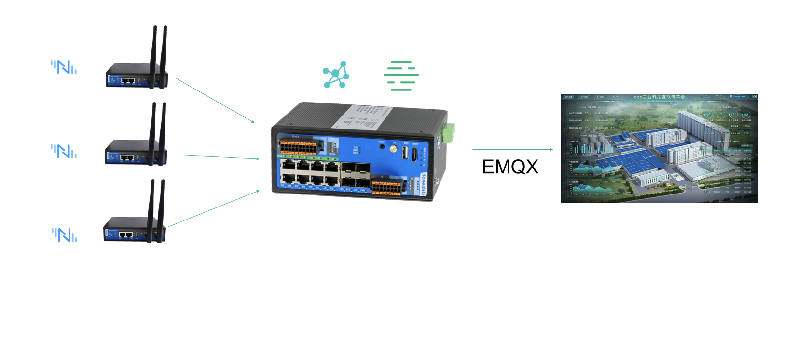
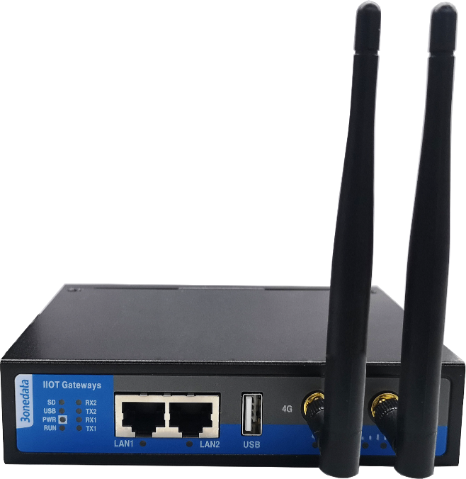
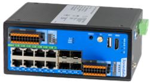

# 3onedata

Headquartered in Shenzhen, founded in 2001, 3onedata has been dedicated to IIoT for 22 years, with rich professional experience in providing industrial communication solutions and services for partners and customers worldwide. In 2020, 3onedata became the first IIoT company to be listed on Shanghai Stock Exchange (SSE) STAR Market, a milestone for our sustainable growth and development.

## Solution

3onedata boasts a significant depth of experience in the realm of industrial gateways and switches, offering hardware products that are both highly competitive and cost-effective. When combined with EMQ's high-performance industrial protocol gateway software, Neuron, this hardware is transformed into a comprehensive edge computing gateway capable of seamlessly interfacing with the EMQ cluster in the cloud. Consequently, the integration of Neuron with 3onedata's gateway culminates in a holistic solution for industrial internet applications.

## Advantages

3onedata has rich experience in various IIoT scenarios. Its rich product category and network interfaces cover various networking requirements, such as Ethernet/Modbus/EtherCAT/WIFI/4G/5G/PoE/Lora/NB-IoT. With the excellent hardware resources and network capability configuration of the 3onedata gateway and the built-in high-performance messaging bus and the rich industrial PLC protocol support of Neuron 2.0, it meets the digital needs of various industrial scenarios.

## RCU-100

**Specification**

- Features 2 Fast Ethernet ports, 2 3-in-1 serial ports, 1 USB port, 1 SIM card slot, and 1 TF (Micro SD) card slot
- Compatible with various mainstream industrial communication protocols and proprietary PLC protocols
- Supports 4G connectivity for cloud-based data transmission
- Accepts a wide range of power input from 12~48V DC
- Operates within a wide temperature range of -40~75℃

## TCU-2000

The TCU200 is a compact ARM-based industrial IoT edge computing smart gateway. It collects data from various terminal devices such as Ethernet, serial ports, and I/O. It integrates with third-party IoT/cloud platforms for local and remote management and control. The product features Gigabit Ethernet, Fast Ethernet, RS-485, RS-232, I/O, PWM, and other interfaces. It is designed for wall-mount installation and suits various application scenarios.

**Specification**

- Supports 2 Gigabit Ethernet ports (LC single-mode fiber connectors), 6 Fast Ethernet ports, 2 RS-485 serial ports (3-wire isolation), 1 RS-232 serial port (3-wire isolation), 4 DI (Digital Input) inputs, 4 DO (Digital Output) outputs, and 1 PWM (Pulse Width Modulation) output.
- Offers edge network expansion, local computing, and storage capabilities, providing intelligent management and services.
- Adopts the standard MQTT protocol for integration with third-party IoT/cloud platforms, enabling cloud-based and local collaborative management and control.
- Incorporates SW-Ring patented technology, supporting single-ring, couple-ring, chain-ring, and Dual-homing ring network functionalities, with automatic network fault recovery time of less than 20ms.
- Supports 1 power input of 12~48V DC.
- Operates within a wide temperature range of -40~75℃.

