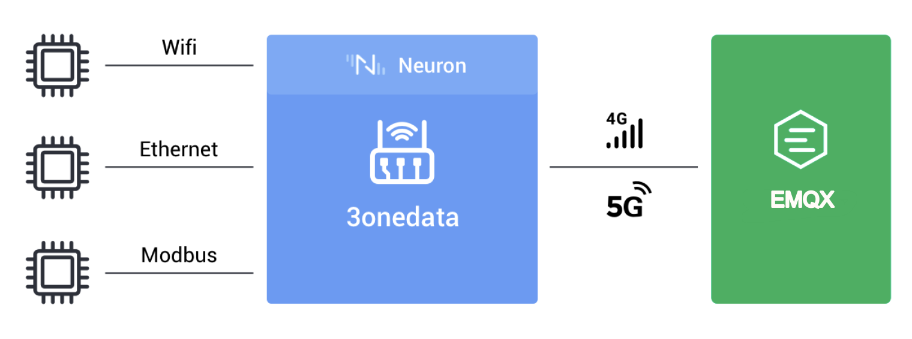

## Eco Partners

The wave of Industry 4.0 is sweeping the world. As a result of the deep integration of a new generation of information technology and the manufacturing industry, the Industrial Internet has become the infrastructure to support the fourth industrial revolution. Accelerating the development of the industrial Internet is not only a strategic choice to meet the trend of industrial development and seize the high ground of industry in the future, but also an objective requirement to promote quality change, efficiency change, and power change in the manufacturing industry and realize high-quality development.

As a lightweight connectivity server for industrial data ops, Neuron is always committed to promoting its ecological partnerships with various industrial internet companies. At present, Neuron has established ecological cooperation with [SMDT](https://www.smartdevicetech.com/) and [3onedata]().

## [Smart Device Technology](./smdt/smdt.md)

As a technology company with full-stack capabilities of "algorithm + IoT hardware + software + cloud platform", SMDT is committed to applying AI technology in various practical scenarios to become the connector between the physical world and the digital world. Neuron has also established a deep partnership with Vision Mate and currently supports the integration of products such as GBOX-66X1, GBOX-68IE, and 3588D.

## [3onedata Co. Ltd](./3onedata/3onedata.md)

3onedata boasts a significant depth of experience in the realm of industrial gateways and switches, offering hardware products that are both highly competitive and cost-effective. When combined with EMQ's high-performance industrial protocol gateway software, Neuron, this hardware is transformed into a comprehensive edge computing gateway capable of seamlessly interfacing with the EMQ cluster in the cloud. Consequently, the integration of Neuron with 3onedata's gateway culminates in a holistic solution for industrial internet applications.

