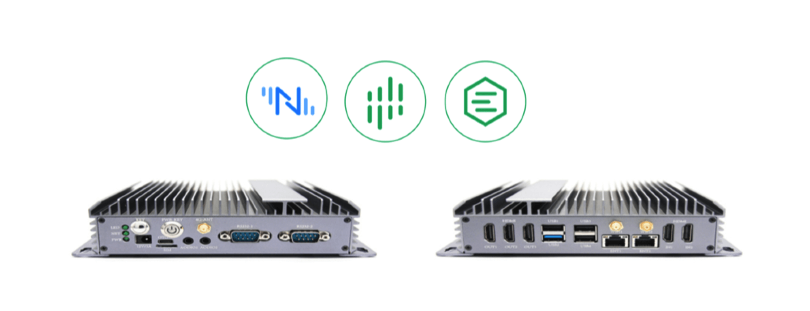

# SMDT Smart Industrial Gateway

As a technology company with full-stack capabilities of "algorithm + IoT hardware + software + cloud platform", SMDT is committed to applying AI technology in various practical scenarios to become the connector between the physical world and the digital world. Neuron has also established a deep partnership with Vision Mate and currently supports the integration of products such as GBOX-66X1, GBOX-68IE, and 3588D.

## GBOX-66X1

The integration with SMDT GBOX-66X1 and Neuron + eKuiper  brings the following advantages:

- Provides compatibility with over 80 industrial protocols for data collection
- Offers data cleansing and aggregation processing at the edge
- Facilitates the extension of AI algorithms

**Specifications**

| A                 | C                       |
| :---------------- | :---------------------- |
| Performance Grade | Low                     |
| Model             | Mbox-3566X              |
| CPU               | 4 core Cortex-A55       |
| Memory (DDR)      | 1G (2G/4G available）   |
| FLASH (EMMC)      | 8G (16G/32G available)  |
| Display           | HDMI(4K)                |
| Power             | DC 12V                  |
| RS232             | 2                       |
| RS485             | 无                      |
| DIO               | 无                      |
| CAN               | 无                      |
| Ethernet          | 1(100M)                 |
| WIFI/BT           | WIFI BlueTooth      |
| GPS               | Not supported           |
| USB               | USB3.0x1  USB2.0x1   |
| RTC               | Support                 |
| Timing switch     | supported               |
| Others            | *1T NPU                 |
| System            | * Android 11 * Linux |

## GBOX-68IE

The integration with SMDT GBOX-68IE and Neuron + eKuiper brings the following advantages:

* Provides compatibility with over 80 industrial protocols for data collection
- Offers data cleansing and aggregation processing at the edge
- Facilitates the extension of AI algorithms

**Specification**

| Processor                  | CPU                   | RK3568J Quad-core  64-bit Cortex-A55, 2.0GHz            |
| -------------------------- | :-------------------- | :------------------------------------------------------ |
|                            | Local memory          | 16G EMMC                                                |
|                            | DDR memory            | 2G                                                      |
| Interface                  | WIFI+BT               | WI-FI 2.4G  BT4.2                                    |
|                            | 4G                    | 4G/CAT1(CAT4 available)                                 |
|                            | RS232                 | 1 * RS232                                               |
|                            | RS485                 | 1 * RS485                                               |
|                            | CAN                   | 1 * CAN                                                 |
|                            | USB                   | 2 * USB (USB3.0OTG and USB2.0HOST)                      |
|                            | Ethernet              | 2  (100M and 1000M)                                     |
|                            | Antennas              | 4G/WI-FI SMA interface                                  |
|                            | Power                 | DC12~24V (±10%)                                         |
|                            | Operating temperature | -40~85 ℃                                                |
|                            | Storage temperature   | -40~125 ℃                                               |
|                            | Power consumption     | 6W (Max)                                                |
| Mechanical Characteristics | Cooling Method        | Fanless Cooling                                         |
|                            | Installation Method   | Fixed by rear bracket rail or screw holes on both sides |
|                            | Device Size           | 165 * 102.5 * 34 (mm)                                   |

## 3588D

The integration with SMDT 3588D and Neuron + eKuiper + EMQX brings the following advantages:

* Provides compatibility with over 80 industrial protocols for data collection
* Offers data cleansing and aggregation processing at the edge
* Facilitates the extension of AI algorithms
* Capable of supporting a large number of MQTT device connections
* Features a rule engine for comprehensive, one-stop data integration

**Specification**

| Performance Grade | High                                            |
| :---------------- | :---------------------------------------------- |
| Model             | 3588D                                           |
| CPU               | Quad-core Cortex-A76 + Quad-core Cortex-A55     |
| Memory (DDR)      | Standard 8G (4G/6G available)                   |
| FLASH (EMMC)      | Standard 32G (16G/64G/128G/256G available)      |
| Display           | HDMI output x3 Type-c DP x1 HDMI input x2 |
| Power             | DC 12V                                          |
| RS232             | 2                                               |
| RS485             | 1                                               |
| DIO               | 2                                               |
| CAN               | 1                                               |
| Ethernet          | 2 (1000M)                                       |
| WIFI/BT           | WIFI  BlueTooth                              |
| GPS               | Reserved                                        |
| USB               | Type-C x1  USB3.0 x1  USB2.0 x3         |
| RTC               | Support                                         |
| Timing switch     | Support                                         |
| Others            | * 6T NPU  * SATA supported                   |
| System            | * Android 12 * Linux (coming soon)           |

