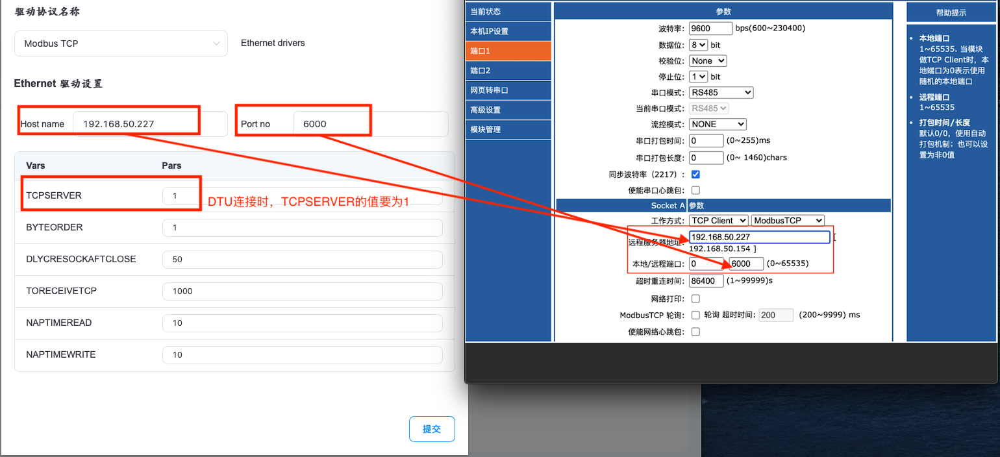

# DTU TCP Server Settings

Modbus supports connecting to DTU devices. Configure the remote server address in the cloud of DTU devices as the IP address of the environment where Neuron is running and configure the corresponding port number, and Neuron can access DTU devices to read data. In the driver setting of Neuron, when setting the Host name, fill in the IP address of the environment where Neuron is running. As shown in the figure：

