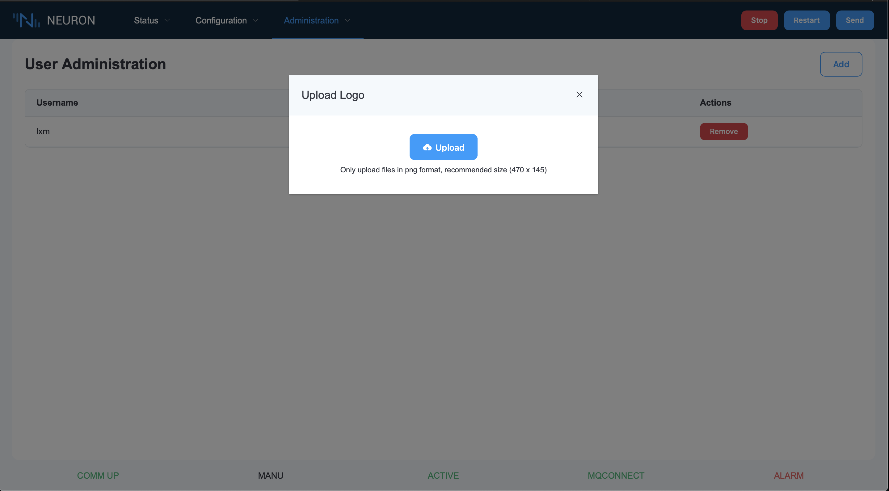
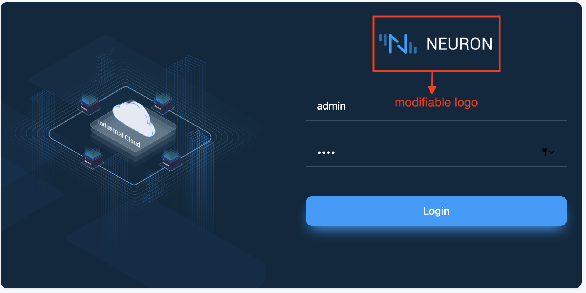
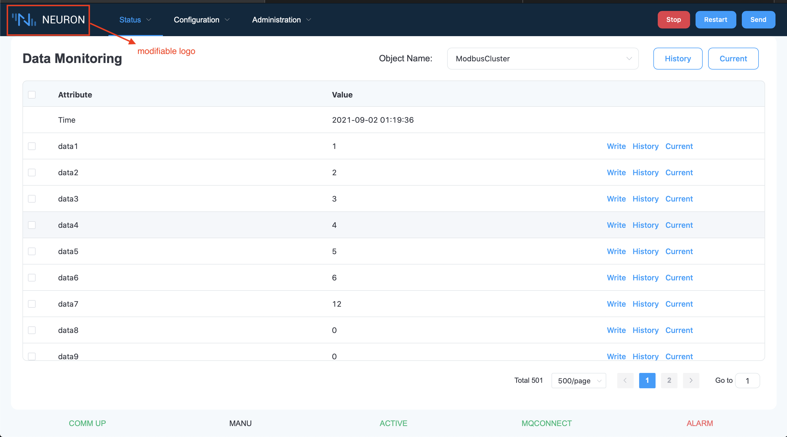

# Upload Logo Settings

This feature provides the ability to modify the logo for paid users.

Select the `Upload Logo` option in `Administration`, a corresponding session box will pop up, upload the logo as required, as shown in the figure below：

The location of the logo can be modified as shown below：

