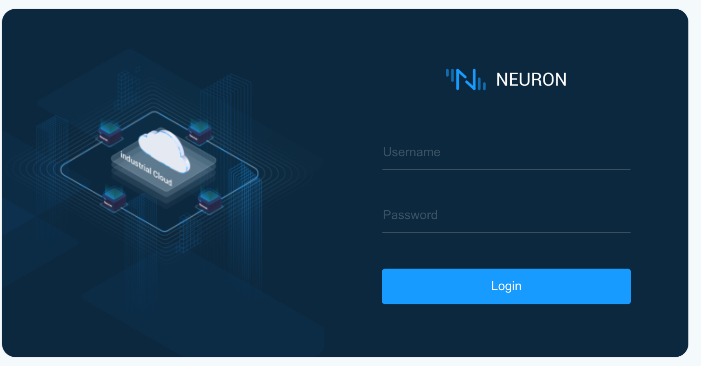
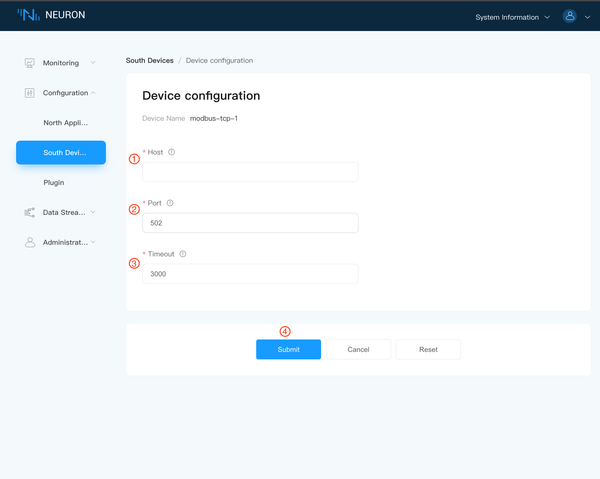
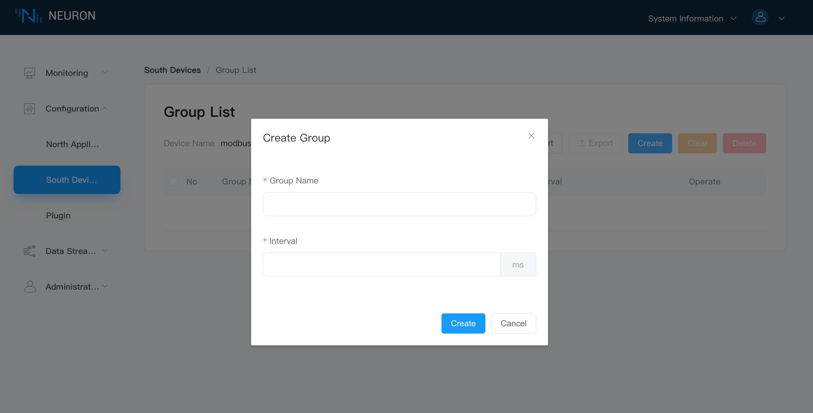
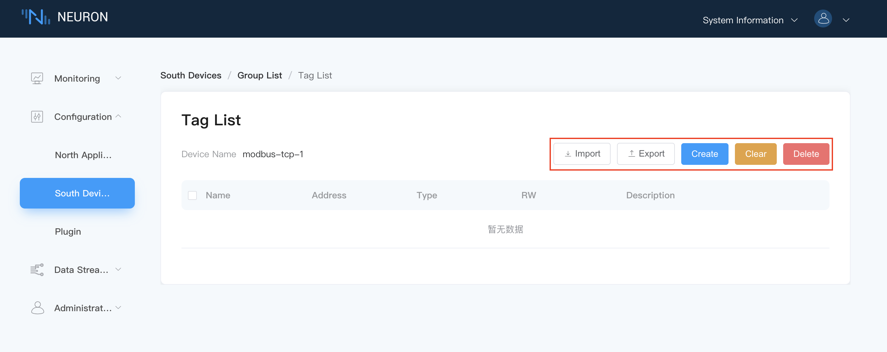
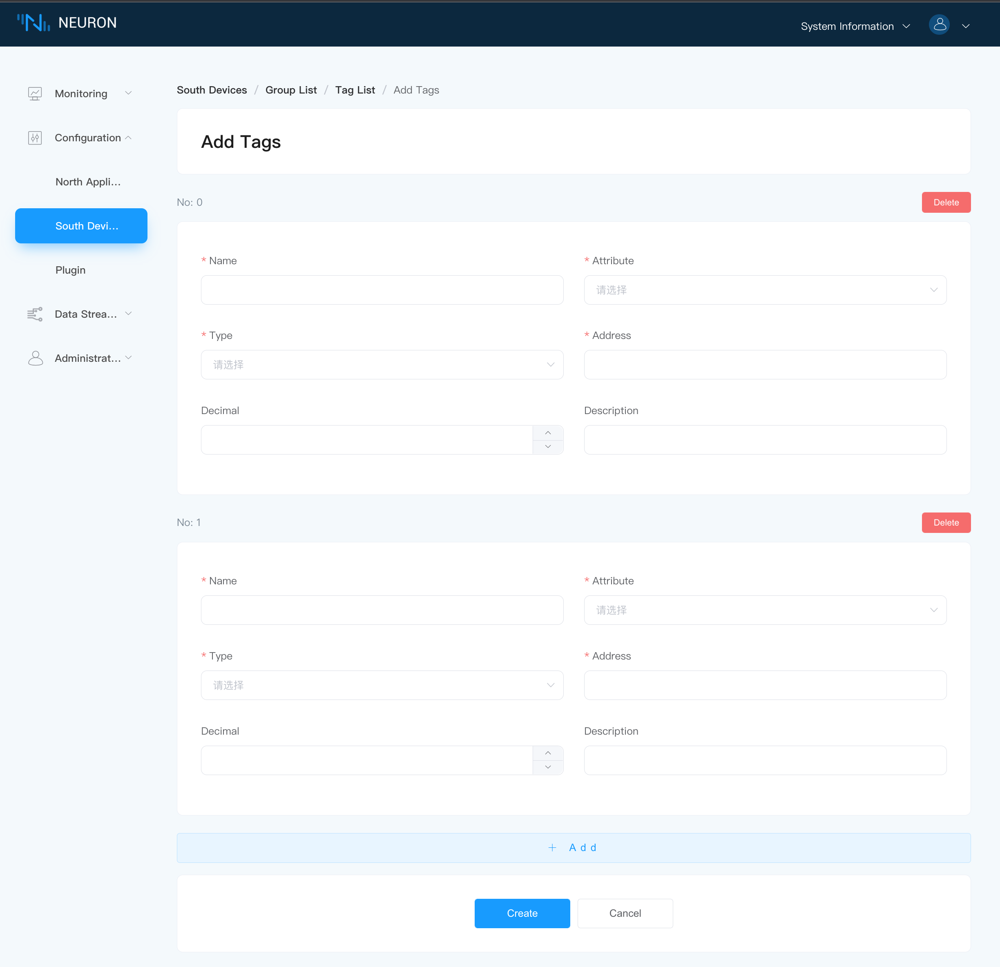
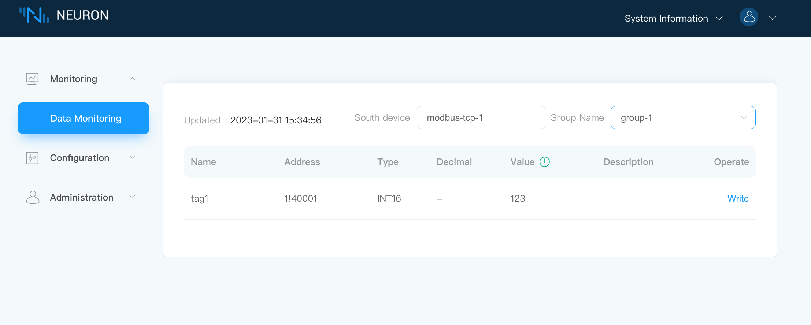
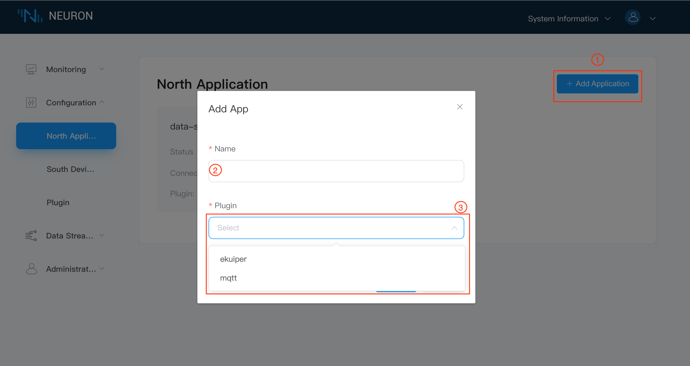
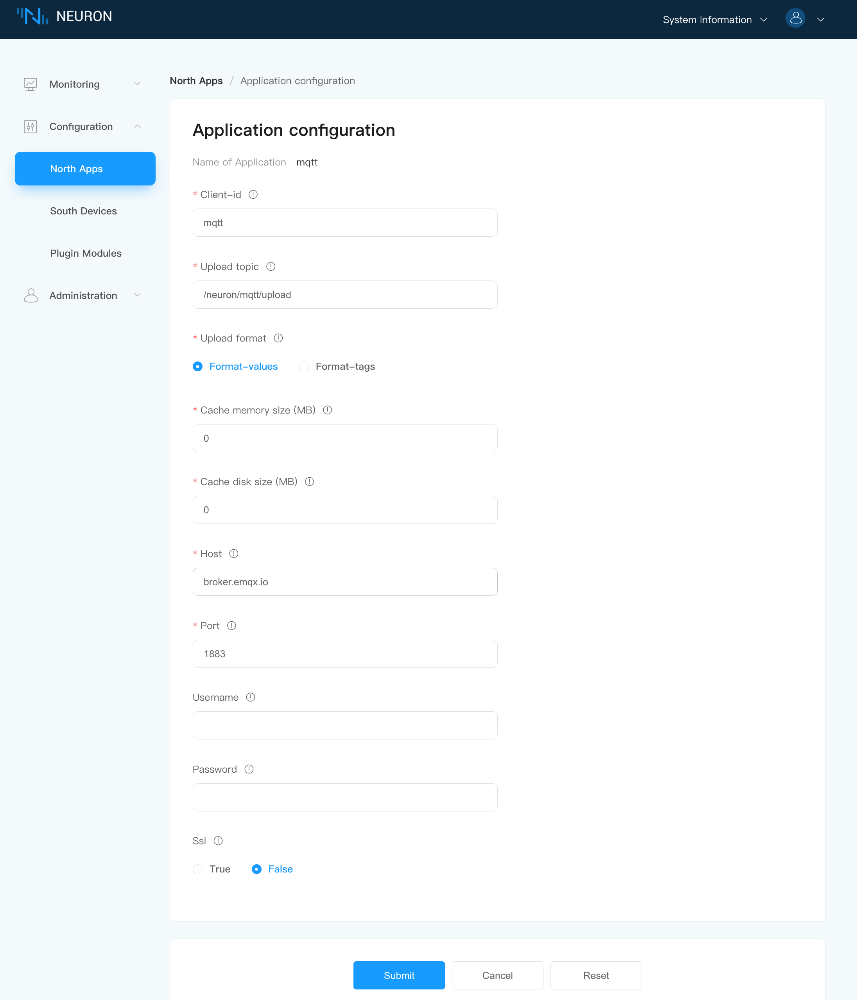
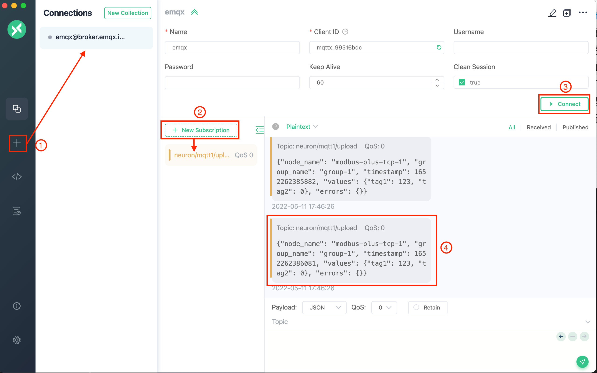
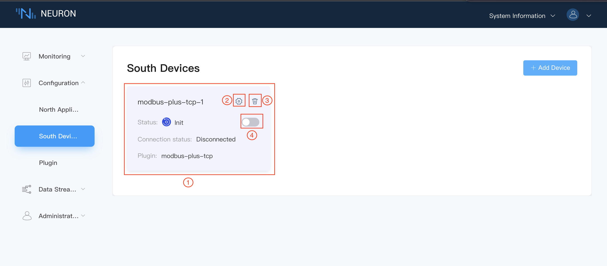

# Quick Start

This chapter will guide users to quickly start using Neuron to collect data simulating Modbus equipment and upload the data to MQTT Broker, taking Modbus TCP driver protocol as an example.

## Install Neuron

Neuron provides a variety of installation methods, and users can view the detailed installation methods in [Installation](./installation.md). This example adopts containerized deployment mode, so as to start experiencing Neuron as soon as possible.

Get Docker image

```bash
$ docker pull emqx/neuron:2.3.4
```

Run the Docker container

```bash
$ docker run -d --name neuron -p 7000:7000 --privileged=true --restart=always emqx/neuron:2.3.4
```

## Install Modbus Simulator

Install PeakHMI Slave Simulators software, and the installation package can be downloaded from [PeakHMI official website ](https://hmisys.com).

After installation, run Modbus TCP slave EX. Set the simulator salve ID and tag value, as shown in the figure below.


::: tip
Neuron and simulator must be run in the same LAN.

Try to turn off the firewall in Windows, otherwise Neuron may not connect to the simulator.
:::

## Quick Using Neuron

Open a Web browser and enter the address and port number of the gateway running Neuron to enter the management console dasboard. The default port number is 7000.

Access format, http://x.x.x.x:7000. x.x.x.x represents the address of the gateway where Neuron is installed.

### Step 1, Login

After the page opens, enter the login interface, and users can log in with their initial user name and password (initial user name: admin, initial password: 0000), as shown in the following figure.



### Step 2, Add Southbound Device

Creating southbound device cards can be used to establish connections between Neuron and devices, select device driver protocols and configure device data acquisition tags.

Select `South Devices` from the `Configuration` menu to enter the southbound device management interface, and click `Add Device` to add deivces, as shown in the figure below.


Add a new southbound device:

* Name: fill in the name of the device, such as modbus-tcp-1;
* Plugin: select the plugin of modbus-tcp from the drop-down box;
* Click the `Create` button to add a new device.

### Step 3, Setting Southbound Device's Parameters

Configure the parameters required for Neuron to establish a connection with the device.

Click the `Device Configuration` button on the southbound device card to enter the device configuration interface, as shown in the figure below.



* Host: fill in the IP of the PC where PeakHMI Slave Simulators software is installed.
* Click `Submit` to complete the equipment configuration, and the equipment card will automatically enter the working state of **Running**;

:::tip
The configuration parameters required by each device are different. Please refer to [Module Setting](../module-plugins/module-driver.md) for detailed description of southbound device parameters.

:::
### Step 4, Create A Group

Creating groups can be used to classify devicw acquisition tags.

Click any blank space in the device card to enter the group list management interface, and click `Create` to open the `Create Group` dialog box, as shown in the following figure.



Create a group for the device:

* Group Name: fill in the name of the Group, such as group-1.
* Click `Create` to complete the creation of the group.

### Step 5, Add Tags To The Group

Add the device tags to be collected, including tag address, tag attribute, tag type, etc.

Click the `Tag list` icon in the group to enter the tag list management interface, as shown in the figure below.



Select the `Create` icon to enter the tag page.



Manually create a tag for a group:

* Name: fill in the tag name, for example, tag1.
* Attribute: drop-down selection tag's attribute, for example, read, write.
* Type: drop-down selection data type, for example, int16.
* Address: fill in the drive address, for example, 1!40001. 1 stands for the tag salve id that setted in Modbus simulator, and 40001 stands for the tag register address. Please refer to [Module Setting](../module-plugins/module-driver.md) for detailed instructions on driving address.
* Click the `Create` icon to complete the creation of the tag;

:::tip
For more tag operations, please refer to **Advanced Operations** at the end of the document.

After the tag is created, the working status of the equipment card is **running**, and the connection status should be **Connected**. If the connection status is still **Disconnected** at this time, please execute the following instructions at the terminal of the Neuron running environment to confirm whether the Neuron running environment can access the corresponding IP and port.

```bash
$ telnet <Running IP on PC side of Modbus simulator> 502
```

Please confirm whether the IP and Port are set correctly and whether the firewall is closed when configuring the device.
:::

### Step 6, Check The Collected Data In Data Monitoring.

Select `Data Monitoring` under the `Monitoring` menu to enter the data monitoring interface to view the values read by the created tags, as shown in the figure below.



Data monitoring displays values in groups:

* Southbound device: select the southbound device you want to view from the drop-down box, for example, select modbus-tcp-1 that has been created in the above steps;
* Group name: select the group under the selected southbound device from the drop-down box, for example, select Group-1 that has been created in the above steps;
* Select Finish, and the page will show the value of each tag read under the group;

### Step 7, Add A Northbound Application

Create northbound application card for Neuron to establish connection with northbound application and upload the collected device data to MQTT Broker.

Select `North Apps` in the `Configuration` menu, and click the `Add App` icon to add an application, as shown in the following figure.



Add an MQTT cloud connection module:

* Name: fill in the application name, for example, mqtt；;
* Plugin: drop-down box to select the plugin of mqtt;
* Click the `Create` icon to add an application.

### Step 8, Setting Northbound Application's Parameters.

Configure the parameters required for Neuron to establish a connection with the northbound application.

Click the `Application Configuration` icon on the application card to enter the application configuration interface, as shown in the figure below.



Set MQTT connection:

* Use the default escalation topic (/neuron/mqtt/upload).
* Use the default public EMQX Broker (broker.emqx.io).
* Click `Submit` to complete the configuration of northbound application, and the application card will automatically enter the working state of **Running**.

### Step 9, Subscribe To The Southbound Group.

The collected data are uploaded to the cloud in groups, and users need to choose which groups of data to upload.

Click any blank space in the application node card to enter the subscription group interface, and click the `Add Subscription` icon in the upper right corner to add a subscription, as shown in the following figure.


Subscribe to the data group of the southbound device:

* Southbound device: select the southbound device that has been created from the drop-down box, for example, modbus-tcp-1;
* Group: click the drop-down box to select the group you want to subscribe to, for example, group-1;
* Click `Submit` to complete the subscription.

### Step 10, Check The Data At The MQTT Client.

After the subscription is completed, users can use the MQTT client (MQTX is recommended and can be downloaded from [official website](https://www.EMQX.com/zh/products/MQTTX) to connect to the public emqx proxy to view the reported data, as shown in the following figure.



After successful subscription, we can see that MQTTX can directly receive the data collected and reported by Neuron.

* open MQTTX to add a new connection, correctly fill in the name and the Host and Port of the public EMQX Broker, and complete the connection;
* Add a new subscription, and the Topic should be consistent with the Upload topic in setting northbound application parameters, for example, fill in `/neuron/mqtt/upload`.

:::tip
The default topic format for uploading topic is `/neuron/{node_name}/upload`, where {node_name} is the name of the created northbound application. Users can also customize the reporting theme.
:::

## Advanced Operation

### License

At present, Neuron has open source MQTT, RESTful API and Modbus TCP, and users can directly use the open source driver protocols. However, by uploading a valid license, users can use more driving protocols such as OPC UA, Modbus RTU, Mitsubishi PLC and Omron PLC.

Please refer to [License Policy](./license_policy.md) for detailed instructions on how to obtain and upload licenses.

Please refer to [Module List](../module-plugins/module-list.md) for the driver protocols supported by Neuron.

### Tag Advanced Operation

* [Configuration Tag Import/Export](../user-guide/configuration-import-export.md): Import tags in batches with Excel tables.
* Decimal: used to simply process the collected data, and the usage is: equipment value * decimal = display value;
* Setting precision: when the data type is float/double, an optional parameter **Precision** will be displayed, which is used to set precision, and the optional range is 1-17.
* [Control Device](../user-guide/device-control.md)：You can operate the device tag with write attribute through the Neuron/northbound application.

### Data Stream Processing

Neuron supports integration with eKuiper to realize data stream processing functions such as cleaning data and controlling equipment. Please refer to [Data Streamnig](../data-processing-engine/prerequisite-setup.md) for details.

### Upload Changed value to MQTT Broker

When the tag attribute is set to Subscribe, the changed value will be uploaded to the cloud only when the collected value changes.

### Management Operation

* [Log Management](../user-guide/log-management.md)。
* [Change Password](../user-guide/change-password.md)。
* [Data Statistics](../user-guide/data-statistics.md)。
* [Plugin Module Management](../user-guide/plugin-modules-management.md)。

## Description Of Parameters

Parameters marked with `*` are required, and each parameter is followed by a field description key. Hover the mouse over it to explain the field in detail.

### Description Of Group Related Parameters

* Interval, which is used to set the time interval for Neuron to collect data from equipment and report the data to MQTT. The minimum setting can be 100ms, but when there are a lot of collected data, if the data monitoring interface reports an error that the point value is invalid, the value of interval can be appropriately increased;

### Southbound Device/Northbound Application Card Parameters

After the southbound device/northbound application is successfully created, a newly created card will appear in the southbound/northbound management interface, as shown in the following figure.



This device card contains the following information:

* Name: the unique name provided by the user for the southbound equipment/northbound application. After setting, the name cannot be modified temporarily.
* Device/application configuration: Click this button to enter the configuration interface, which is used to set the parameter settings required for connecting Neuron with southbound devices/northbound applications.
* Data statistics：statistics node card information.
* More
    * DEBUG log: print the node debug log, and restore the default log level after ten minutes.
    * Delete: delete this node from the list of southbound devices.
* Status: displays the current status of the equipment node and five working statuses.
    * **Init**: after the southbound device/northbound application card is added for the first time, it will enter the initialization state.
    * **Setup**: enter the device/application configuration and enter the configuration state.
    * **Ready**: after successful configuration, enter the ready state.
    * **Running**：running device card.
* Working state switch button: open to connect to the device.
    * Open, Neuron establishes connection with equipment/application, and begins to collect data.
    * Close, disconnect, stop collecting data.
* Connection Status: displays the connection status of the device.
    :::tip
    After adding group and tag, Neuron will connect the device to collect data, and the connection status will show **Connected**.
    :::
* Delay time: the time interval between sending and receiving an instruction.
* Plugin: Used to display the name of the plugin module used by this device.

