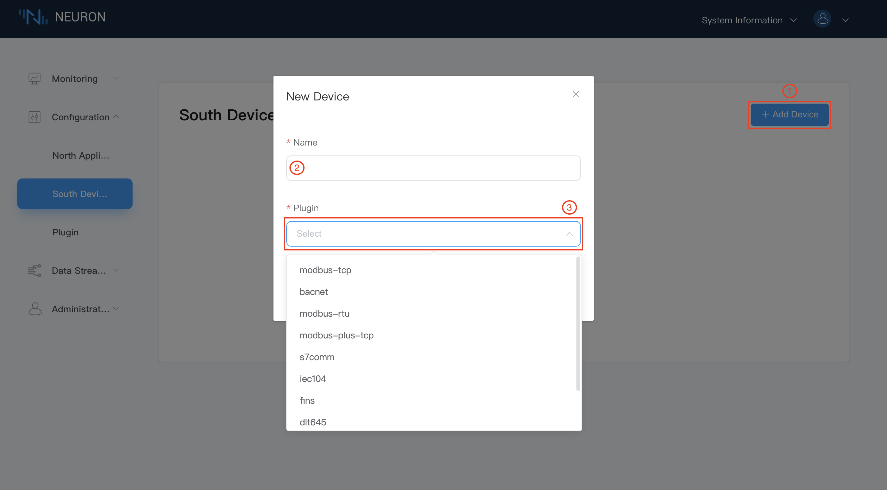
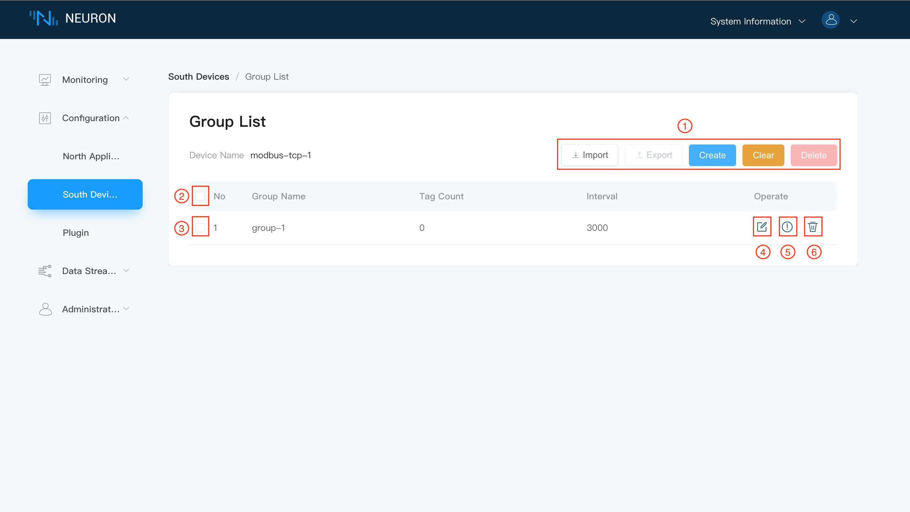
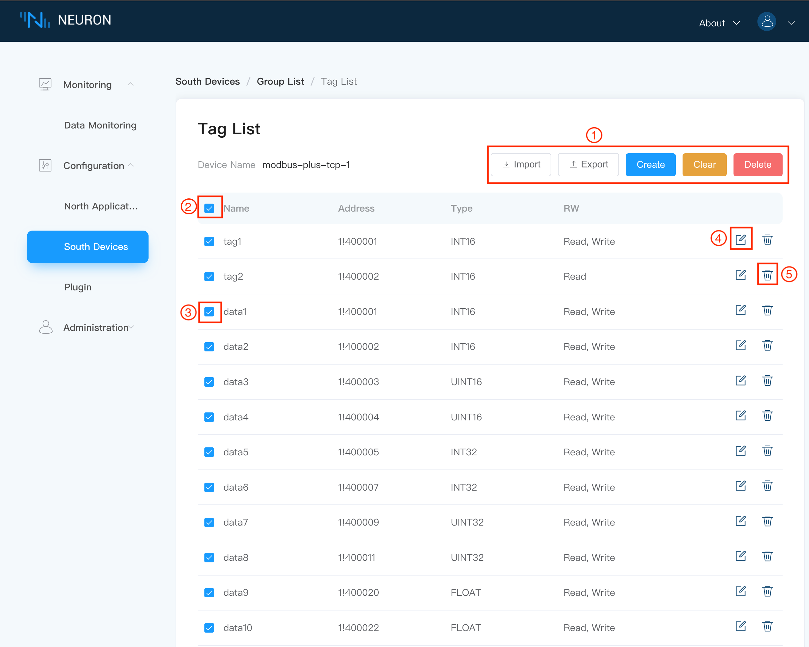
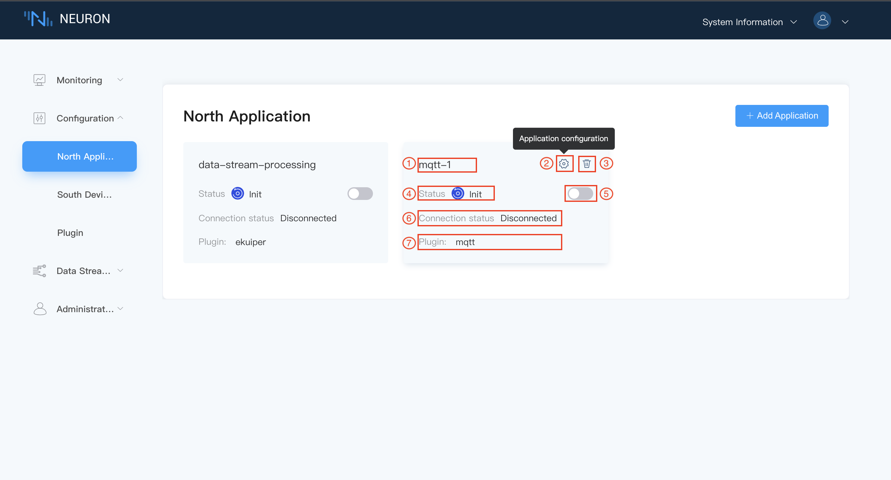
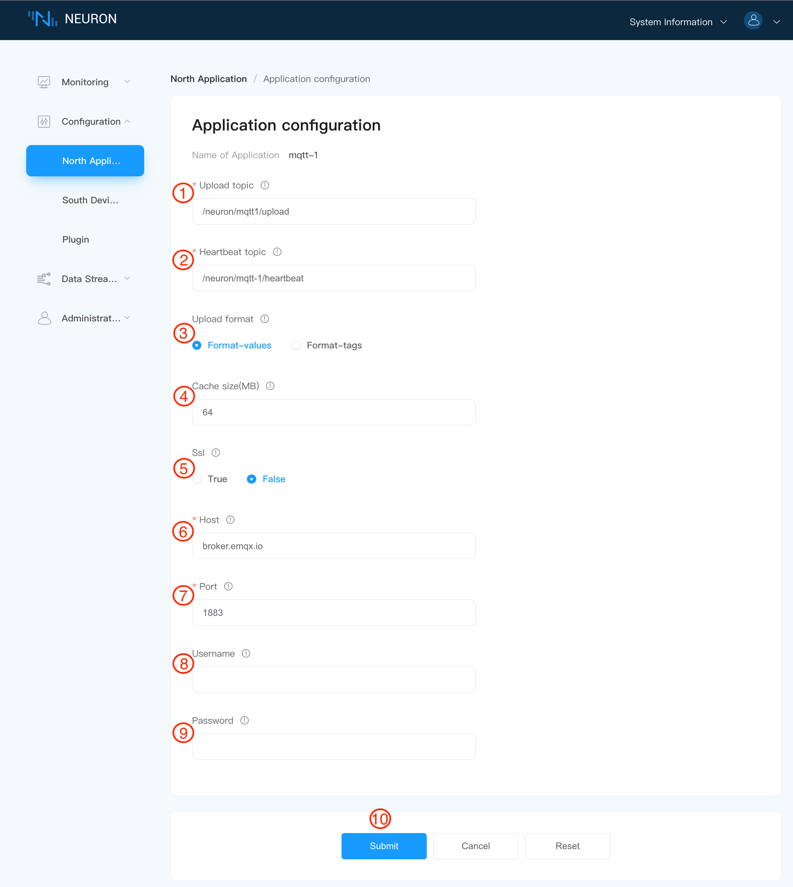
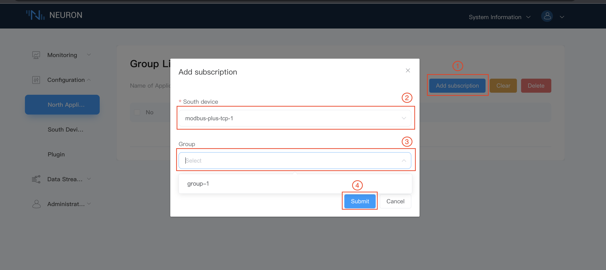
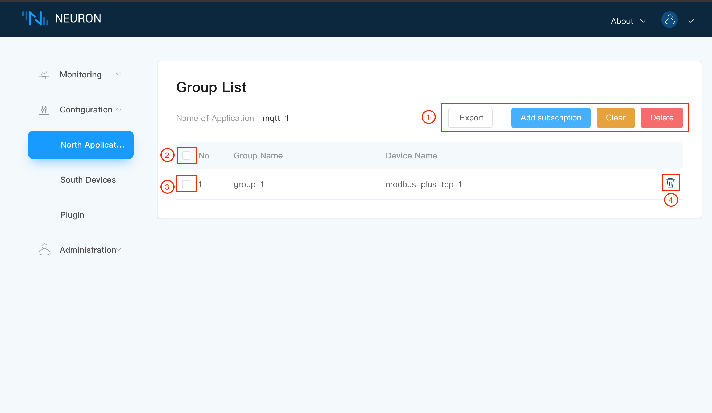

# Quick Start

## Environment setup

### Package Installation

The environment used in this example is Ubuntu 20.04.3, armv71.

1. Download the installation package
Neuron packages can be downloaded from the Neuron website [https://neugates.io/downloads](https://neugates.io/downloads).

2. Unzip the installation package
Unzip the package into any directory (e.g. /home/Neuron) and enter the command：

```bash
sudo dpkg -i neuron-2.1.0-linux-armhf.deb
```

::: tip
After successful installation of the deb package, Neuron is automatically started.
:::

### Neuron operation

#### Checking Neuron Status

```bash
sudo systemctl status neuron
```

#### Stop Neuron

```bash
sudo systemctl stop neuron
```

#### Restart Neuron

```bash
sudo systemctl restart neuron
```

### Running EMQX in Docker

We need to deploy an MQTT Broker to do the connection processing of messages, here we recommend using EMQX. Again EMQX can be installed and used quickly using a Docker container.The latest version can be obtained from the [EMQX](https://www.emqx.com/en/try?product=broker).

1. Get the Docker image

```bash
docker pull emqx/emqx:4.4.3
```

2. Start the Docker container

```bash
docker run -d --name emqx -p 1883:1883 -p 8081:8081 -p 8083:8083 -p 8084:8084 -p 8883:8883 -p 18083:18083 emqx/emqx:4.4.3
```

### Install Modbus Simulator

Install PeakHMI Slave Simulator, download the software from the [PeakHMI official website](https://hmisys.com).
After installation, open the Modbus TCP slave.

::: tip
Disable the firewall on Windows, otherwise the Neuron may not be able to connect to the simulator.
:::

## Run for the First Time

When the installation environment is ready, open a web browser and enter the address and port number where you are running Neuron to get into the administration console page, the default port number is 7000, e.g [http://127.0.0.1:7000](http://127.0.0.1:7000)。

### Step 1 Login

The first screen is the login page, where users can login using their username and password as shown below.


To login to dashboard control panel,

1. Fill in default username `admin`.
2. Fill in default password `0000`.
3. Click on the `Login` button.

### Step 2 Add southbound plugin modules for device drivers

Click on `Southbound Device` in the `Configuration` menu to show the Southbound Device Management screen, where no devices have been found in this case, we now create a Modbus TCP device, as shown below.



To add a new southbound device,

1. Click on the `Add Device` button at top right corner to show New Device dialog box.
2. Fill in the device name, e.g. modbus-tcp-1.
3. Click on the drop-down box, which shows all the southbound driver protocols available for this software version, in this case we choose modbus-tcp plugin module.
4. Click on `Create` button to create the device.

::: tip
You suppose to install a valid trail or commercial license to select the plugin modules other than modbus-tcp. Only modbus-tcp is open source plugin module in the list.
:::

### Step 3 Manage southbound device node list

After the device has been successfully created, the new device node information will appear in the southbound device screen, as shown below.


The device node contains the following information

1. Device Name - the unique name you give to the device.
2. Device Configuration Button - click on this button to show the device configuration screen.
3. Delete Button - click on this to remove this device from southbound device list.
4. Node Status - show the current status of device node, see below for details.
5. State Change Button - switch on to connect to device.
6. Connection Status - show connection status to device.
7. Plugin Module Name - the name of plugin module used for this device.

There are five working status for each south device node.

* **Init**, the initial status for the first creation of southbound devices.
* **Setup**, when the configuration of device node is started, it goes to setup state.
* **Ready**, after successfully configuring the device node, it goes to ready state.
* **Running**, when the device node is started and is collecting data from device. it goes running state.
* **Stop**, when the device node is stopped or for reason it can't connect to device, it goes to stop state.

### Step 4 Setup southbound device parameters

Click on `Device Configuration Button` in device node to configure the southbound device parameters, as shown below.


Items with `*` are required, and each item is followed by a field description key. Hovering over on exclaimation mark will display a detailed description.

To setup southbound device parameters,

1. Fill in the Host IP of the machine on which the Modbus simulator is running.
2. Fill in the Port number of the Modbus simulator, the default is 502.
3. Fill in the request timeout, the default is 3000.
4. Fill in the connection mode, default is Client mode.
5. Click `Submit` to complete the device configuration.
6. Click on the `Status Change Button` switch in the device node to make the device node to **Running** state.

::: tip
The running Neuron instance and the simulator must be under the same network segment.
:::

### Step 5 Create groups for device node

Click on any blank space in the device node to enter the Group list management screen, where this time will show an empty list. as shown below.


To create a group for device node,

1. Click on the `Create` at the top right corner to show up `Create Group` dialog box.
2. Fill in the Group name, e.g. group-1.
3. Fill in the Interval, set the time interval for the neuron to collect data from the device and upload the data to MQTT. The minimum can be set to 100ms, but when there is a lot of collected data, if the data monitoring interface reports an error that the point value is invalid, you can adjust the value a bit higher to fix the error.
4. Click on the `Submit` button to complete the creation of the Group.

### Step 6 Manage group list

The newly created Group will be shown in the Group list, as shown below.



The Group List contains following elements,

1. `Clear` button, delete all created groups with one click. When you select some groups, and then click the `Delete` button, you can quickly delete the selected groups in batches. `Cretae` button is used to create a new group.
2. Select all groups in the list
3. Select this group in the list
4. `View icon` View the group configuration
5. `Tag List icon` Create data tags for this group.
6. `Delete icon` Delete this group.

### Step 7 Add data tags into group

Click on the `Tag List icon` at the end of a group row to show up the tags configuration list screen, as shown below.


 At this point we can either create tags manually by clicking on the `Create` button, or import a bulk list of tags in a Excel sheet by clicking on the `Import` button.

 `Export` button is also available for exporting those data tags details into an Excel file. `Clear` button is used to delete all data tags in the list. `Delete` button will remove the selected tags in the list.

### Step 8 Setup data tag details

Clicking the `Create icon`,  data tags details setup screen will be shown as below.In the example, we will describe the manual way of adding tags.


All data tags will be manually added one by one to show you how to setup the tag details. However, all data tags could be inputted in Excel sheet first and then import to the group.

To create a tag for the group list,

1. Fill in the Tag name, e.g. tag1.
2. Fill in the driver address, e.g. 1!400001; for detailed instructions on how to use the driver address, please refer to the [driver instructions](../module-plugins/module-driver.md).
3. Select the Tag type, e.g. Read, Write.
4. Select the data type, e.g. int16.
5. Click on the `Add` button to add next tag, repeat 1 - 4 until the last tag added.
6. Optionally delete a tag.
7. Click the `Create` button to complete the Tag creation.

::: tip
A new tag can be created by using the `Add` button, where a `Delete` button will appear next to the information box after the tag is successfully created.
:::

### Step 9 Manage data tags of group

After all tags creation are complete, tag list will be shown as below.



* `Import` button, batch configuration tag information in Excel form;
* `Export` button to output the created tag information in Excel form;
* `Clear` button, delete all tags with one click;
* `Delete` button, when selecting all, click the `Delete` button, the effect is equivalent to `Clear`, which can delete all tags. When selecting some tags, click the `delete` button to quickly delete the selected tags in batches;
* Each tag contains name, address, type, read/write properties, description, button to `edit` tag information and `delete` button.

### Step 10 Check over the data in monitoring screen

Click on `Data Monitoring` in the `Monitoring` menu to show the data monitoring screen, where you can find those tags created and its data value as shown below.


To switch between data group for monitoring,

1. Select the southbound device you want to view from the drop down box, in this case, select modbus-tcp-1 which has been created above.
2. Click on the drop down box to select the Group you want to view under the selected southbound device, in this case, select group-1 which has been created above.
3. When the selection is complete, the page will show the value of each Tag read under the Group.

::: tip
If you find data value is a non-sense large number, you can adjust the byte order settings in simulator. The default byte order for the Modbus TCP simulator is BE 3,4,1,2
:::

### Step 11 Make change to simulator data tag value

By setting the value of the register in the simulator, check whether the value displayed by the data monitoring is consistent with the value in the simulator, as shown below.


### Step 12 Input device control value in dashboard

When the tag is set with the write attribute, the tag of the data monitoring interface will have a write operation. Click `Write` to realize the reverse control device, as shown below.


To perform dashboard data write operation,

1. Click on `Write` button at the end of the tag which is going to change value.
2. Choose whether to enter the value in hexadecimal.
3. Enter the new value for the tag.
4. Click on `Submit` button to submit new value.

::: tip
The tag in the device must be the writable.
:::

### Step 13 Add northbound plugin modules for application

Click on `Northbound Application` in the `Configuration` menu to show the Northbound Application Management screen. There will be a default data stream application node, now you can add more manually, in this case we will create an mqtt application node, as shown below.


To add MQTT cloud connection module,

1. Click on the `Add Application` button in the top right hand corner.
2. Fill in the name of the application, for example, mqtt-1.
3. The drop-down box shows the northbound applications available for this software version, in this case we choose the mqtt plugin.

### Step 14 Manage northbound application node list

After the application node has been successfully created, an new application node will appear in the northbound application management screen, as shown below.



The device node contains the following information

1. Application Name - the unique name you give to the application.
2. Application Configuration Button - click on this button to show the application configuration screen.
3. Delete Button - click on this to remove this application from northbound application list.
4. Node Status - show the current status of application node, see below for details.
5. State Change Button - switch on to connect to application.
6. Connection Status - show connection status to application.
7. Plugin Module Name - the name of plugin module used for this application.

There are five working status for each northbound application node.

* **Init**, the initial status for the first creation of northbound applications.
* **Setup**, when the configuration of application node is started, it goes to setup state.
* **Ready**, after successfully configuring the application node, it goes to ready state.
* **Running**, when the application node is started and is sending data to cloud. it goes running state.
* **Stop**, when the applicaiton node is stopped or for reason it can't connect to cloud, it goes to stop state.

### Step 15 Setup northbound application parameters

Click on the `Application Configuration` button to enter the application configuration screen, as shown below.



Items with `*` are required, and each item is followed by a field description key. Hovering over it will display a detailed description.

To setup MQTT connection,

1. Fill in the Client Id of MQTT, which is also the name of northbound application node, e.g. mqtt1，please refer to the [MQTT Topics](../reference/mqtt-api.md).
2. Fill in the MQTT publish topic.
3. Select the upload format.
4. Set up SSL authentication option.
5. Fill in the hostname of MQTT Broker, where the default connection is to the emqx public broker.
6. Fill in the port number of the MQTT Broker.
7. Set up a username, which is optional.
8. Set up a password, which is optional.
9. Click on the `Submit` button to complete the configuration of the northbound application, and click the working status switch in the application card to make the application enter the **running** state.

### Step 16 Subscribe to southbound tag groups

Click any blank space of the application node to show the subscription group interface, as shown below.



To subscribe data group of southbound devices,

1. Click on the `Add subscription` button in the upper-right corner to add a subscription.
2. Click on the drop down box to select the southbound device, in this case, we select the modbus-tcp-1 device built above.
3. Select the Group you want to subscribe to in the drop-down box, in this case, we select the group-1 created above.
4. Click on `Submit` button to complete the subscription.

### Step 17 Manage subscribed group list

After the subscription is added successfully, all subscribed Groups will be displayed in the Group list, as shown below.



The Group list contains following components,

* `Clear` button to cancel all subscribed groups with one click.
* `Delete` button, when selecting all, click the `Delete` button, the effect is equivalent to `Clear`, which can cancel the subscription of all Groups. When you select some groups, and then click the `Delete` button, you can quickly cancel the subscription of the selected groups in batches.
* Each group contains Group name, device name and `Delete` button.

### Step 18 Check over the payload in MQTT broker

Once the subscription is completed, we can use the MQTT client (MQTTX is recommended here and can be downloaded from the official website [https://www.emqx.com/en/products/mqttx](https://www.emqx.com/en/products/mqttx) to connect to the EMQX broker to view the subscirbed topic's data, as shown below.


After successfully subscribed the topic, you can see that MQTTX can receive the data from Neuron.

* Open MQTTX to add a new connection, Fill in the correct name and the Host and Port of the EMQX broker you have just connected, and then start the connection.

* Add a new subscription, the default upload topic format is `neuron/{mqtt_clientid}/upload`, where {mqtt_clientid} is the `Client-id` configured in the northbound application node of MQTT, in this case, we fill in `mqtt1`.
