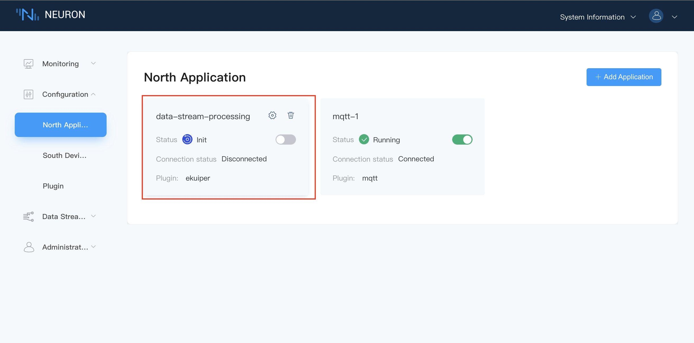
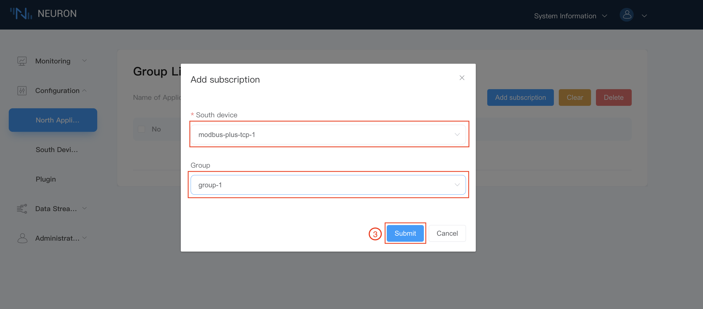
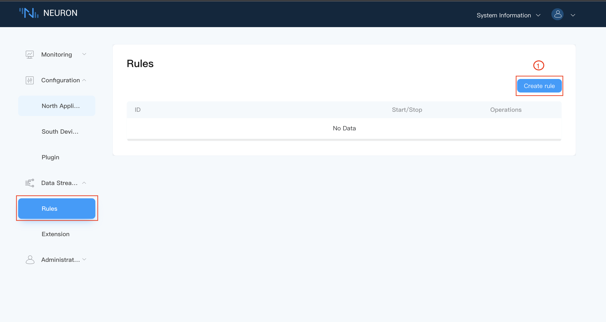
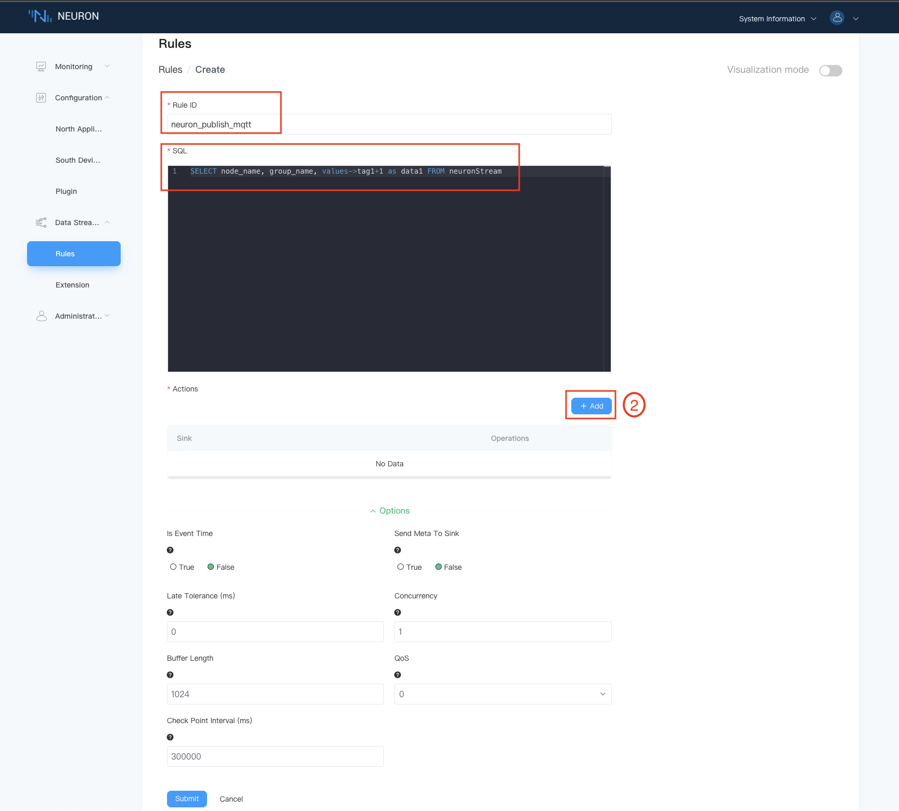
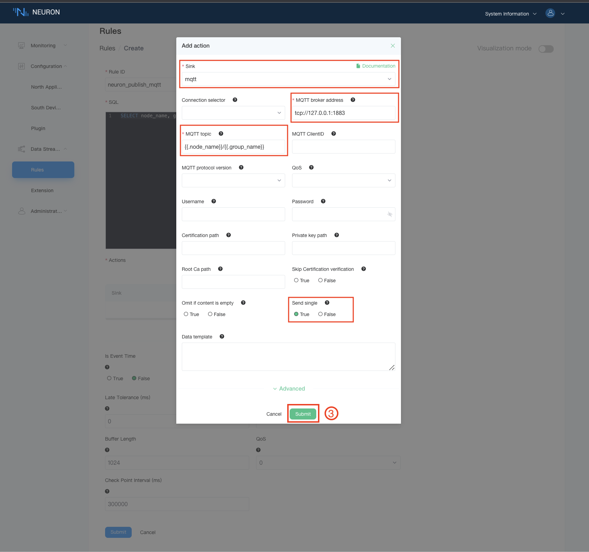
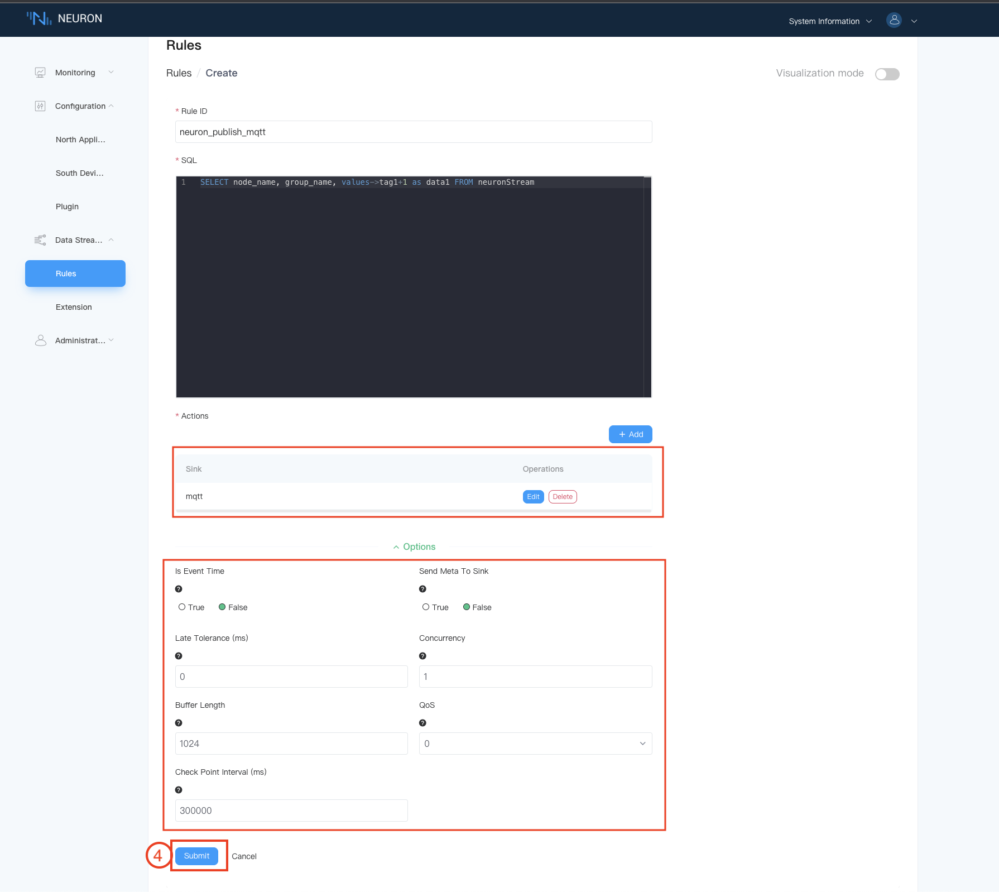
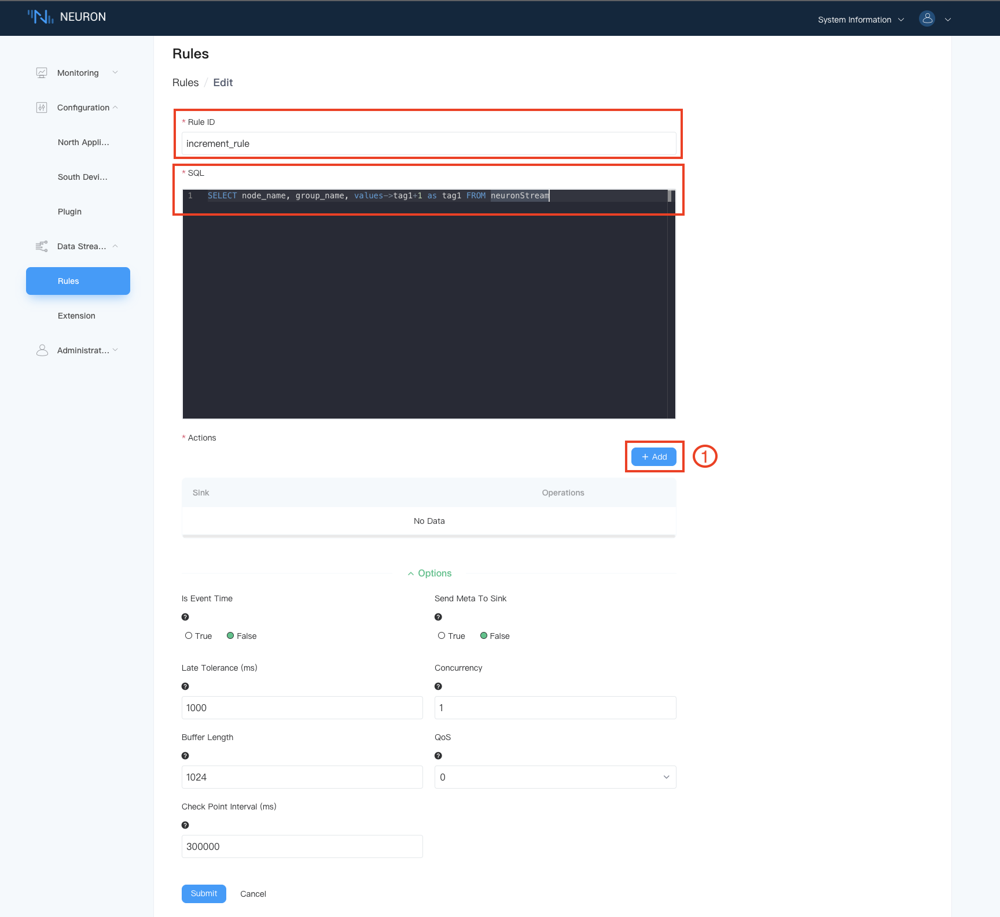
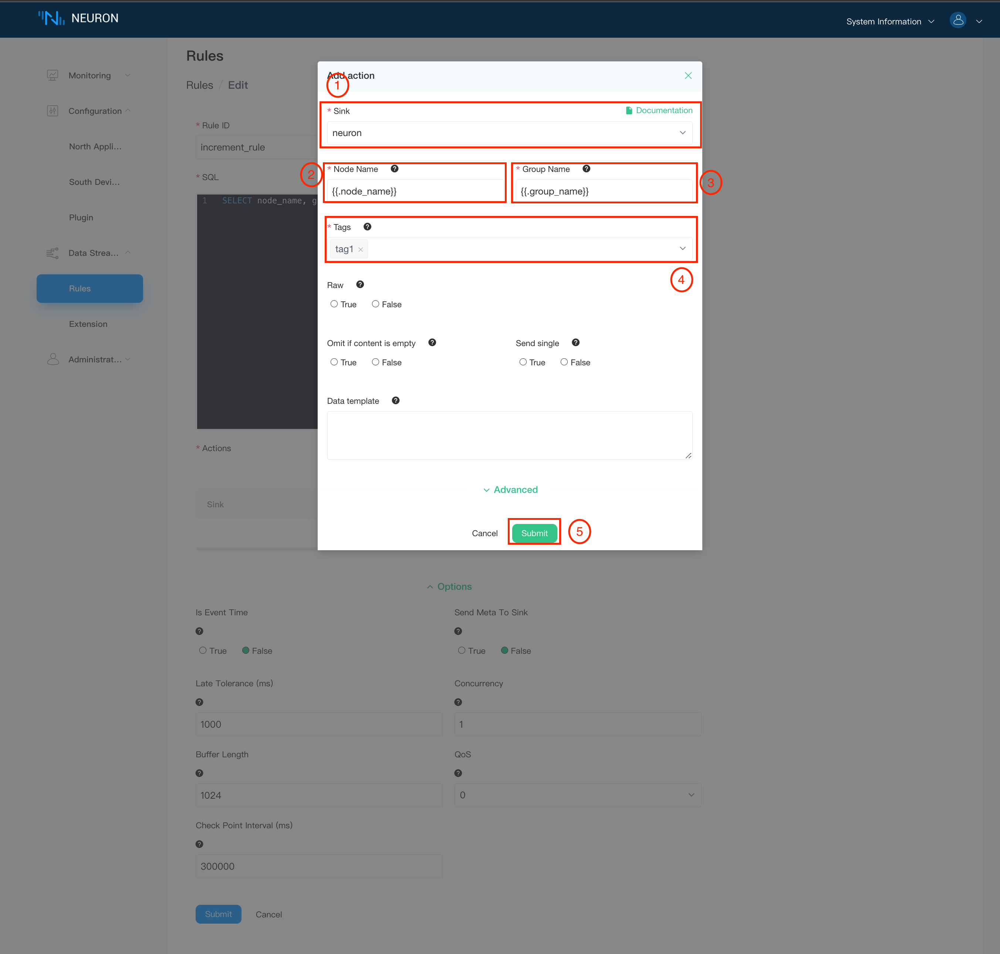
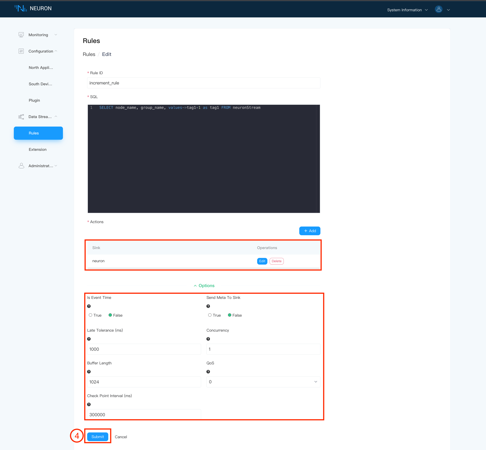
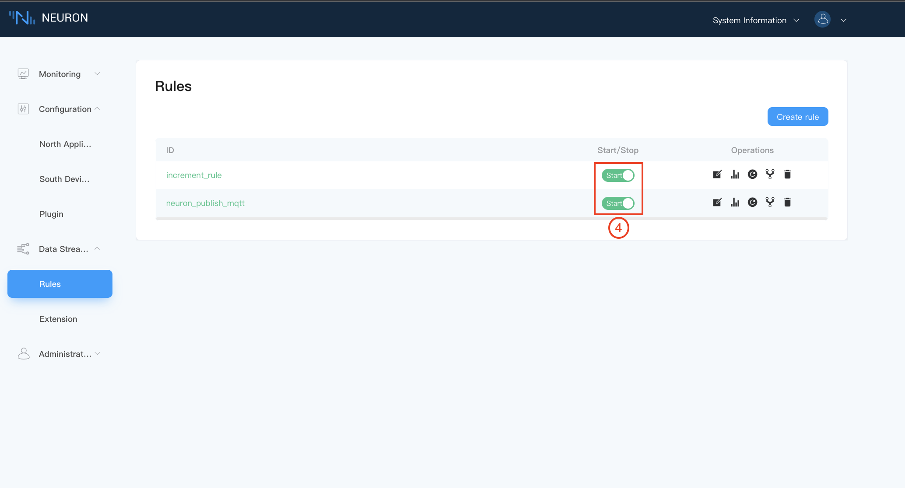

# Quick Start

## Environment setup

### Package Installation

The environment used in this example is Ubuntu 20.04.3, armv71.

1. Download the installation package
Neuron packages can be downloaded from the Neuron website [https://neugates.io/downloads](https://neugates.io/downloads).

2. Unzip the installation package
Unzip the package into any directory (e.g. /home/Neuron) and enter the command：

```bash
sudo dpkg -i neuron-2.1.0-linux-armhf.deb
```

::: tip
After successful installation of the deb package, Neuron is automatically started.
:::

### Neuron operation

#### Checking Neuron Status

```bash
sudo systemctl status neuron
```

#### Stop Neuron

```bash
sudo systemctl stop neuron
```

#### Restart Neuron

```bash
sudo systemctl restart neuron
```

### Running EMQX in Docker

We need to deploy an MQTT Broker to do the connection processing of messages, here we recommend using EMQX. Again EMQX can be installed and used quickly using a Docker container.The latest version can be obtained from the [EMQX](https://www.emqx.com/en/try?product=broker).

1. Get the Docker image

```bash
docker pull emqx/emqx:4.4.3
```

2. Start the Docker container

```bash
docker run -d --name emqx -p 1883:1883 -p 8081:8081 -p 8083:8083 -p 8084:8084 -p 8883:8883 -p 18083:18083 emqx/emqx:4.4.3
```

### Install Modbus Simulator

Install PeakHMI Slave Simulator, download the software from the [PeakHMI official website](https://hmisys.com).
After installation, open the Modbus TCP slave.

::: tip
Disable the firewall on Windows, otherwise the Neuron may not be able to connect to the simulator.
:::

## Run for the First Time

When the installation environment is ready, open a web browser and enter the address and port number where you are running Neuron to get into the administration console page, the default port number is 7000, e.g [http://127.0.0.1:7000](http://127.0.0.1:7000)。

### 1.Login

The first screen is the login page, where users can login with their initial username and password (initial username: admin, initial password: 0000) as shown below.


### 2.License

Neuron cannot read/write/upload data either without a valid license or with an expired license, you need to apply for a valid license from our website <http://neugate.io> and upload it through the license screen.

::: tip
In the commercial version, there is a default license that expires on 22/07/2022, after this date, please apply for a new license and update it through the interface.
:::

1. Select License from the `About` drop down box in the top right hand corner of the page.

2. You have to upload license from our website [http://neugate.io](http://neugate.io) for free trail license, or you may contact our sales representatives for official license, after receiving the license file, click on the `Upload` button to upload the license as shown below.


3. Go the License screen, which displays the license information.If the license has expired, you have to re-apply and click on the `Reupload` button to upload the license as shown below.


### 3.South Configuration

Select `Southbound Device Management` in the `Configuration` menu to go to the Southbound Device Management screen, where no devices have been shown in this case, we now create Modbus TCP devices.

**Step 1**, Add south devices.

1. Add the device manually by clicking on the `Add device` button.
2. Fill in the device name, e.g. modbus-plus-tcp-1;
3. Click on the drop-down box, which shows all the southbound driver protocols available for this software version, in this case we choose modbus-plus-tcp plugin, as shown below.


After the device has been successfully created, the new device information box will appear in the southbound device management screen, at this time the device is at the initialisation state and the connection state is at the disconnection state, as shown in the figure below.


**Step 2**, Set up equipment configuration.

Click on `Device Configuration` in the above diagram to configure the device, as shown below, with `*` are required fields, each followed by a field description key, mouse over it, will display detailed description information.

1. Fill in the Host IP of the machine on which the Modbus simulator is running.
2. Fill in the Port number of the Modbus simulator, the default is 502.
3. Fill in the request timeout, the default is 3000.
4. Fill in the connection mode, default is Client mode.
5. Click `Submit` to complete the device configuration and the device status will change to **Ready**.

::: warning
The running Neuron instance and the simulator must be under the same network segment.
:::


**Step 3**, Set up Group.

Click on device node box to enter the Group list management screen, and click on the `Create` button, as shown in the figure below.

1. Fill in the Group name, e.g. group-1.
2. Fill in the Interval, set the time interval for reading data from the device and reporting data, the value should be greater than 100, we set it to 100.
3. Click on the `Submit` button to complete the creation of the Group.


The Group list will show the newly created group, as shown below.


**Step 4**, Set up tags of Group.

Click on the `Tag list` icon at the end row to go to the Tag list screen, as shown below. At this point we can either create tags manually by clicking on the `Create` button, or import a bulk list of tags in a Excel sheet by clicking on the `Import` button, in the example, we will describe the manual way of adding tags.


After going into the Tag List screen:

1. Fill in the Tag name, e.g. tag1. 2. fill in the driver address, e.g. 1!400001.
2. Fill in the driver address, e.g. 1!400001; for detailed instructions on how to use the driver address, please refer to the [driver instructions](../module-plugins/module-driver.md).
3. Select the Tag type, e.g. Read, Write.
4. Select the data type, e.g., int16.
5. Click the `Create` button to complete the Tag creation.

::: tip
A new tag can be created by using the `Add` button, where a `Delete` button will appear next to the information box after the Tag is successfully created.
:::


Once created, the screen below has shown.


Click on `Southbound device management` and tap on the operating status switch in the device node to turn the device into a **running** state.

**Step 5**, Data monitoring.

Under the `Monitoring` menu select `Data Monitoring` to enter the data monitoring screen as shown below.

1. Select the southbound device you want to view from the drop down box, in this case, select modbus-plus-tcp-1 which has been created above.
2. Click on the drop down box to select the Group you want to view under the selected southbound device, in this case, select group-1 which has been created above.
3. When the selection is complete, the page will show the value of each Tag read under the Group.

::: tip
The default byte order for the Modbus TCP simulator is BE 3,4,1,2
:::


Check over the data readings of each data tag in Data Monitoring screen by comparing with the simulator's relevant data registers.


::: tip
When a tag has a write attribute set, the tag in the Data Monitor screen will have a write action button at the end of row, click `Write` to write a new value to the tag as shown below.
:::


### 4.North Configuration

Select `Northbound Application Management` in the `Configuration` menu to enter the Northbound Application Management screen. There will be a default data stream application node, now you can add more manually, in this case we will create an mqtt application node.

**Step 1**, Add a northbound application node.

1. Click on the `Add Application` button in the top right hand corner.
2. Fill in the name of the application, for example, mqtt-1.
3. The drop-down box shows the northbound applications available for this software version, in this case we choose the mqtt plugin, as shown in the image below.


After the application node has been successfully created, an new application node will appear in the northbound application management screen, the running status of node is at the initial state and the connection is at disconnection state, as shown in the figure below.


**Step 2**, Set up application configuration.

Click on the `Application Configuration` button to enter the application configuration screen, as shown below, all fields with `*` indicators at the beginning are required fields, and short description icon at the end, when move mouse pointer over it.

1. Fill in the Client Id of MQTT, which is also the name of northbound application node, e.g. mqtt1，please refer to the [MQTT Topics](../mqtt.md).
2. Fill in the MQTT publish topic.
3. Select the upload format.
4. Set up SSL authentication option.
5. Fill in the hostname of MQTT Broker, where the default connection is to the emqx public broker.
6. Fill in the port number of the MQTT Broker.
7. Set up a username, which is optional.
8. Set up a password, which is optional.
9. Click on the `Submit` button to complete the configuration of the northbound application and the working status will change to **Ready**, the connection status should change to **Connected** if the application node is configured correctly.


**Step 3**, Subscribe Groups for MQTT node.

Click on Device node to go to the Group Subscription screen.

1. Click on the `Add subscription` button in the top right corner to add a subscription.
2. Click on the drop down box to select the southbound device, in this case, we select the modbus-plus-tcp-1 device built above.
3. Select the Group you want to subscribe to in the drop-down box, in this case, we select the group-1 created above.
4. Click on `Submit` button to complete the subscription.


A Group name will be shown as below.


Tap `Northbound Application Management` and switch on the working status in the application node to bring the application node into **running** state.

**Step 4**, View subscribed topic in MQTT client.

Once the subscription is completed, we can use the MQTT client (MQTTX is recommended here and can be downloaded from the official website [https://www.emqx.com/en/products/mqttx](https://www.emqx.com/en/products/mqttx) to connect to the EMQX broker to view the subscirbed topic's data, as shown below.

1. Open MQTTX to add a new connection, Fill in the correct name and the Host and Port of the EMQX broker you have just connected, and then start the connection.

2. Add a new subscription, the default upload topic format is `neuron/{mqtt_clientid}/upload`, where {mqtt_clientid} is the `Client-id` configured in the northbound application node of MQTT, in this case, we fill in `mqtt1`.

After successfully subscribed the topic, you can see that MQTTX can receive the data from Neuron, as shown in the following.


### 5.Data Stream Processing

There is a pre-defined a data stream named `neuronStream` with type attribute `neuron` in data stream engine. This data stream is all collected data from various southbound drivers. All rules would share this data stream. This section describes two rules of **data cleaning for cloud** and **device control**.

**Step 1**, Subscribe Groups for data stream node.

Click on `data-stream-processing` application node to go to the Group Subscription screen.



1. Click on the `Add subscription` button in the top right corner to add a subscription.
2. Click on the drop down box to select the southbound device, in this case, we select the modbus-plus-tcp-1 device built above.
3. Select the Group you want to subscribe to in the drop-down box, in this case, we select the group-1 created above.
4. Click on `Submit` button to complete the subscription.



**Step 2**, Add rules for cleaning data to the cloud

This rule implements +1 processing of the data collected by the neuron from the device, renames it to a meaningful name, and sends the result to the MQTT dynamic topic `${node_name}/${group_name}` in the cloud.



1. Click `New Rule` to create a new rule in the rule page.
2. Fill in the `Rule ID` and `SQL` statement.
3. Click on `Add` button to add sink action for the rule, you may add more than one sink action for each rule.
4. Click on `Submit` button to complete the rule definition.



::: v-pre
1. Fill in the name of sink action.
2. Fill in the MQTT broker address.
3. Fill in the MQTT topic, in this case, we have `{{.node_name}}/{{.group_name}}`.
4. Select the `True` for send single.
5. Click on `Submit` button to complete the sink action.
:::



The rule has shown as below



1. Start rule execution.


::: v-pre
1. Start MQTTX client, subscribe the topic `{{.node_name}}/{{.group_name}}`.
:::

::: tip
The node_name used in this example is **modbus-plus-tcp-1** and the group_name is **group-1**, that is, the subscription topic is modbus-plus-tcp-1/group-1.
:::


**Step 3**, Add rules for controlling devices

This rule implements +1 processing of the data collected by neuron from the device, and neuron writes the result back to the device. At this time, the tag attribute must be a write attribute, otherwise it cannot be written successfully.

1. Click `New Rule` to create a new rule in the rule page.
2. Fill in the `Rule ID` and `SQL` statement.
3. Click on `Add` button to add sink action for the rule, you may add more than one sink action for each rule.
4. Click on `Submit` button to complete the rule definition.



1. Fill in the name of sink action.
2. Fill in the node name.
3. Fill in the group name.
4. Fill in the tag name.
5. Click on `Submit` button to complete the sink action.



The rule has shown as below



1. Start rule execution.



1. Start neuron data monitoring, check data.
