# Quick Start

## Environment setup

### Package Installation

The environment used in this example is Ubuntu 20.04.3, armv71.

1. Download the installation package
Neuron packages can be downloaded from the Neuron website [https://neugates.io/downloads](https://neugates.io/downloads).

2. Unzip the installation package
Unzip the package into any directory (e.g. /home/Neuron) and enter the command：

```bash
$ sudo dpkg -i neuron-2.X.X-linux-armhf.deb
```

*Note*  After successful installation of the deb package, Neuron is automatically started.

### Neuron operation

#### Checking Neuron Status

```bash
$ sudo systemctl status neuron
```

#### Stop Neuron

```bash
$ sudo systemctl stop neuron
```

#### Restart Neuron

```bash
$ sudo systemctl restart neuron
```

### Running EMQX in Docker

We need to deploy an MQTT Broker to do the connection processing of messages, here we recommend using EMQX. Again EMQX can be installed and used quickly using a Docker container.The latest version can be obtained from the [EMQX](https://www.emqx.com/en/try?product=broker).

1. Get the Docker image

```bash
$ docker pull emqx/emqx:4.4.3
```

2. Start the Docker container

```bash
$ docker run -d --name emqx -p 1883:1883 -p 8081:8081 -p 8083:8083 -p 8084:8084 -p 8883:8883 -p 18083:18083 emqx/emqx:4.4.3
```

### Install Modbus Simulator

Install PeakHMI Slave Simulator, download the software from the [PeakHMI official website](https://hmisys.com).
After installation, open the Modbus TCP slave.

*Note:* Disable the firewall on Windows, otherwise the Neuron may not be able to connect to the simulator.

## Running And Use

When the environment and resources are ready, open a web browser and enter the gateway address and port number where you are running Neuron to get to the administration console page, the default port number is 7000, e.g [http://127.0.0.1:7000](http://127.0.0.1:7000)。

### 1.Login

The page opens to the login screen, where users can log in using their initial username and password (initial username: admin, initial password: 0000) as shown below.


### 2.License

Neuron cannot read/write/upload data without a valid license or when the license has expired, you need to apply for a valid license from our website http://neugate.io and upload it through the interface.

*Note* In the commercial version, there is a default license that expires on 22/07/2022, after this date, please apply for a new license and update it through the interface.

1. Select License from the `About` drop down box in the top right hand corner of the page.

2. Enter the License screen, which displays the default license information. After the license has expired, you will need to re-apply from website, we offer both free trial and official use, after receiving the license file, click on the `Reupload` button to upload the license as shown below.


### 3.South Configuration

Select `Southbound Device Management` in the `Configuration` menu to go to the Southbound Device Management screen, where no devices have been shown, in this case, we create Modbus TCP devices.

Step 1, Add south devices.

1. Add the device manually by clicking on the `Add device` button.
2. Fill in the device name, e.g. modbus-plus-tcp-1;
3. The drop-down box shows the southbound driver protocols available to us in this software version, in this case we choose modbus-plus-tcp plugin, as shown below.


After the device has been successfully created, a card of the just created device will appear in the southbound device management interface, at this time the device is in the initialisation state and the connection state is in the disconnection state, as shown in the figure below.

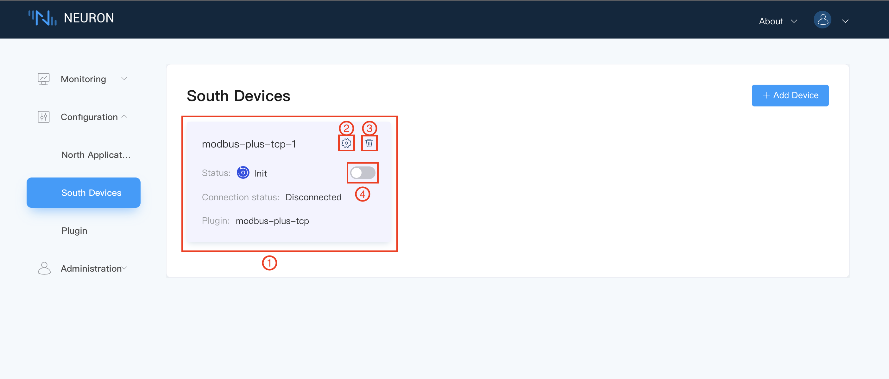
Step 2, Equipment Configuration.
Click on 2 (`Device Configuration`) in the above diagram to configure the device, as shown below, with `*` are required fields, each followed by a field description key, mouse over it, will display detailed description information.

1. Host: fill in the IP of the machine on which the Modbus simulator is running. 2.
2. Port: the port number of the Modbus simulator, the default is 502. 3.
3. Timeout: the request timeout, the default is 3000. 4.
4. Connection mode: the connection mode, default is Neuron as Client mode.
5. Click Submit to complete the device configuration and the device status will change to **Ready**.

*Note:* The running Neuron and the emulator must be under the same network segment.


Step 3, Set up the Group.
Click on any blank space in Device Card 1 in step 1 to enter the Group list management interface, and click on the `Create` button on the page, as shown in the figure below.

1. fill in the Group name, e.g. group-1.
2. fill in the Interval, set the time interval for reading data from the device and reporting data, the value should be greater than 100, we set it to 100 here.
3. Click `Submit` to complete the creation of the Group.

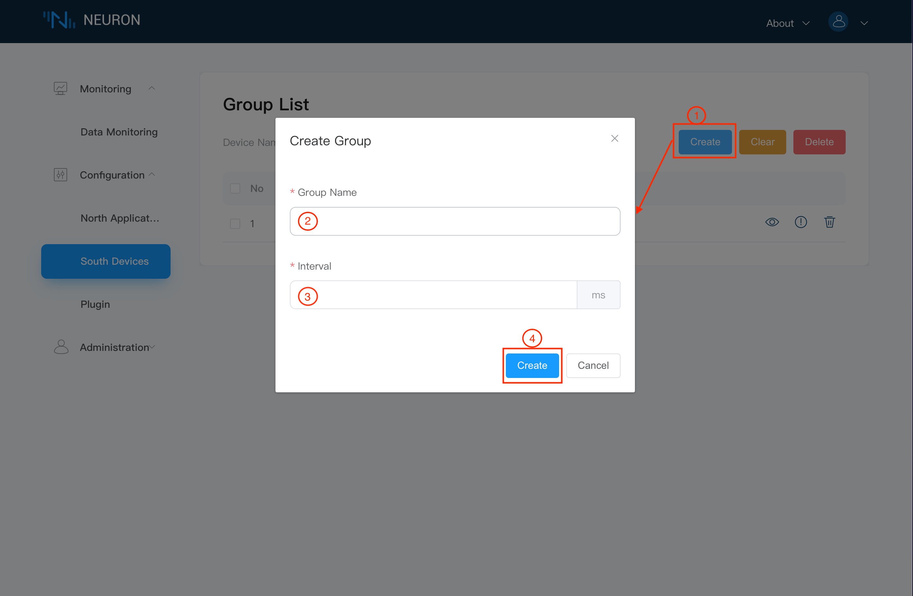

The Group list will show the newly created group, as shown below.


Step 4, Set up tags.
In the image above, click on 5 (`Tag list`) to go to the Tag list screen, as shown below. At this point we can either create tags manually by clicking on the `Create` button, or we can import tags in bulk using Excel by clicking on the `Import` button, in this example we will describe the manual way of adding tags.

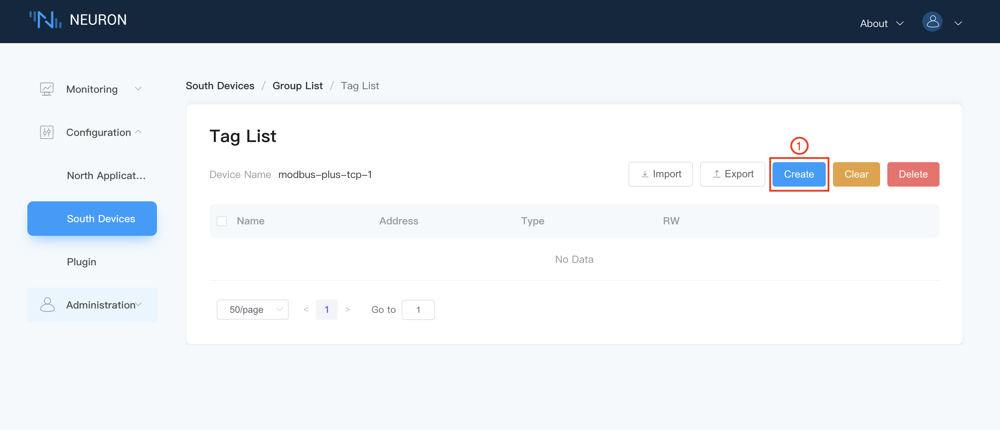

Click the `Create` button to go to the Create Tags page:

1. fill in the Tag name, e.g. tag1. 2. fill in the driver address, e.g. 1!400001.
2. fill in the driver address, e.g. 1!400001; for detailed instructions on how to use the driver address, please refer to the [driver instructions](../module-plugins/module-driver.md).
3. select the Tag type, e.g. Read, Write.
4. select the data type, e.g., int16.
5. click the `Create` button to complete the Tag creation.

Note: A new Tag can be created here by using the button at 6 (`Add`), where a `Delete` button will appear for each Tag to be deleted.

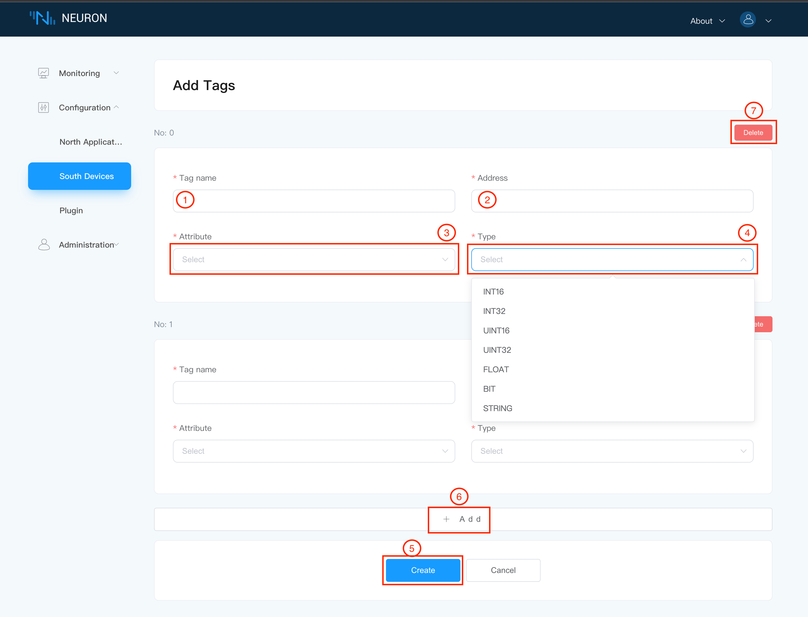

Once created, the image below shows.

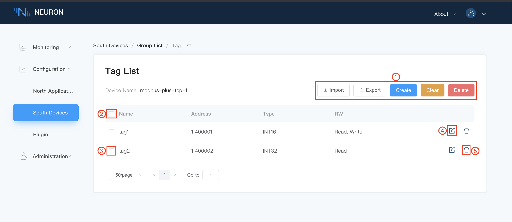

Click on `Southbound device management` and tap on the operating status switch in the device card to put the device into a **running** state.

*Note* that the modbus device is now in the unconnected state, the neuron will only connect to the modbus tcp device if there is a read data command, next go to the data monitoring screen to view the read data.

Step 5, Data monitoring.
Under the `Monitoring` menu select `Data Monitoring` to enter the data monitoring interface as shown below.

1. Select the southbound device you want to view from the drop down box, here select modbus-plus-tcp-1 which has been created above. 2;
2. drop down box to select the Group you want to view under the selected southbound device, here select group-1 which has been created above.
3. when the selection is complete, the page will show the value of each Tag read under the Group, which can be compared against the simulator.

*Note* the default byte order for the Modbus TCP simulator is BE 3,4,1,2

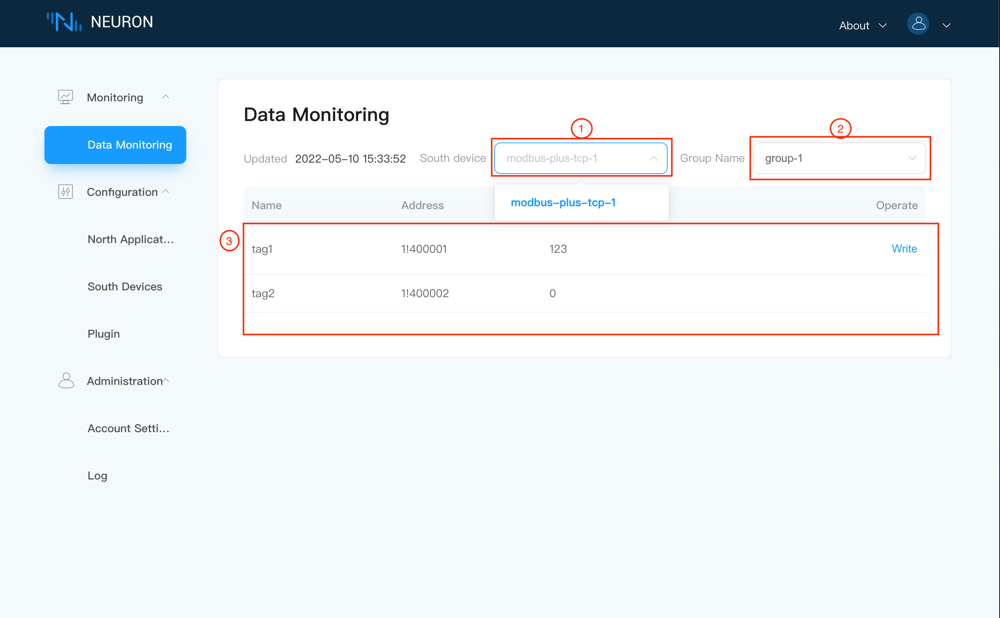


*Added* When a Tag has a write attribute set, the Tag in the Data Monitor screen will have a write action, click `Write` to rewrite the value of that Tag as shown below.

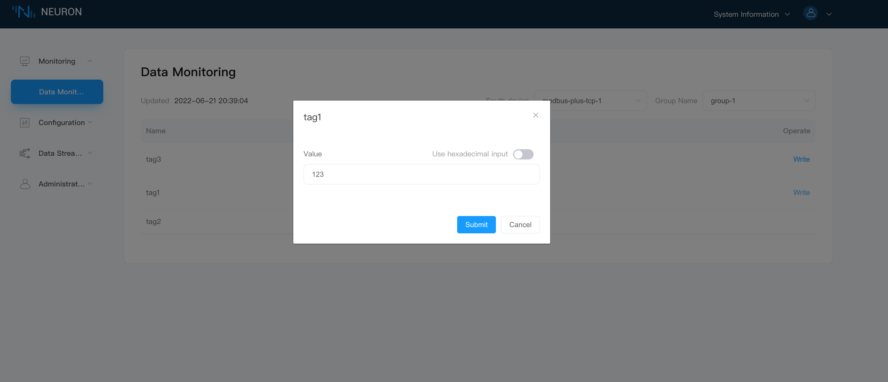

### 4.North Configuration

Select `Northbound Application Management` in the `Configuration` menu to enter the Northbound Application Management interface. No applications have been added at this point, so you will need to add them manually, in this case we will create an mqtt application.

Step 1: Add a northbound application.

1. click on the `Add Application` button in the top right hand corner.
2. fill in the name of the application, for example, mqtt-1.
3. The drop-down box shows the northbound applications available to us in this software version, in this case we choose the mqtt plugin, as shown in the image below.

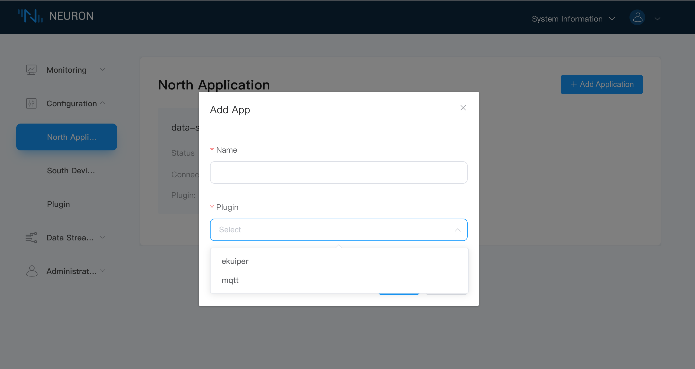

After the application has been successfully created, a card of the application just created will appear in the northbound application management interface, with the application working in the initialisation state and the connection state in the disconnection state, as shown in the figure below.

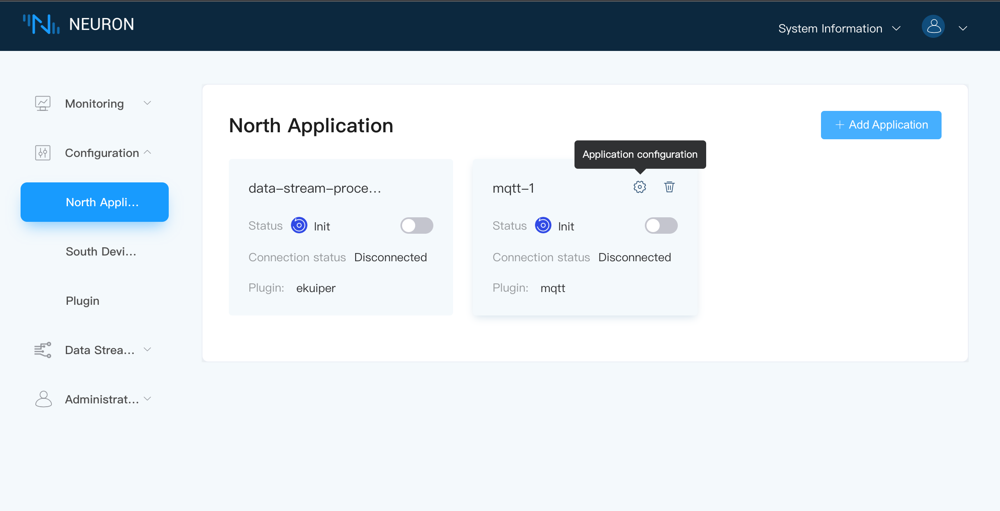

Step 2, Application Configuration.

In the above diagram, click on 1 (`Application Configuration`) to enter the application configuration interface, as shown below, with ` * ` are required fields, each followed by a field description key, mouse over it, it will display detailed description information.

1. client-id: applied to the subscription topic, used to distinguish the northbound application, e.g. mqtt1, see [MQTT Topics](../mqtt.md) for details of the subscription topic.
2. upload format: Neuron supports two formats for uploading data, default selection on this side.
3. whether or not to perform SSL authentication.
4. the deployed MQTT Broker, where the default connection is to the emqx public broker.
5. the port number of the deployed MQTT Broker.
6. an optional item, whether to set a username, where the default is none.
7. Optional field, whether to set a password, here the default is none.
8. Click `Submit` to complete the configuration of the northbound application and the working status will change to **Ready**, the connection status should change to Connected if the application is configured correctly.

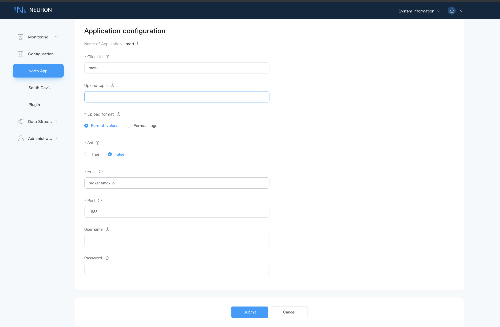

Step 3, Subscribe to group for MQTT.

Click on any blank space in Device Card 1 in step 1 to go to the Subscribe to Group screen, as shown below.

1. click on the `Add subscription' button in the top right corner to add a subscription.
2. drop down box to select the southbound device, here we select the modbus-plus-tcp-1 device built above.
3. select the Group you want to subscribe to in the drop-down box, here we select the group-1 created above.
4. click `Submit` to complete the subscription, as shown in the figure below.

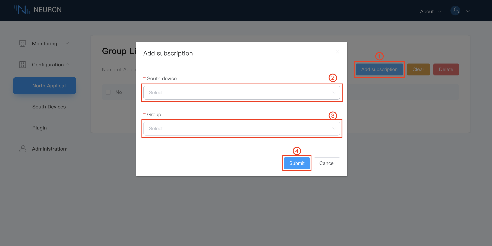

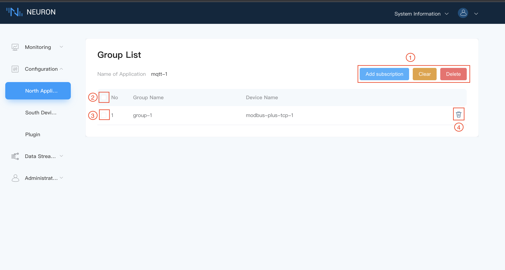

Tap `Northbound Application Management` and tap the working status switch in the application card to bring the application into **running** status.

Step 4, MQTT client view.

Once the subscription is complete, we can use the MQTT client (MQTTX is recommended here and can be downloaded from the official website [https://www.emqx.com/en/products/mqttx](https://www.emqx.com/en/products/mqttx) to connect to the just-deployed EMQX to view the reported data, as shown below.

1. Open MQTTX to add a new connection, fill in the correct name and the Host and Port of the EMQX Edge you have just deployed, and finish the connection;
2. add a new subscription, the default upload topic format is `neuron/{mqtt_clientid}/upload`, where {mqtt_clientid} is the `Client-id` configured in the Neuron interface in the northbound application, here we fill in the above set mqtt1.
After successful subscription, you can see that MQTTX can receive the data collected and reported by Neuron directly, as shown in the following figure.


Step 5, Subscribe to group for eKuiper.
