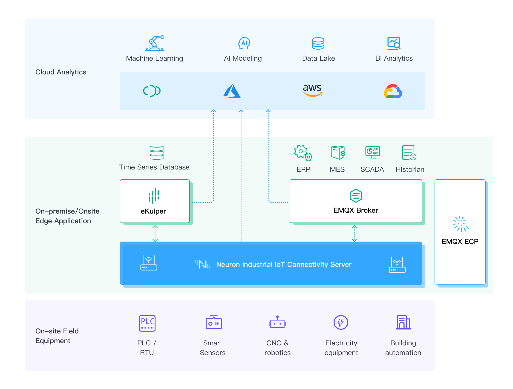

# Integrations

Neuron can integrate with various Cloud platform via MQTT and REST including EMQX Cloud, AWS, Google Cloud Platform and Microsoft Azure to seamlessly stream real-time industrial data directly into industrial application such as MES, ERP, Big data, analytic software and etc.

Neuron also provides an integrated SQL streaming processing rule engine eKuiper for data analysis to leverage the benefit of low-latency processing at the edge side. Output stream data can be stored in the timeseries database like influxdb at the edge side.

Neuron can be integrated with eKuiper to provide [edge processing](./ekuiper/ekuiper.md) capabilities.

Neuron can be integrated with EMQX to provide Industrial Communication with [Sparkplug support](./sparkplug/sparkplug.md).