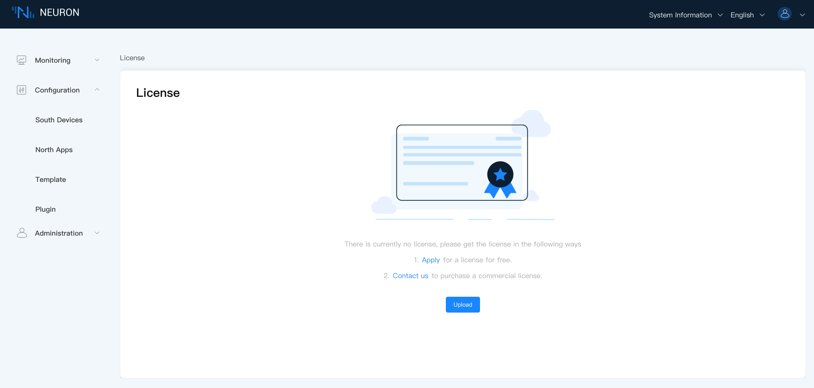

# License Policy

Neuron is an open-source project. We encourage our community to develop their own pluggable modules.

Core framework, dashboard, and a few plugin modules such as Modbus TCP, MQT, and eKuiper are open source under LGPLv3 license. Neuron may run with these open-source modules without an EMQ license. But all other commercial plugin modules require an official EMQ license to run without limitation. 

:::tip 30 Connections forever free

For these commercial modules, Neuron also provides a forever free quota (with 30 connections and 30 data tags) for your exploration. 

:::

## Apply for License

A trial EMQ license can be downloaded from our [official website](https://www.emqx.com/en/apply-licenses/neuron). All available modules could be used with a limitation of 100 connections and 1000 data tags for 15 days. If the trial EMQ license is expired, you can apply for the trial EMQ license via our official website again. Please note that each mailbox is limited to two trial license applications.

Of course, you can also directly [contact us](https://www.emqx.com/en/contact?product=neuron) to obtain the official license.

Each plugin module can be authorized independently in the EMQ license.

## Manage License

After applying for a trial or commercial license, you can manage or upload your license in Neuron. Simply log in and navigate to **System Information** -> **License**.

