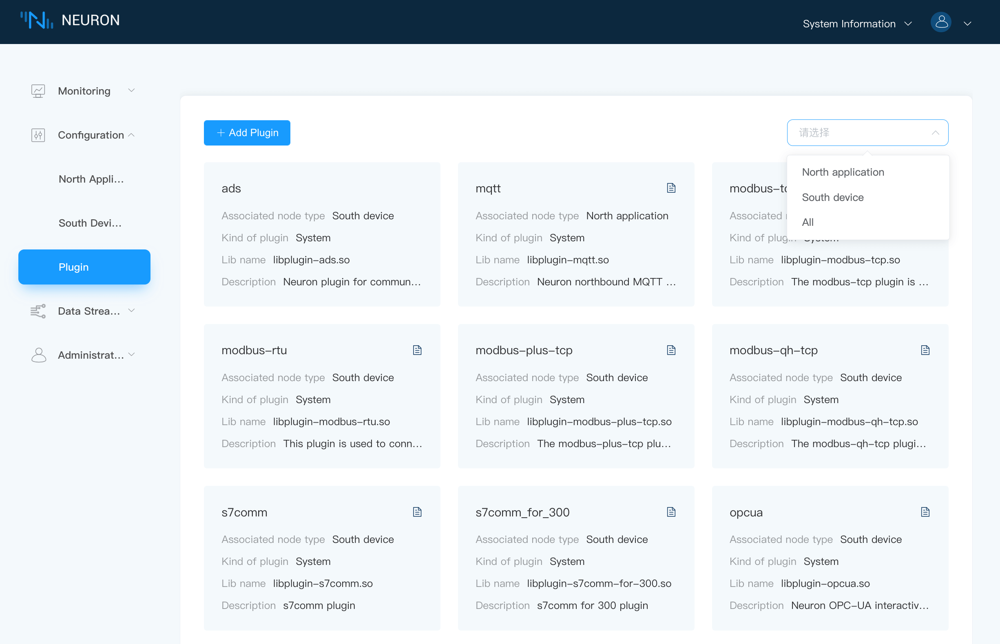
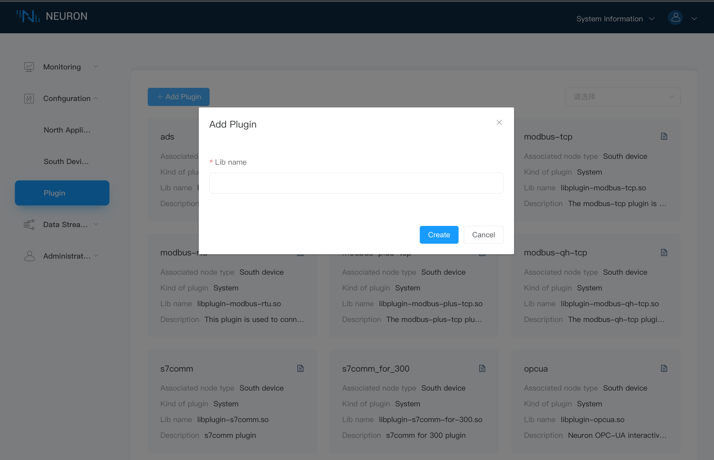

# Plugin List

## View All Available Plugins

The plugin management page displays all the pluggable modules available and detailed information, including the name of the plug-in, associated node type, plug-in category, driver library name and description, as shown in the following figure.

Click the `Document` button in the upper right corner of the plugin card to jump to the documentation for the specific use and description of the driver.

The plug-in types include the following 3 modes:

* Static: cannot be deleted
* System: cannot be deleted, native
* Custom: Deletable, user-developed or custom-developed

:::tip
Users can filter out the plugins for northbound applications or southbound devices from the dropdown box.
:::

## Add a New Pluggable Module

Click on the `Add Plugin` button in the upper right corner as shown below

To add a new Pluggable module,

* Fill in the path and file name of the .so file that needs to be added.
* Click on the `Create` button to move .so file to the build directory.

:::tip
Please make sure that the plugin .so file you have written is placed under the neuron/build/plugins directory before adding it. For specific plugin development tutorials, please refer to [SDK Tutorial](../../dev-guide/sdk-tutorial/sdk-tutorial.md).
:::

## Southbound Plugin Modules

### Global Standards

| Protocol Name           | Interface  | Type        | Available | Remark |
| ----------------------- | ---------- | ----------- | --------- | -------------------------------- |
| 
Modbus TCP
              | 
Ethernet
   | 
Open Source
 | 
Yes
       |  |
| 
Modbus RTU
              | 
Serial
     | 
Open Source
  | 
Yes
        |  |
| 
Modbus RTU over TCP
     | 
Ethernet
   | 
Open Source
  | 
Yes
       |  |
| 
OPC UA
                  | 
Ethernet
   | 
Commercial
  | 
Yes
       |  |
| 
CIP Ethernet/IP
         | 
Ethernet
   | 
Commercial
  | 
Yes
        | 
CIP – Common Industrial Protocol
  |

### PLC Drivers

| Protocol Name                                                | Interface | Type       | Available  | Remark                           |
| ------------------------------------------------------------ | --------- | ---------- | ---------- | -------------------------------- |
| 
Siemens 3964R/RK512
                                          | 
Serial
    | 
Commercial
 | 
V1.x only
  | 
For S5 and S7
 |
| 
Siemens Industrial Ethernet ISO for S7-200/300/400/1200/1500
 | 
Ethernet
  | 
Commercial
 | 
Yes
        | |
| 
Siemens Fetch Write for S7-300/400 and CP443 module
          | 
Ethernet
  | 
Commercial
 | 
Yes
  | |
| 
Allen-Bradley DF1 half-duplex
     | 
Serial
    | 
Commercial
 | 
Yes
  | 
For PLC2 and PLC5
                |
| 
Allen-Bradley CIP EtherNet/IP
     | 
Ethernet
    | 
Commercial
 | 
Yes
  | 
CIP – Common Industrial Protocol
                |
| 
Schneider PLC Modbus RTU
                                     | 
Serial
    | 
Commercial
 | 
V1.x only
  | |
| 
Schneider PLC Modbus TCP
                                     | 
Ethernet
  | 
Commercial
 | 
V1.x only
  | |
| 
Schneider Telemecanique UNI-TE
                               | 
Serial
    | 
Commercial
 | 
V1.x only
  | |
| 
ABB SattControl Comli
                                        | 
Serial
    | 
Commercial
 | 
Yes
  | |
| 
Omron Host Link
                                              | 
Serial
    | 
Commercial
 | 
V1.x only
  | 
For Single and Multiple connection
 |
| 
Omron FINS on Host Link
                                      | 
Serial
    | 
Commercial
 | 
V1.x only
  | |
| 
Omron FINS on TCP
                                            | 
Ethernet
  | 
Commercial
 | 
Yes
        | |
| 
Omron FINS on UDP
                                            | 
Ethernet
  | 
Commercial
 | 
Yes
        | |
| 
Mitsubishi MC Protocol for Q series and C24 module
           | 
Serial
    | 
Commercial
 | 
V1.x only
  | |
| 
Mitsubishi MC Protocol for Q series and E71 module
           | 
Ethernet
  | 
Commercial
 | 
Yes
        | 
3E frame
 |
| 
Mitsubishi FX Series
                                         | 
Serial
    | 
Commercial
 | 
V1.x only
  | |
| 
Mitsubishi FX3U-ENET-ADP
                                     | 
Ethernet
  | 
Commercial
 | 
Yes
         | 
1E frame
 |
| 
Mitsubishi 232ADP/485BD: Serial/RS485
                        | 
Serial
    | 
Commercial
 | 
No
         | |
| 
Panasonic FP series MEWTOCOL-COM
                             | 
Serial
    | 
Commercial
 | 
No
         | |
| 
Panasonic FP series MEWTOCOL-COM
                             | 
Ethernet
  | 
Commercial
 | 
Yes
         | |
| 
Panasonic FP series MEWTOCOL-DAT
                             | 
Ethernet
  | 
Commercial
 | 
No
         | |
| 
Beckhoff ADS/AMS TCPIP
                                       | 
Ethernet
  | 
Commercial
 | 
Yes
         | |
| 
Keyence CIP Ethernet/IP
                                      | 
Ethernet
  | 
Commercial
 | 
Yes
         | 
CIP – Common Industrial Protocol
 |
| 
Keyence MC Protocol
                                          | 
Ethernet
  | 
Commercial
 | 
Yes
         | 
Mitsubishi MC Protocol
 |
| 
Delta DVP communication protocol
                             | 
Serial
    | 
Commercial
 | 
No
         | |
| 
Delta Modbus TCP
                                             | 
Ethernet
  | 
Commercial
 | 
Yes
         | |
| 
Delta CIP Ethernet/IP
                                        | 
Ethernet
  | 
Commercial
 | 
Yes
         | 
CIP – Common Industrial Protocol
 |
| 
Fatek FACON serial
                                           | 
Serial
    | 
Commercial
 | 
No
         | |
| 
Fatek FACON ethernet
                                         | 
Ethernet
  | 
Commercial
 | 
No
         | |
| 
GE FANUC 90-30 SNPX
                                          | 
Serial
    | 
Commercial
 | 
No
         | |
| 
GE FANUC 90-30 Ethernet SRTP
                                 | 
Ethernet
  | 
Commercial
 | 
No
         | |

### Electricity

| Protocol Name       | Interface | Type       | Available | Remark     |
| ------------------- | --------- | ---------- | --------- | ---------- |
| 
DL/T645-1997
          | 
Serial
    | 
Commercial
 | 
Yes
       | 
Chinese standards for power meters
  |
| 
DL/T645-2007
          | 
Serial
    | 
Commercial
 | 
Yes
       | 
Chinese standards for power meters
  |
| 
IEC 60870-5-101
      | 
Serial
     | 
Commercial
  | 
No
         | |
| 
IEC 60870-5-102
      | 
Serial
     | 
Commercial
  | 
No
         | |
| 
IEC 60870-5-103
      | 
Serial
     | 
Commercial
  | 
No
         | |
| 
IEC 60870-5-104
      | 
Ethernet
  | 
Commercial
 | 
Yes
       | |
| 
IEC 61850
           | 
Ethernet
  | 
Commercial
 | 
Yes
        | |
| 
DNP3
                | 
Ethernet
  | 
Commercial
 | 
No
        | |

### Building Automation

| Protocol Name  | Interface  | Type       | Available | Remark |
| -------------- | ---------- | ---------- | --------- | --------- |
| 
KNXnet IP
      | 
Ethernet
   | 
Commercial
 | 
Yes
 |  |
| 
BACnet IP
      | 
Ethernet
   | 
Commercial
 | 
Yes
 |  |
| 
BACnet MS/TP
    | 
Serial
      | 
Commercial
  | 
No
  | 
 
 |
| 
LON
            | 
Ethernet
   | 
Commercial
 | 
No
 |  |

### CNC Machines & Robotics

| Protocol Name  | Interface  | Type       | Available | Remark |
| -------------- | ---------- | ---------- | --------- | ------ |
| 
MTConnect
      | 
Ethernet
    | 
Commercial
    | 
No
         | 
 
 |
| 
Fanuc 0i, 30i, 31i, 32i and 35i
      | 
Ethernet
    | 
Commercial
    | 
Yes
         | 
 
 |
| 
Mitsubishi M800/M80
      | 
Ethernet
    | 
Commercial
    | 
No
         | 
 
 |
| 
Siemens 840D、810、828D
      | 
Ethernet
    | 
Commercial
    | 
No
         | 
 
 |

## Northbound Plugin Modules

### Cloud Connectivity

| Protocol Name         | Type        | Available | Remark |
| --------------------- | ----------- | --------- | ------- |
| 
RESTful API
           | 
Open Source
  | 
Yes
       |  |
| 
MQTT
                   | 
Open Source
  | 
Yes
        | 
 
 |
| 
MQTT Sparkplug B
    | 
Commercial
  | 
Yes
       |  |
| 
Websocket
             | 
Commercial
  | 
Yes
        |  |

### Application

| Protocol Name         | Type        | Available | Remark |
| --------------------- | ----------- | --------- | ------- |
| 
eKuiper Stream Processing
    | 
Open Source
  | 
Yes
        | 
 
 |

## EMQ License Policy for Commercial Modules

Core framework, dashboard, and a few plugin modules such as Modbus TCP, MQT, and eKuiper are open source under LGPLv3 license. Neuron may run with these open-source modules without an EMQ license. But all other commercial plugin modules require an official EMQ license to run without limitation. 

:::tip 30 Connections forever free

For these commercial modules, Neuron also provides a forever free quota (with 30 connections and 30 data tags) for your exploration. 

Note: The Fanuc Focas Ethernet and Mitsubishi CNC plugins are not within the scope of the 30-point free-for-life offer. If you wish to try them out, you can directly [contact us](https://www.emqx.com/en/contact?product=neuron).

:::

## Apply for License

A trial EMQ license can be downloaded from our official website [https://www.emqx.com/en/apply-licenses/neuron](https://www.emqx.com/en/apply-licenses/neuron). All available modules could be used with a limitation of 100 connections and 1000 data tags for 15 days. If the trial EMQ license is expired, you can re-apply for the trial EMQ license via our official website again. However, a mailbox can only apply for a trial license up to two times.

* Each plugin module can be authorized independently in the EMQ license.
