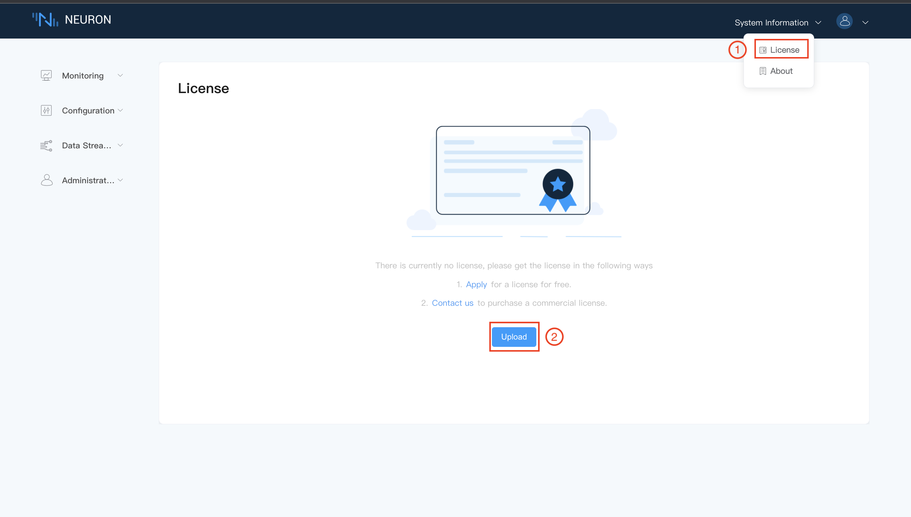

# Modules List

## Southbound Plugin Modules

### PLC Drivers

| Protocol Name                                                | Interface | Type       | Available  | Remark                           |
| ------------------------------------------------------------ | --------- | ---------- | ---------- | -------------------------------- |
| Allen-Bradley DF1 half-duplex for PLC2                       | Serial    | Commercial | V1.x only  | For PLC2 and PLC5                |
| Allen-Bradley CIP EtherNet/IP                                | Ethernet  | Commercial | No         | CIP – Common Industrial Protocol |
| Schneider PLC Modbus RTU                                     | Serial    | Commercial | V1.x only  | |
| Schneider PLC Modbus TCP                                     | Ethernet  | Commercial | V1.x only  | |
| Schneider Telemecanique UNI-TE                               | Serial    | Commercial | V1.x only  | |
| ABB SattControl Comli                                        | Serial    | Commercial | V1.x only  | |
| Omron Host Link                                              | Serial    | Commercial | V1.x only  | For Single and Multiple connection |
| Omron FINS on Host Link                                      | Serial    | Commercial | V1.x only  | |
| Omron FINS on TCP                                            | Ethernet  | Commercial | Yes        | |
| Siemens 3964R/RK512                                          | Serial    | Commercial | V1.x only  | For S5 and S7 |
| Siemens Fetch Write for S7-300/400 and CP443 module          | Ethernet  | Commercial | V1.x only  | |
| Siemens Industrial Ethernet ISO for S7-200/300/400/1200/1500 | Ethernet  | Commercial | Yes        | |
| Mitsubishi FX Series                                         | Serial    | Commercial | V1.x only  | |
| Mitsubishi 232ADP/485BD: Serial/RS485                        | Serial    | Commercial | No         | |
| Mitsubishi MC Protocol for Q series and C24 module           | Serial    | Commercial | V1.x only  | |
| Mitsubishi MC Protocol for Q series and E71 module           | Ethernet  | Commercial | Yes        | |
| Mitsubishi FX3U-ENET-ADP                                     | Ethernet  | Commercial | No         | For FX only |
| Panasonic FP series MEWTOCOL-COM                             | Serial    | Commercial | No         | |
| Panasonic FP series MEWTOCOL-COM                             | Ethernet  | Commercial | No         | |
| Panasonic FP series MEWTOCOL-DAT                             | Ethernet  | Commercial | No         | |
| Beckhoff ADS/AMS TCPIP                                       | Ethernet  | Commercial | No         | |
| Keyence CIP Ethernet/IP                                      | Ethernet  | Commercial | No         | CIP – Common Industrial Protocol |
| Keyence MC Protocol                                          | Ethernet  | Commercial | No         | Mitsubishi MC Protocol |
| Delta DVP communication protocol                             | Serial    | Commercial | No         | |
| Delta Modbus TCP                                             | Ethernet  | Commercial | No         | |
| Delta CIP Ethernet/IP                                        | Ethernet  | Commercial | No         | |
| Fatek FACON serial                                           | Serial    | Commercial | No         | |
| Fatek FACON ethernet                                         | Ethernet  | Commercial | No         | |
| GE FANUC 90-30 SNPX                                          | Serial    | Commercial | No         | |
| GE FANUC 90-30 Ethernet SRTP                                 | Ethernet  | Commercial | No         | |

### Global Standards

| Protocol Name           | Interface  | Type        | Available | Remark |
| ----------------------- | ---------- | ----------- | --------- | -------------------------------- |
| Modbus RTU              | Serial     | Commercial  | Yes       |  |
| Modbus RTU over TCP     | Ethernet   | Commercial  | Yes       |  |
| Modbus TCP              | Ethernet   | Open Source | Yes       |  |
| OPC UA                  | Ethernet   | Commercial  | Yes       |  |
| CIP Ethernet/IP         | Ethernet   | Commercial  | No        | CIP – Common Industrial Protocol |

### Electricity

| Protocol Name       | Interface | Type       | Available | Remark     |
| ------------------- | --------- | ---------- | --------- | ---------- |
| IEC 60870-5-101     | Serial    | Commercial | No        | |
| IEC 60870-5-104     | Ethernet  | Commercial | Yes       | |
| IEC 61850           | Ethernet  | Commercial | No        | |
| DNP3                | Ethernet  | Commercial | No        | |
| DL/T645-07          | Serial    | Commercial | Yes       | Chinese standards for power meters |

### Building Automation

| Protocol Name  | Interface  | Type       | Available |
| -------------- | ---------- | ---------- | --------- |
| BACnet MS/TP   | Serial     | Commercial | No |
| BACnet IP      | Ethernet   | Commercial | Yes |
| KNXnet IP      | Ethernet   | Commercial | Yes |
| LON            | Ethernet   | Commercial | No |

### CNC Machines & Robotics

| Protocol Name | Interface   | Type         | Available |
| ------------- | ----------- | ------------ | --------- |
| MTConnect     | Ethernet    | Commercial   | No        |

## Northbound Plugin Modules

### Cloud Connectivity

| Protocol Name         | Type        | Available |
| --------------------- | ----------- | --------- |
| MQTT                  | Open Source | Yes       |
| MQTT + Sparkplug B    | Commercial  | Yes       |
| Websocket             | Commercial  | No        |
| RESTful API           | Open Soure  | Yes       |

### Application

| Protocol Name                     | Type        | Available |
| --------------------------------- | ----------- | --------- |
| eKuiper Stream Processing Engine  | Open Source | Yes       |

## EMQ License for commercial modules

* EMQ License must be installed to run Neuron.

* A trial EMQ license can be download from website [https://www.emqx.com/zh/apply-licenses/neuron](https://www.emqx.com/zh/apply-licenses/neuron). All available modules could be used for 15 days without limitation.

* Core framework, and some plugin modules are open source under LGPLv3 license.

* Commercial plugin modules require an official EMQ license to run without time limitation.

* Each plugin module can be authorized independently in EMQ license file.
