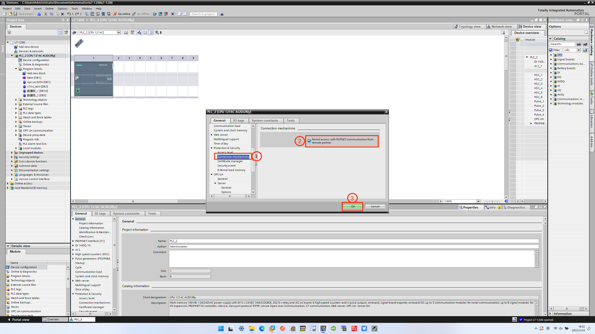

# Siemens S7-1200/1500 Setting

Software used: TIA Portal V16

## Software connection to PLC

First, the connection device settings should be made, as shown in the image below.

1. Under the device name, double-click `Device configuration`, and select **Ethernet addresses** in the **interface** directory.
2. Fill in the IP address of the network connected to the PLC correspondingly to complete the connection setting.

## Check slot and rack

Under the condition that the software is correctly connected to the device, on the `Device configuration` page, select **General** -> **Project information** to view the  rack number and slot number, as shown in the image below.

## PLC Setting

The following settings are also required when accessing an S7 1200/1500 PLC.

### First, to close the access to the optimization block

Right-click the DB block that you want to use, and select **Properties** in the pop-up dialog box, as shown in the image below.

In the dialog box that pops up, uncheck **Optimized block access**, as shown in the image below.

### Second, PLC security settings

Right-click the device name, and select **Properties** in the pop-up dialog box, as shown in the image below.

First, set the **Access level**, and set the read and write permissions according to your needs, as shown in the image below.

Then set **Connection mechanism**, check **Permit access with PUT/GET communication from remote partner**, as shown in the image below.

