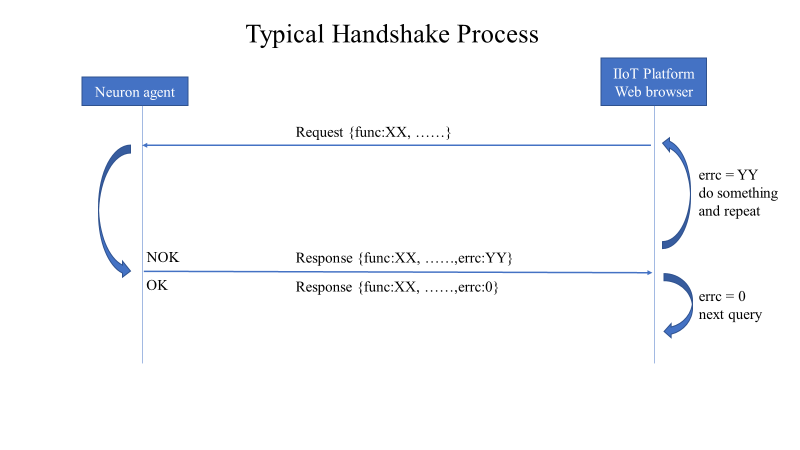
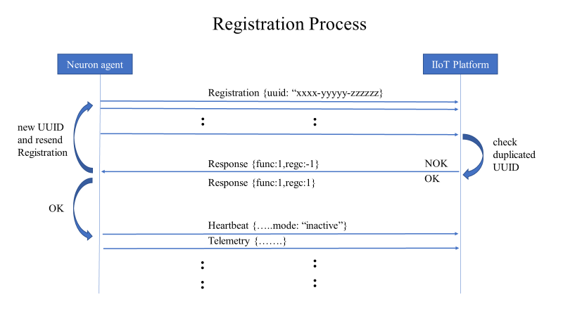
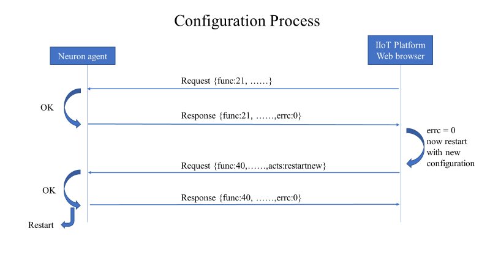
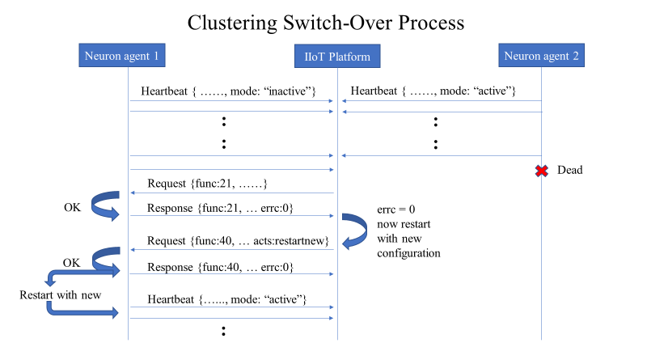
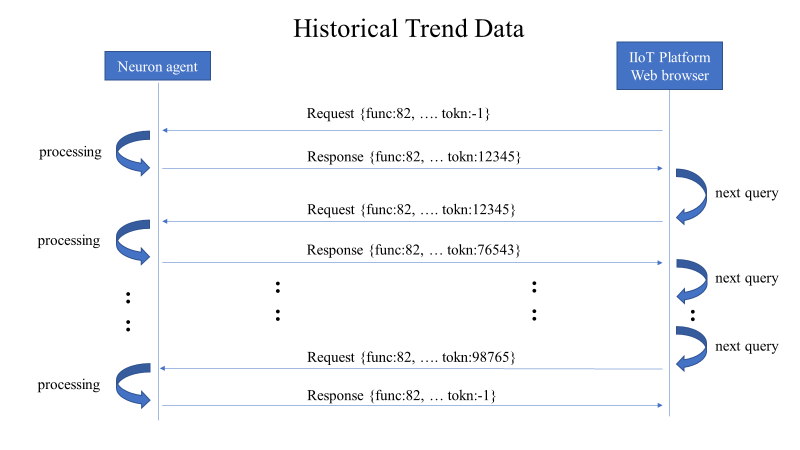
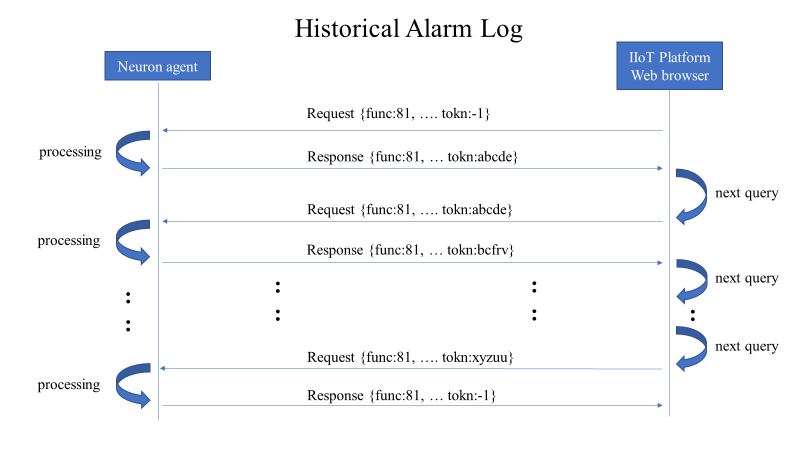
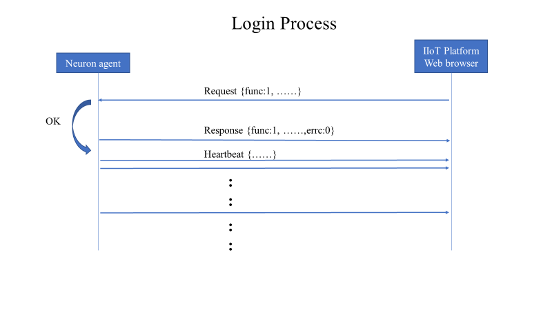

# Handshake Process

Handshake process is for Neuron and IIoT platform to send a series of
messages back and forth that make the data transmission to complete
safely. A typical client-server communication would be the base of the
handshake process. Neuron would act as server-side while IIoT platform
will perform client-side to initiate the communication. But there are
some special cases that would be discussed as below.

## Typical handshake

A typical handshake process is just a client-server communication
process. That is the client side (IIoT platform or web browsers)
initiate the communication by sending the request message to server side
(Neuron) who will send back the response after finishing the work as
request. The following functions use typical handshake for data exchange
with IIoT platform or web browsers.

- _Write Registers_

- _Mode Change_

- _Script Editing_

- _User Administration_

## Registration

Registration is the only handshake process that the role of
client-server has swapped. It is the Neuron to initiate the
communication by repeatedly sending the registration request to IIoT
platform until receiving the response message. If IIoT pass the
registration, Neuron begin to transmit Heartbeat to IIoT platform.
Registration process only happen in communication with IIoT platform.

## Configuration

Configuration process involve two consecutive communication functions.
First, IIoT platform or web browsers initiate a save configuration
function 21 request to Neuron who will checkup the configuration in the
request. If pass the checkup, it would save the configuration in the
local buffer temporary and send back success response to IIoT platform
or web browsers. Then, the second function 40 restarting with new
configuration will be sent to Neuron who perform new configuration
restart.

## Clustering

By taking advantages of this mode change, a group of Neuron can provide
clustering service. If hardware failure happens, IIoT platform can
reinitialize by sending function 21 and function 40 to the extra
inactive or standby Neuron to take over the work immediately. So,
Clustering process is to implement the Configuration process when the
hardware failure occurs.

## Historical Trend Data

A running Neuron would generate trend data stream that may be stored in
local device according to configuration setting. These stored trend data
could be read by IIoT platform or web browsers through the historical
trend function 82. Perhaps, there will be huge number of data to be
transmitted. Therefore, we need to truncate the whole data set into
several request / response message to complete the whole data set
transmission. A token will be used to synchronize the data set in
sequence. Initially, the token will be set to -1 at the IIoT platform or
web browsers. Neuron would return a positive number token which means
the data transmission is not yet completed. This token will be coped to
next request message. This mechanism will be repeated until the response
token is -1.

## Historical Alarm Log

As same as Historical Trend function, a running Neuron would generate a
lot of alarm message that will be stored in local device according to
alarm category settings. These stored alarm message could be retrieved
by IIoT platform or web browsers through the historical alarm function 81. Because of same reason as Historical Trend function, a token
mechanism will be employed during the consecutive message transmission.

## Login

Both IIoT platform and web browsers are required to login Neuron at the
beginning. By default, IIoT platform would login with high privilege
automatically when the connection has made. After the login pass, Neuron
then start the transmission of heartbeat and telemetry.

