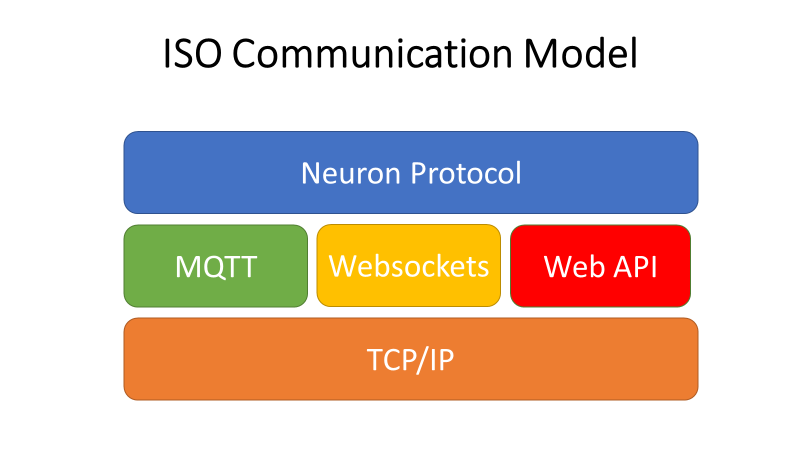

# ISO Model

Neuron protocol is a presentation layer protocol in ISO communication
model. Below it, there will be the Internet protocols such as HTTP, MQTT
and Websockets. TCP/IP would be the lowest layer protocol. So, this
document is a definition of data representation and format used for
communication between Neuron and IIoT platform. The format we use is
JSON schemes . Because it is widely used in Internet data transmission
and is easy for web/cloud application to extract the data from JSON
syntax.

