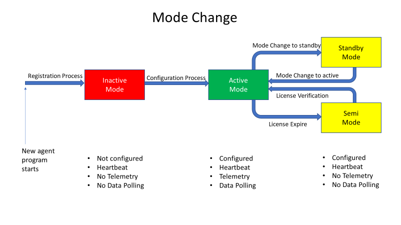

# System Mode Control

When you first time start a new copy of Neuron, it immediately undergoes
the registration process by sending the registration request to the IIoT
platform repeatedly until it gets back the response. If registration
pass, Neuron would enter Inactive mode running without any configuration
inside. At this moment, users can setup the configuration such as data
registers, alarms and event. After setup finished, Neuron need to
restart to enter the Active mode.

API service functions are mode dependent. That means some functions are
restricted to be called in specific mode. Moreover, heartbeat and
telemetry transmission are also mode dependent. Data polling would
perform in active mode only. Below there is table shows the availability
of various API services and transmission in different mode.

|                                            | Inactive | Active | Standby | Semi |
| ------------------------------------------ | -------- | ------ | ------- | ---- |
| Heartbeat Transmission                     | Yes      | Yes    | Yes     | Yes  |
| Telemetry Transmission                     | No       | Yes    | No      | Yes  |
| Device Data Polling                        | No       | Yes    | No      | No   |
| User Admin API func:10 to func:16          | Yes      | Yes    | Yes     | Yes  |
| Configuration API func:21 to func:23       | Yes      | Yes    | Yes     | Yes  |
| Scripts API func:30 to func:37             | No       | Yes    | Yes     | No   |
| Write Data to Device Service func:51       | No       | Yes    | No      | No   |
| Object Control API func:59 to func:60      | No       | Yes    | Yes     | No   |
| Gateway Control API func:70                | Yes      | Yes    | Yes     | Yes  |
| Gateway Control API func:72                | No       | Yes    | Yes     | Yes  |
| Gateway Information API func:73 to func:74 | No       | Yes    | Yes     | Yes  |
| Alarm & Event API func:79 to func:80       | No       | Yes    | Yes     | No   |
| Historical API func:81 to func:82          | No       | Yes    | Yes     | Yes  |
| License Update API                         | No       | Yes    | Yes     | Yes  |
