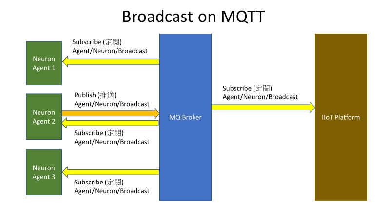

# Broadcast

Broadcast services allow a group of Neuron and IIoT platform to
broadcast the group message to each other. In fact, Neuron shows itself
existence in the group. In addition, there are also some license
information of sender in message.

**_MQTT Topics for Neuron_**

Subscribe: Neuron/Broadcast

Publish: Neuron/Broadcast

**_MQTT Topics for IIoT platform_**

Subscribe: Neuron/Broadcast

Publish: Neuron/Broadcast



**_Neuron broadcast syntax_**

```json
{

"func": 92,

"wtrm": "REGISTRY42",

"uuid": "16538d28-4592-11e9-a787-00e067109f12",

"wkey": 1,

"time": 27784718,

"data": 0.023928972,

"expd": 1609300740,

"natt": 20,

"nalr": 6

}
```

| Broadcast |                                |
| --------- | ------------------------------ |
| **func**  | Function code 92               |
| **wtrm**  | A water mark for broadcasting  |
| **uuid**  | UUID                           |
| **wkey**  | Master Neuron with license key |
| **time**  | Remain time                    |
| **data**  | Data usage                     |
| **expd**  | Expiration date                |
| **natt**  | No of attributes in use        |
| **nalr**  | No of alarms in use            |
