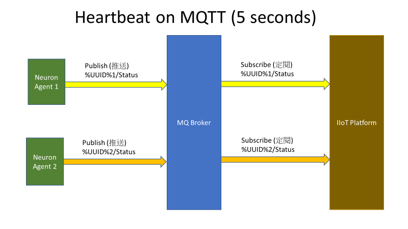
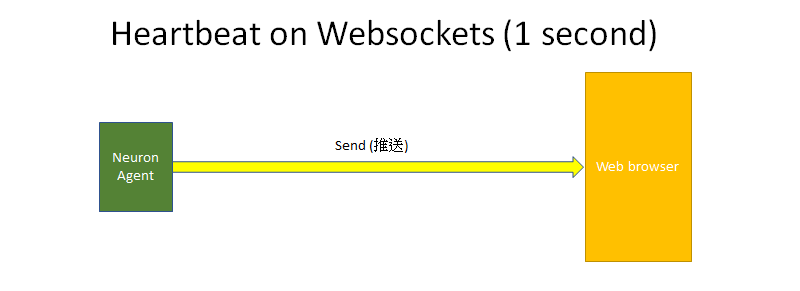

# Heartbeat

For each certain period, Neuron would send a heartbeat to the IIoT platform for aliveness. If IIoT platform can't
receive this heartbeat in certain time (e.g. 5 seconds), it may treat the Neuron as dead. In addition, heartbeat message
may contain some useful information such as alarm status, running mode, communication status and data usage.

**_MQTT Topics for Neuron_**

Publish: Neuron/Heartbeat/%UUID%

**_MQTT Topics for IIoT platform_**

Subscribe: Neuron/Heartbeat/%UUID%





**_Neuron heartbeat syntax_**

```json
{
  "tstp": 1581515618,
  "comm": "UP",
  "mach": "MANU",
  "mode": "ACTIVE",
  "mqcn": "MQCONNECT",
  "dalm": "NON-EXIST",
  "galm": "UNACKNOWLEDGE",
  "ngal": 4,
  "grow": [
    {
      "acat": "alarm",
      "astt": "OFF",
      "amod": "UNACKALARM",
      "atim": 1581513580,
      "alid": 1,
      "comt": "temp1@Temp (812) < low@Temp (800)"
    },
    {
      "acat": "alarm",
      "astt": "ON",
      "amod": "UNACKALARM",
      "atim": 1581515415,
      "alid": 3,
      "comt": "temp2@Temp (791) < low@Temp (800)"
    },
    {
      "acat": "critical",
      "astt": "ON",
      "amod": "UNACKALARM",
      "atim": 1581515415,
      "alid": 4,
      "comt": "temp3@Temp (864) > high@Temp (850)"
    },
    {
      "acat": "alarm",
      "astt": "OFF",
      "amod": "UNACKALARM",
      "atim": 1581513592,
      "alid": 5,
      "comt": "temp3@Temp (864) < low@Temp (800)"
    }
  ]
}
```

| Heartbeat |                                                       |
| --------- | ----------------------------------------------------- |
| **tstp**  | TimeStamp                                             |
| **comm**  | PLC or hardware communication status<br /> UP<br /> DOWN  |
| **mach**  | Machine Mode<br /> AUTO<br /> MANU<br /> SERV |
| **mode**  | Please refer to Status Mode section.<br /> Inactive Mode<br /> Standby Mode <br /> Semi-Standby Mode <br /> Active Mode<br /> Semi-Active Mode|
| **mqcn**  | MQ broker connection status<br /> MQCONNECT<br /> MQDISCONNECT|
| **dalm**  | Device Alarm which specify which device has <br /> communication problem.|
| **ndal**  | Number of device alarms                               |
| **drow**  | Device alarm rows                                     |
| **chnl**  | Channel number of devices                             |
| **addr**  | Address of devices                                    |
| **galm**  | General Alarm which user define their own alarms and <br />triggers|
| **ngal**  | Number of general alarms                              |
| **grow**  | General alarm rows                                    |
| **acat**  | Alarm Category <br /> critical <br /> alarm<br /> warning<br /> event<br /> view |                                       
| **astt**  | Alarm Status                                          <br /> ON                                                    <br /> OFF                                                   |
| **amod**  | Alarm Mode                                            <br /> UNACKALARM                                            <br /> DISABLE                                               |
| **atim**  | Alarm TimeStamp                                       |
| **alid**  | Alarm ID                                              <br /> must be copied this ID when user acknowledge function <br /> 80                                                    |
| **comt**  | Alarm Comments                                        |
