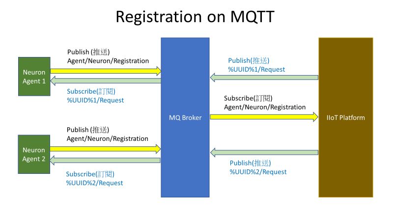

# Registration

Every Neuron has to present its identity UUID to IIoT platform for access grant. This is not a must operation process.
It is only for the IIoT platform which require UUID authentication to check over that its UUID is uniquely existence in
the registry. So, this process only available when IIoT platform support the registration process. Otherwise, IIoT
platform should skip this registration process.

**_MQTT Topics for Neuron_**

Subscribe: Neuron/Registry/%UUID%

Publish: Neuron/Broadcast

**_MQTT Topics for IIoT platform_**

Subscribe: Neuron/Broadcast

Publish: Neuron/Registry/%UUID%



**_Neuron request syntax_**

```json
{
  "srno": "SN010101200227",
  "host": "Instance 0",
  "uuid": "16538d28-4592-11e9-a787-00e067109f12",
  "modl": "ENT-x86_64-1-0101",
  "bver": "1.1.1",
  "pver": 1
}
```

**_IIoT Platform response syntax_**

```json
{
  "func": 1,
  "regr": 0
}
```

| Request  |                                                                                                                                |
| -------- | ------------------------------------------------------------------------------------------------------------------------------ |
| **srno** | Serial number                                                                                                                  |
| **host** | System hostname                                                                                                                |
| **uuid** | UUID                                                                                                                           |
| **modl** | Model number                                                                                                                   |
| **bver** | Software build version and date<br />First number -- major change<br />Second number -- minor change<br />Third number -- build date |
| **pver** | Protocol version                                                                                                               |

| Response |                                                      |
| -------- | ---------------------------------------------------- |
| **func** | Function code 1                                      |
| **regr** | Registry Return<br />-1 \-- not accept<br />0 \-- accept |
