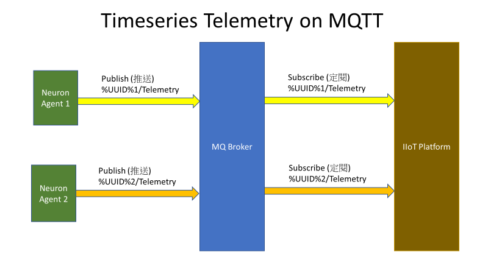
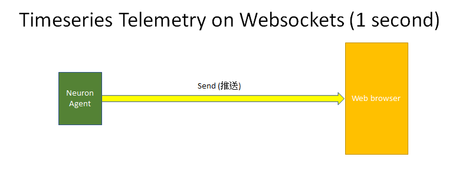

# Telemetry

Telemetry is where the time series data sending to IIoT platform in time series. Telemetry structure will depend on how
object and data tags are defined by users in the configuration. Basically, telemetry would contain timestamp in the
message.

**_MQTT Topics for Neuron_**

Publish: Neuron/Telemetry /%UUID%

**_MQTT Topics for IIoT platform_**

Subscribe: Neuron/Telemetry /%UUID%





**_Neuron telemetry syntax_**

```json
{
  "temperature@Tank_1": 81.2,
  "energy@Tank_1": 2181.8,
  "switch@Tank_1": 1,
  "buzzer@Tank_1": 0,
  "temperature@Tank_2": 79.1,
  "energy@Tank_2": 3176.2,
  "switch@Tank_2": 1,
  "buzzer@Tank_2": 0,
  "temperature@Tank_3": 86.4,
  "energy@Tank_3": 1146.3,
  "switch@Tank_3": 0,
  "buzzer@Tank_3": 1,
  "high@Temp": 85,
  "temp1@Temp": 81.2,
  "temp2@Temp": 79.1,
  "temp3@Temp": 86.4,
  "low@Temp": 80,
  "energy1@Energy": 2181.8,
  "energy2@Energy": 3176.2,
  "energy3@Energy": 1146.3
}
```

| Telemetry |                 |
| --------- | --------------- |
| **tele**  | Telemetry Array |
| **objn**  | Object Name     |
| **tstp**  | TimeStamp       |
