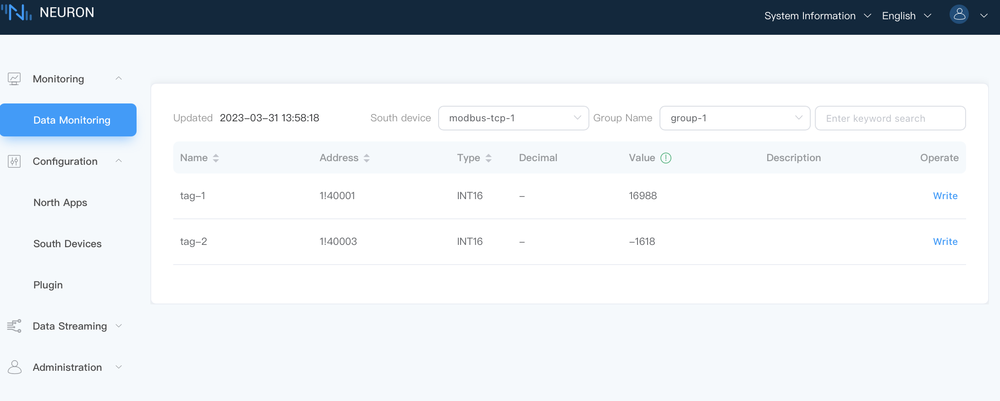

# Monitoring data

Select `Data Monitoring` under the `Monitoring` menu to enter the data monitoring interface to view the values read by the created tags, as shown in the figure below.

* Southbound device: select the southbound device you want to view, for example, select modbus-tcp-1;
* Group name: select the group under the selected southbound device, for example, select Group-1;
* Data monitoring displays values in groups, and the page will show the value of each tag read under the group.