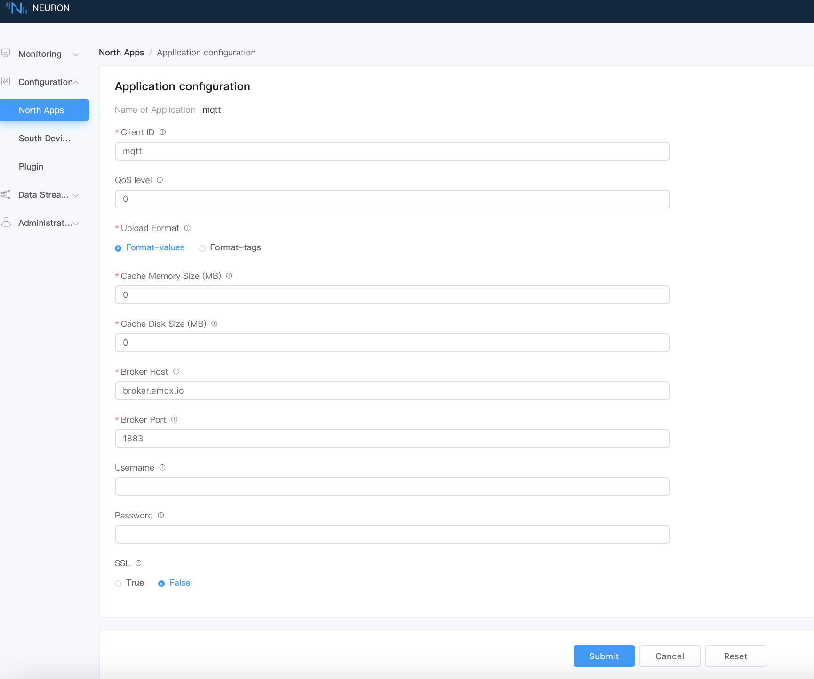

# Connect to MQTT

## Step 1, Add northbound MQTT plug-in node

Create northbound MQTT node, and upload the collected device data to MQTT Broker.

Select **North Apps -> Configuration** , and click `Add App` to add MQTT client node:

* Name: fill in the application name, for example, mqtt;
* Plugin: select the plugin of mqtt;

## Step 2, Setting parameters of MQTT client.

Configure the parameters required for MQTT client.

Click the `Application Configuration` icon on the application card to enter the application configuration interface to set MQTT connection, as shown in the figure below.

* Client-id:Client ID, note that each ID should be independent of each other and cannot be repeated. Use the default value of mqtt;
* Host:Use the default public EMQX Broker (broker.emqx.io);
* Port:Use MQTT broker port(1883);
* Click `Submit` to complete the configuration of northbound application, and the application card will automatically enter the working state of **Running**.

## Step 3, Subscribe to the group of tags.

The collected tags are uploaded to the cloud in groups. Subscribe to the tag group to upload.

Click MQTT node to enter the subscription group interface. Select the tag group and click `Add Subscription` to add a subscription:

* Southbound device: select the southbound device that you want to subscribe to, for example, modbus-tcp-1;
* Group: select a group from the southbound device, for example, group-1;

## Step 4, Check the data by MQTTX.

After the subscription is completed, you can use the MQTT client (MQTTX is recommended and can be downloaded from [official website](https://www.EMQX.com/zh/products/MQTTX)) to connect to the public emqx proxy to view the reported data, as shown in the following figure.

After subscribing to the corresponding topic in MQTTX, you can see that the data reported by Neuron can be continuously received in this topic.

* open MQTTX to add a new connection, correctly fill in the name and the Host and Port of the public EMQX Broker, and complete the connection;
* Add a new subscription, and the Topic should be consistent with the Upload topic in setting northbound application parameters, for example, fill in `/neuron/mqtt/upload`.

:::tip
The default topic format for uploading topic is `/neuron/{node_name}/upload`, where {node_name} is the name of the created northbound application. Users can also customize the reporting theme.
:::