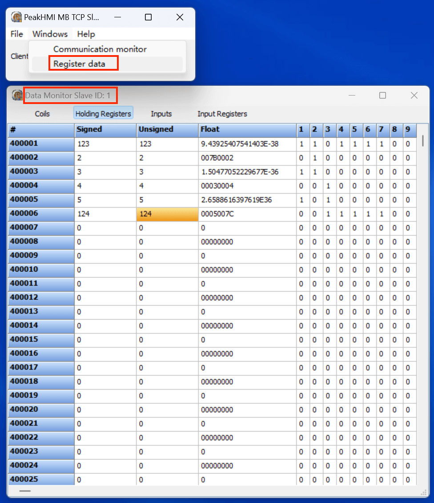
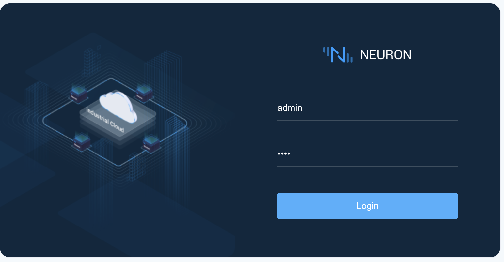
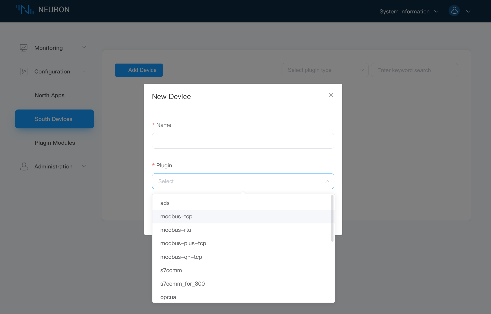
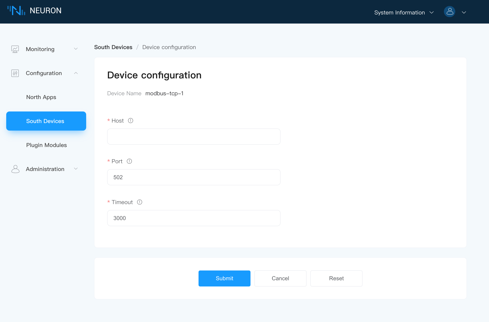
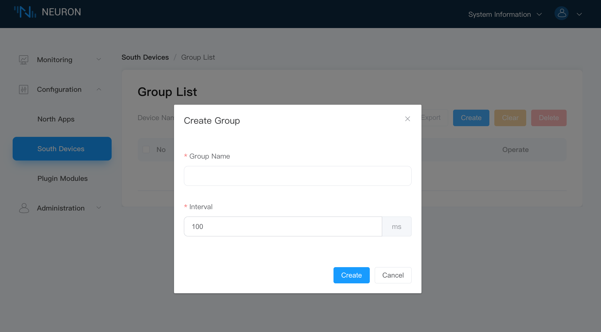
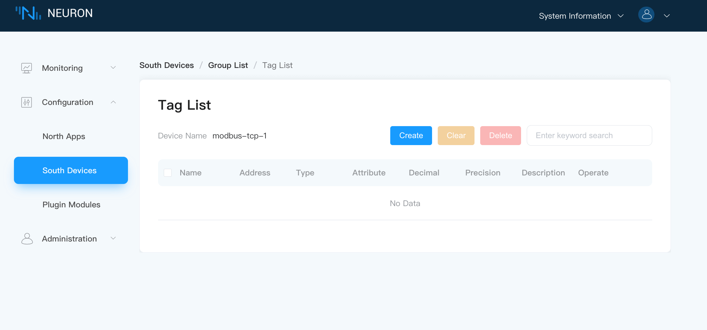
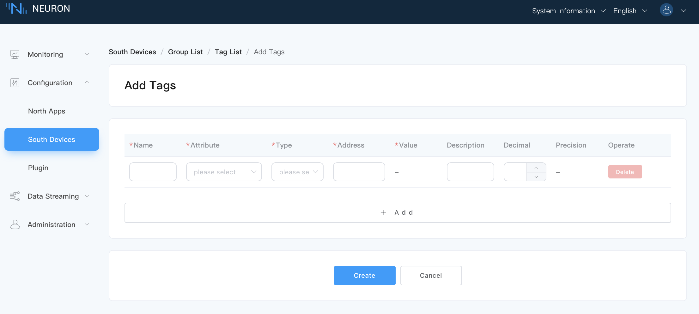
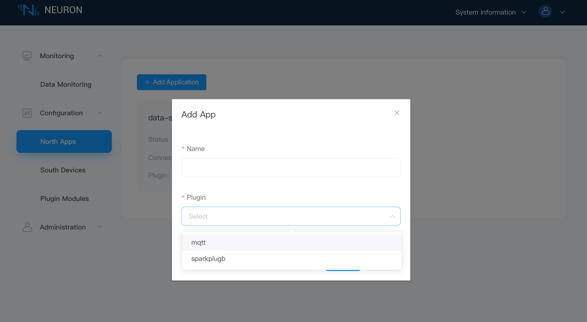
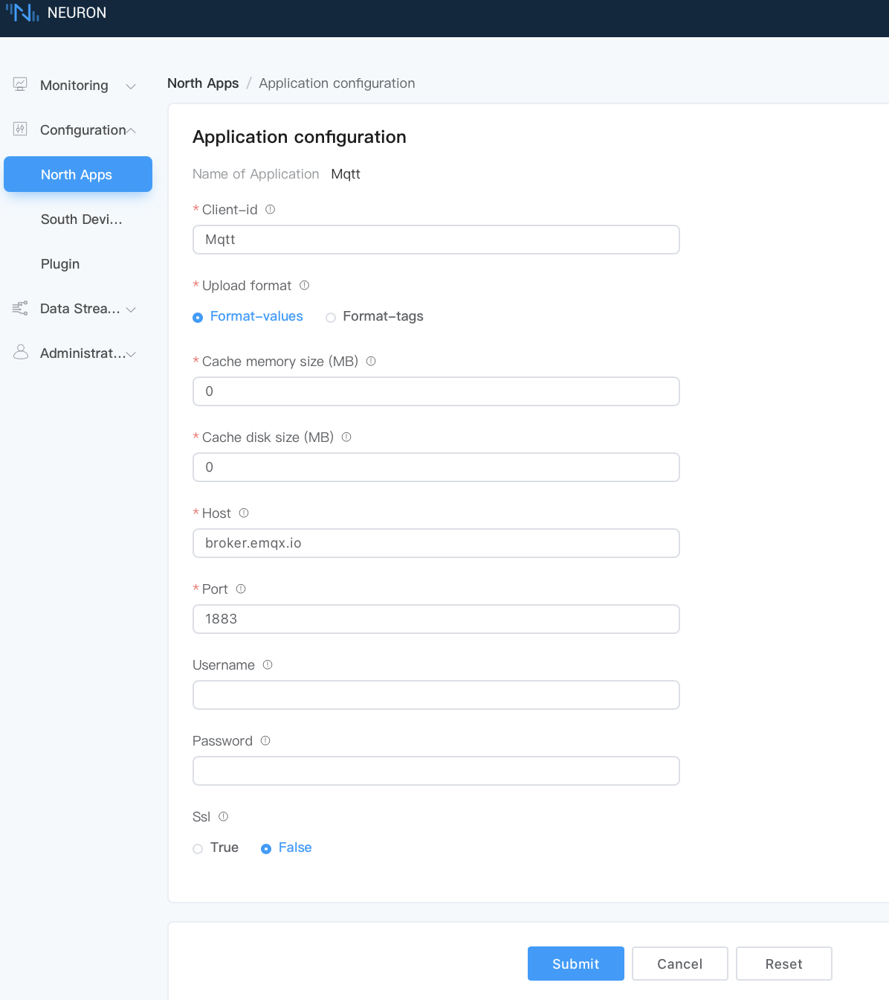
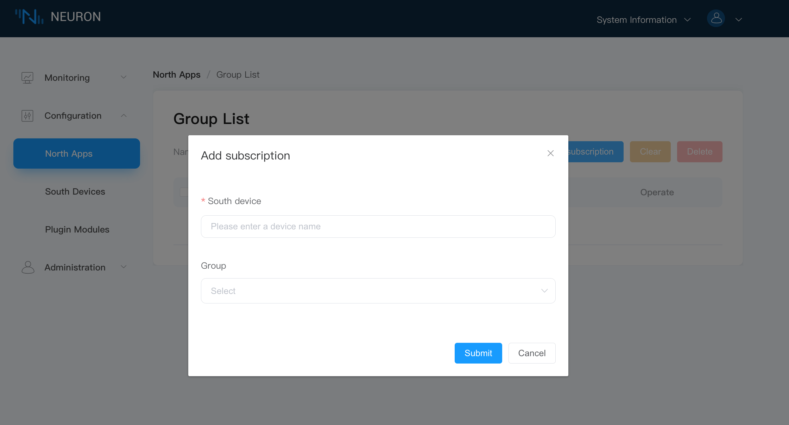

# Quick Start

This chapter will guide users to quickly start using Neuron to collect data simulating Modbus equipment and upload the data to MQTT Broker, taking Modbus TCP driver protocol as an example.

## Install Neuron

Neuron provides a variety of installation methods, and users can view the detailed installation methods in [Installation](../installation/installation.md). This example adopts containerized deployment mode, so as to start experiencing Neuron as soon as possible.

Get Docker image

```bash
$ docker pull emqx/neuron:2.3.4
```

Run the Docker container

```bash
$ docker run -d --name neuron -p 7000:7000 --privileged=true --restart=always emqx/neuron:2.3.4
```

## Install Modbus Simulator

Install [PeakHMI Slave Simulators software](https://hmisys.com).

After installation, run Modbus TCP slave EX. Set the simulator salve ID and tag value, as shown in the figure below.



::: tip
Neuron and the simulator must be run on the same LAN.

Try to turn off the firewall in Windows, otherwise Neuron may not connect to the simulator.
:::

## Quick Using Neuron

Access the Neuron gateway management console, open a web browser and enter the address and port number of the gateway running Neuron ([http://x.x.x.x:7000](http://x.x.x.x:7000/)). Replace "x.x.x.x" with the actual IP address of the gateway where Neuron is installed. 

### Login

Log in with the initial username and password:

- Username: `admin` 
- Password: `0000`



### Add a Southbound Device

In Neuron, southbound refers to the connection between Neuron and devices. This step illustrates how to create a southbound device.

Select **South Devices** from the **Configuration** menu to enter the southbound device management interface, and click **Add Device** to add devices, as shown in the figure below.



Add a new southbound device:

* **Name**: fill in the name of the device, such as "modbus-tcp-1";
* **Plugin**: select the plugin of modbus-tcp from the drop-down box;
* Click the **Create** button to add a new device.

### Connect the Device to Neuron

#### Set Device Address

Configure the parameters required for Neuron to establish a connection with the device.

Click the Device Configuration icon on the southbound device card to enter the **Device configuration** interface, as shown in the figure below.



* **Host**: fill in the IP of the PC where PeakHMI Slave Simulators software is installed.
* For **Port** and **Timeout**, you can keep the default value. 
* Click **Submit** to complete the equipment configuration, and the equipment card will automatically enter the working state of **Running**;

:::tip
The configuration parameters required by each device are different. Please refer to [Configuration](../configuration/south-devices/south-devices.md) for detailed description of southbound device parameters.

:::

#### Add Tags for Data Communication

Before adding tags, you should first create a group for the device to facilate tag management. 

##### Create a Group

Click any blank space in the device card to enter the **Group List** management interface, and click **Create** to open the **Create Group** dialog box, as shown in the following figure.



Create a group for the device:

* **Group Name**: Fill in the name of the group, such as group-1.
* **Interval**: Keep the default value. <!--need some explanation-->
* Click **Create** to complete the creation of the group.

##### Add Tags

Add the device tags to be collected, including tag address, tag attribute, tag type, etc.

Click the **Tag List** icon in the group to enter the tag list management interface, as shown in the figure below.



Select the **Create** button to enter the tag page.



Manually create a tag for a group:

* **Name**: Fill in the tag name, for example, tag1.
* **Attribute**: Select the tag attribute from the drop-down list, for example, read, write, or subscribe.
* **Type**: Select data type from the drop-down list, for example, int16.
* **Address**: fill in the drive address, for example, 1!40001, where 1 stands for the tag salve id setted in Modbus simulator, and 40001 stands for the tag register address. Please refer to [Module Setting](../configuration/south-devices/south-devices.md) for detailed instructions on driving address.
* Click the **Create** button to complete the creation of the tag;

:::tip
For more tag operations, please refer to **Advanced Operations** at the end of the document.

After the tag is created, the working status of the equipment card is **running**, and the connection status should be **Connected**. If the connection status is still **Disconnected** at this time, please execute the following instructions at the terminal of the Neuron running environment to confirm whether the Neuron running environment can access the corresponding IP and port.

```bash
$ telnet <Running IP on PC side of Modbus simulator> 502
```

Please confirm whether the IP and Port are set correctly and whether the firewall is closed when configuring the device.
:::

### View Collected Data

Click **Monitoring** -> **Data Monitoring** to enter the data monitoring interface to view the values read by the created tags, as shown in the figure below.


Data monitoring displays values in groups, you can group the devices by device or groups:

* South device: select the southbound device you want to view from the drop-down box, for example, select modbus-tcp-1 that has been created in the above steps;
* Group Name: select the group under the selected southbound device from the drop-down box, for example, select Group-1 that has been created in the above steps;
* Select **Finish**, and the page will show the value of each tag read under the group;

### Add A Northbound Application

In Neuron, northbound refers to the connection between Neuron and MQTT broker. . This step illustrates how to create a southbound device.

Select **North Apps** in the **Configuration** menu, and click the **Add Application** buttton to add an application, as shown in the following figure.



Add an MQTT cloud connection module:

* **Name**: Fill in the application name, for example, mqtt;
* **Plugin**: Select the plugin of mqtt from the drop-down list;
* Click the **Create** icon to add an application.

### Establish the Connection

Configure the parameters required for Neuron to establish a connection with the northbound application.

Click the **Application Configuration** icon on the application card to enter the application configuration interface, as shown in the figure below.



Set MQTT connection:

* **Upload topic**: Use the default escalation topic (/neuron/mqtt/upload).
* **Host**: Use the default [public EMQX Broker](https://www.emqx.com/en/mqtt/public-mqtt5-broker) (broker.emqx.io).
* For the rest fields, you can keep the default settings. 
* Click **Submit** to complete the configuration of northbound application, and the application card will automatically enter the working state of **Running**.

### Subscribe to Southbound Group

The collected data are uploaded to the cloud in groups, and users need to choose which groups of data to upload.

Click any blank space in the application node card to enter the **Group List** page, and click the **Add Subscription** icon in the upper right corner to add a subscription, as shown in the following figure.



Subscribe to the data group of the southbound device:

* **South device**: Select the southbound device that has been created from the drop-down box, for example, modbus-tcp-1;
* **Group**: Click the drop-down box to select the group you want to subscribe to, for example, group-1;
* Click **Submit** to complete the subscription.

### View Data with MQTT Client

After the subscription is completed, users can use the MQTT client (MQTX is recommended and can be downloaded from [official website](https://www.EMQX.com/zh/products/MQTTX) to connect to the public emqx proxy to view the reported data, as shown in the following figure.


After successful subscription, we can see that MQTT X can directly receive the data collected and reported by Neuron.

* Ppen MQTT X to add a new connection, correctly fill in the name and the Host and Port of the public EMQX Broker, and complete the connection;
* Add a new subscription, and the **Topic** should be consistent with the **Upload topic** in the applicatin configuration step, for example, `/neuron/mqtt/upload`.

:::tip
The default topic format for uploading topic is `/neuron/{node_name}/upload`, where `{node_name}` is the name of the created northbound application. Users can also customize the reporting theme.
:::

