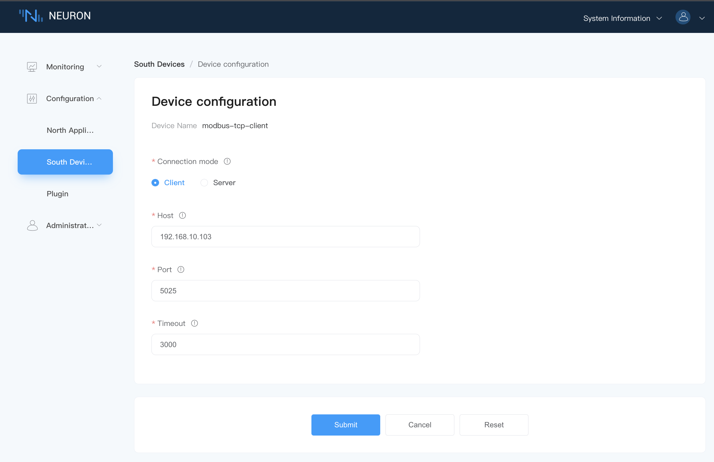
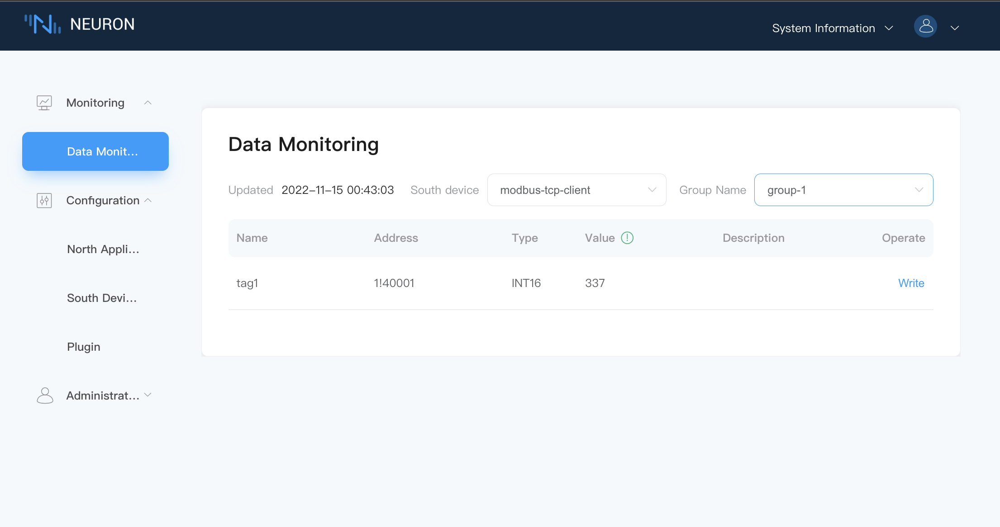
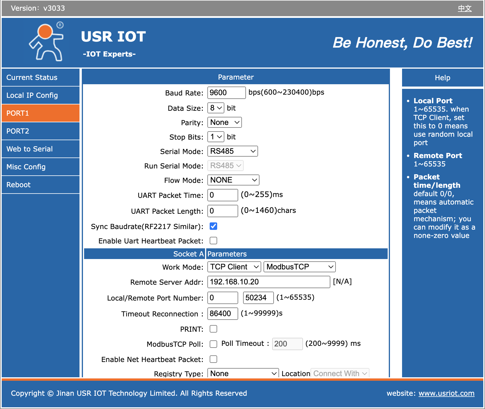
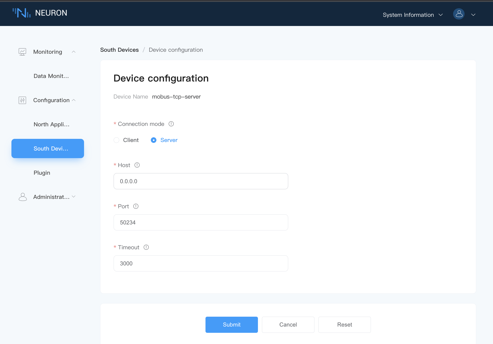
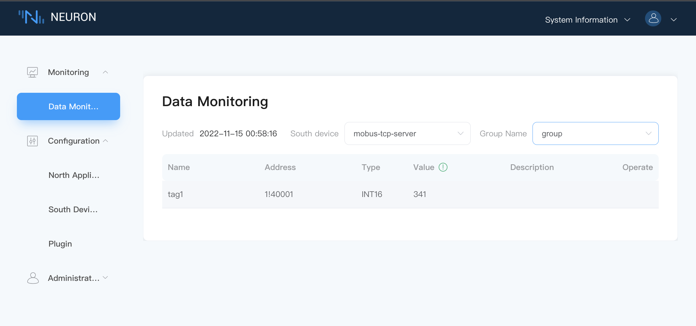

# Cloud Usr DTU Connection Neuron Example

This article will take the example of connecting the device through the RS485 mode of the Cloud-Usr DTU pass-through module to introduce how to convert the serial device into a network connection to Neuron. The connection diagram is shown in the figure below.


DTU supports two-way conversion of data, supports mutual conversion of common serial data such as RS232, RS485, RS422 and TCP/IP data, and transmits them through the wireless communication network. The communication methods generally used by DTU are 2/3/4G, NB-IoT, LoRaWAN, WIFI, etc.

## What Is Client/server Mode?

Client/Server, also known as client/server mode, referred to as C/S mode, is a network communication architecture, which is used to distinguish the two parties who establish a communication connection as a client (Clent) and a server (Server).

Although the C/S structure is very mature in technology, it has the characteristics of strong interaction, safe access mode, fast response speed, and good for processing large amounts of data. However, the C/S structure lacks versatility, and system maintenance and upgrades require redesign and development, which increases the difficulty of maintenance and management, and further data expansion is more difficult, so the C/S structure is limited to small LANs. If the Client and the Server are not in the same local area network, the user needs to ensure that the Client can access the Server through a network address and the Server can give the Client an access right to achieve communication between the two ends.

A complete inter-network communication requires five element identifications: protocol, local address, local port number, remote port number, and remote address. In the C/S mode, the client receives user requests, actively sends a connection request to the server, and the server passively waits for the request from the client, processes the request and returns the result to the client. The port number is used to distinguish the logical number of different services.

* When configuring the TCP connection on the client side, the server IP address and listening port must be set;
* When configuring the TCP connection on the server side, the port used by the server must be set, and the client IP address and port are optional;

## How To Connect To Neuron As A Client?

This section mainly introduces how to configure the communication connection between Neuron and DTU under the condition that Neuron and DTU are in the same LAN, and Neuron acts as the client.

### Configure DTU Server

First, you need to configure the parameters of the connection between the DTU and the serial port, and second, you need to configure the parameters of the Socket for the connection between the DTU and the Neuron, as shown in the figure below.


* Working mode, TCP Server, Modbus TCP;
* Fill in the unused local port, no need to fill in the remote port;
* The following parameters are optional.

:::tip
When the working mode of DTU is Modbus TCP, since DTU converts the modbus rtu serial port protocol to modbus tcp protocol, the modbus-plus-tcp driver in Neuron should be used.

When the working mode of DTU is pass-through mode, the modbus-rtu driver in Neuron should be used at this time.
:::

### Check DTU IP

When configuring the Neuron southbound driver, it needs to be the IP of the DTU on the server side, as shown in the figure below.


### Configure Neuron Southbound Driver Client

In the southbound driver management, create a node whose plugin is modbus-plus-tcp, and configure the driver, as shown in the figure below.


* Connection mode selection client;
* Host fill in the IP address of DTU;
* Port fill in the port of DTU configuration;

### View Data Monitoring

After adding points to the southbound drive, enter the data monitoring interface to view the data collected from the device, as shown in the figure below.


## How To Connect To Neuron As Server?

This section mainly introduces how to configure the communication connection between Neuron and DTU under the condition that Neuron and DTU are in the same LAN and Neuron is used as the server.

### Configure DTU Client

First, you need to configure the parameters of the connection between the DTU and the serial port, and second, you need to configure the parameters of the Socket for the connection between the DTU and the Neuron, as shown in the figure below.


* Remote server address, fill in the IP address of Neuron running as the server;
* Local port, not filled in by default;
* Remote port, since each TCP Server port will listen to the incoming TCP traffic on the port specified by the client, therefore, the user needs to customize an unoccupied port for handshake establishment between the client and the server connect.

:::tip
You can execute the following command on the server terminal to determine whether the listening port is occupied.

```bash
# Check port range
$ cat /proc/sys/net/ipv4/ip_local_port_range
# Confirm whether the port is occupied
$ telnet <ip> <port>
```
:::

### Configure Neuron Southbound Driver Server

In the southbound driver management, create a node whose plugin is modbus-plus-tcp, and configure the driver, as shown in the figure below.


* Select server as the connection mode;
* Host, fill in 0.0.0.0;
* Port, fill in the listening port;

### View data monitoring

After adding tags to the southbound drive, enter the data monitoring interface to view the data collected from the device, as shown in the figure below.



## Supplementary Instructions

When Neuron and DTU are not in the same LAN, you can map the LAN IP and port of the Neuron operating environment to the WAN, and use Neuron as the server end and DTU as the client end. The configuration method is the same as above.
