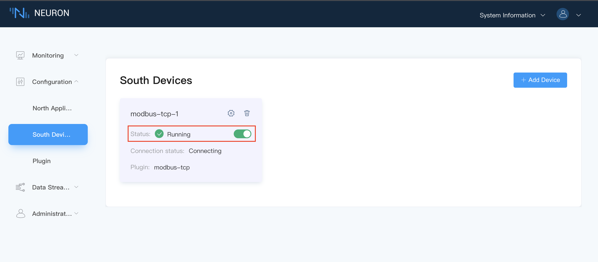
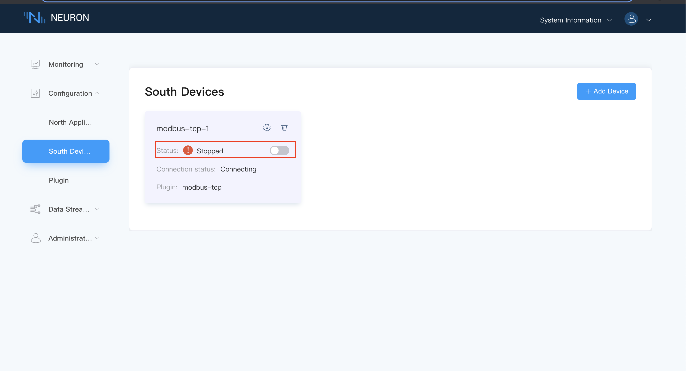
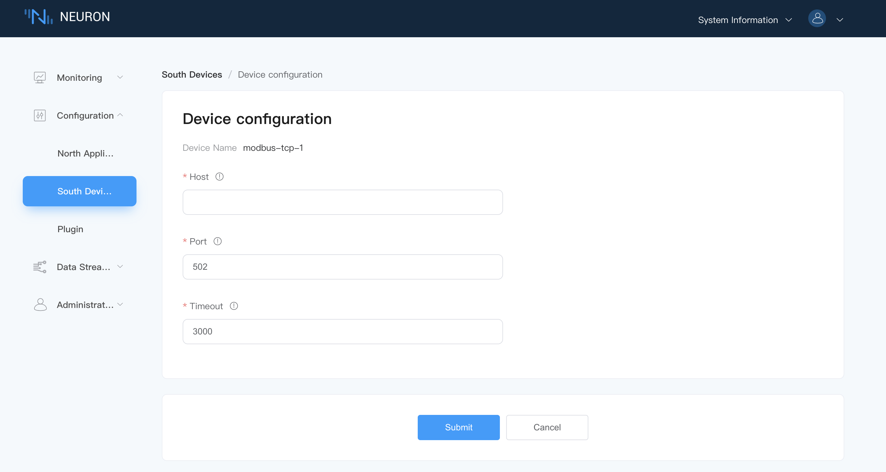

# Modbus plugin development example

The southbound driver development mainly includes the following parts, the bottom layer is the protocol layer development, and the outermost layer is the driver layer development.
| Modules                     | Documentation                             | Instructions                                                                          |
| --------------------------- | ----------------------------------------- | ------------------------------------------------------------------------------------- |
| Protocol layer development  | modbus.c modbus.h                         | Packing and unpacking of device protocol packets connected by plugins                 |
| Protocol stack analysis     | modbus_stack.c modbus_stack.h             | Mainly used for protocol stack analysis                                               |
| Point processing            | modbus_point.c modbus_point.h             | The tag type in Neuron is converted to a more specific type required by the plugin    |
| Driver layer development    | modbus_tcp.c modbus_req.c modbus_req.h    | Implementation of plugin theme framework                                              |
| Plugin Settings File        | modbus-tcp.json                           | Definition of Plugin Settings File                                                    |

## Step 1 Protocol layer development

This part mainly implements the implementation of the grouping and unpacking of the device protocol connected by the plug-in, and also includes the implementation of some structure definitions and related functions, among which modbus.h defines the basic message of the modbus protocol and the grouping of the message. Packing and unpacking functions, modbus.c implements the functions of packing and unpacking.

When the Modbus protocol is transmitted through TCP, the format of the read and write request message is shown in the table below.

| Message Format            | Data Length | Description               |
| ------------------------- | ------- | ----------------------------------------------------------------------------------------------- |
| Header                    | 6 bytes | Application header, including transport ID, protocol ID, and byte length                        |
| Address code              | 1 byte  | Device address, also site number                                                                |
| Function code             | 1 byte  | Notify which operation to perform, different function codes correspond to different operations  |
| Register start address    | 2 bytes | Specify the start address of the register to be read, high byte first, low byte last            |
| Number of registers       | 2 bytes | Specify the number of registers to read, high byte first, low byte last                         |
| Data field                | N bytes | Used in the write instruction, the value to be written to the register                          |

### Enumeration Description

| Enumeration     | Description                     |
| --------------- | ------------------------------- |
| modbus_function | Modbus different function codes |
| modbus_area     | Different register types        |

### modbus_header

This part contains the packet header function modbus_header_wrap and the corresponding unpack function modbus_header_unwrap.

### modbus_code

This part contains the package function modbus_code_wrap of address code and function code and the corresponding unpack function modbus_code_unwrap.

### modbus_address

This part contains the pack function modbus_address_wrap and the corresponding unpack function modbus_address_unwrap for the initial address of the register and the number of registers.

### modbus_data

This part mainly includes the packing function modbus_data_wrap and the corresponding unpacking function modbus_data_unwrap that need to write the register value.

## Step 2 Protocol stack analysis

This part is mainly used for the analysis of the protocol stack, including the initialization of the protocol stack analysis and the release of resources, the generation of read and write request messages, the analysis of received read and write response messages, and data processing.

### modbus_stack_create

This function is mainly used for the initialization of protocol stack analysis.

### modbus_stack_destroy

This function is mainly used to release protocol stack parsing resources.

### modbus_stack_recv

This function is mainly used to pass the data received from the tcp/udp/serial port to the protocol stack parser, and to process and analyze the data.

### modbus_stack_read

This function is mainly used to generate the protocol message of the point to be read through the protocol parser.

### modbus_stack_write

This function is mainly used to generate the protocol message to be written into the point value through the protocol parser.

## Step 3 Point processing

This part is mainly used to convert the tag information set in Neuron into the more specific information needed.

* The address configured by the point in Neuron can be further parsed into the device address Slave ID, register type and register start address, and can check whether the address conforms to the plug-in specification.
* Different registers support different data types. Here, you can judge whether the configured address supports this attribute according to the parsed register type and the attributes configured in Neuron.
* Modbus supports batch reading of data. Neuron can aggregate and classify user-configured points. According to the classification results, the function of reading data in batches can be realized.

### modbus_tag_to_point

This function realizes the conversion of the tag information set in Neuron into the more specific information required. neu_datatag_t is the point information configured in Neuron, and modbus_point_t stores the converted tag information. The parameters are explained as follows.

|  Parameter         | Description                        |
| ------------------ | ---------------------------------- |
| slave_id           | device address, i.e. Slave ID      |
| area               | Register type                      |
| start_address      | Register start address             |
| n_register         | Number of registers                |
| type               | data type                          |
| option             | Choice of endian                   |
| name               | tag name                           |

### modbus_tag_sort

modbus_tag_sort is mainly used to aggregate and classify user-configured points. According to the classification results, batch reading can be realized. The corresponding modbus_tag_sort_free function is used to free the resources created by modbus_tag_sort.

## Step 4 Driver layer development

The modbus_req.c and modbus_req.h files define the specific function implementation and structure used in the modbus_tcp.c file.The modbus_tcp.c file is mainly the interface exported by the plugin, which is defined by plugin.h in neuron. The description of plugin_intf_funs is as follows.

### open

Call the driver_open function, based on the first function called by neuron when the plugin creates a node, create a struct neu_plugin defined by the plugin itself.

### close

Call the driver_close function, the last function called by neuron when a node is removed to free the neu_plugin_t created by open.

### init

Call the driver_init function, when creating a node, the function that neuron calls immediately after open is called. This function is mainly used for some resources that need to be initialized in the plug-in. The modbus plug-in mainly initializes the modbus protocol stack analysis.

* The modbus_send_msg callback function is used to send data on the tcp connection;
* The modbus_value_handle callback function is used to update the data to the adapter when it is received;
* The modbus_write_resp callback function is used to return the error code when writing the value to the point of the device.

### uninit

Call the driver_uninit function, when deleting a node, the first function called by neuron, this function mainly releases some resources applied and initialized in init.

### start

Call the driver_start function, when the user clicks on the neuron node page, neuron will call this function, start does not do any processing, only returns 0, notifies the plugin to start running, and starts to connect to the device, etc. The processing of the connection status is placed in the tcp connection Processed in an asynchronous callback function.

### stop

Call the driver_stop function, when the user clicks stop on the neuron node page, neuron will call this function, stop notifies the plug-in to stop running, close the connection with the device, and the driver.group_timer will not be triggered again.

### setting

Call the driver_config function, it is used by the user when setting on the neuron node setting page. The parameters set by the node will be presented in json mode, and neuron will notify the plugin to set through this function.The driver_config function first parses and saves the configuration information, and then establishes a tcp connection. The two callback functions modbus_conn_connected and modbus_conn_disconnected will be called when tcp establishes and closes the connection respectively, and the corresponding two functions will update the connection status of the plugin.

### request

Call the driver_request function, the function is not used in the southbound driver.

### driver.validate_tag

Call the driver_validate_tag function, when adding a tag to a node or updating a tag, neuron will use this function to notify the plug-in of the tag-related parameters. The plug-in checks whether the tag parameter meets the requirements of the plug-in according to their respective implementations. The function returns 0, which means success.

### driver.group_timer

Call the driver_group_timer function, after adding a group to the node and setting the node state to running, this function will be called regularly with the interval parameter of the group, mainly used to interact with the device and read device data.

neu_plugin_group_t structure parameter description.

| Parameters     | Description                            |
| -------------- | ------------------------------------------- |
| group_name     | The name of the group that triggered the timer |
| tags           | array of type neu_datatag_t |
| user_data      | User-defined information |
| group_free     | When this group is deleted, the callback function used to release user-defined information |

### driver.write_tag

Call the driver_write function, when using the write api, neuron will call this function to notify the plugin to write a specific value to the point tag.

## Step 5 Plugin settings file

The modbus-tcp.json file configures the plugin settings, among which tag_type and timeout are required items. Other parameters can be added according to the plugin configuration. The parameter descriptions are shown in the following table.

| Parameters | Description                                       |
| ---------- | ------------------------------------------------- |
| tag_type   | Data type supported by the drive point            |
| tag_regex  | different data type address configuration rules   |
| host       | IP address                                        |
| port       | port number                                       |
| timeout    | Timeout time for receiving data                   |
