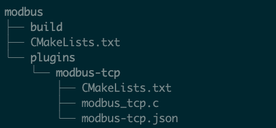

# SDK-based driver development

This article mainly introduces how to develop a new driver plugin based on the SDK package and apply it to Neuron.

## Step 1 Download and install the SDK

Download link: [https://github.com/emqx/neuron/releases](https://github.com/emqx/neuron/releases)

According to different development systems, download the corresponding sdk tar.gz package, e.g. neuron-sdk-2.1.3-linux-amd64.tar.gz to the corresponding development system and decompress it to obtain neuron-sdk-x.x.x, where x.x.x represents the version number, execute the following command.

```bash
# take version 2.1.3 as an example
$ cd neuron-sdk-2.1.3
# install sdk
$ sudo ./sdk-install.sh
```

After the script is executed, you need to pay attention to the usage of the following paths.

| Path                      | Description                            |
| --------------------------| ------------------------------------------------------------------------------------------------------------------- |
| /usr/local/include/neuron | Stores Neuron header files and apply to include_directories in the CMakeLists.txt compilation file                   |
| /usr/local/lib/neuron     | Stores Neuron dependent library files, which are applied to link_directories in the CMakeLists.txt compilation file |
| /usr/local/bin/neuron     | Holds files needed to run Neuron             |

## Step 2 Driver development

Create a new directory file in the development environment to store the files required for the development driver, create a compilation configuration file CMakeLists.txt under the directory file, a build directory file to store the compiled files and a plugins directory file for To store all the driver files that need to be developed, each driver needs to have an independent directory to store the required files for driver development. Taking the development of modbus-tcp driver plug-in as an example, the directory level is shown in the figure below.



### CMakeLists.txt example

The main thing is that include_directories, link_directories and add_subdirectory should be configured correctly.

```shell
cmake_minimum_required(VERSION 3.12)

enable_language(C)
set(CMAKE_C_STANDARD 99)

find_package(Threads)

# add the path to the neuron header
include_directories(/usr/local/include /usr/local/include/neuron)
# add the path to the neuron library
link_directories(/usr/local/lib /usr/local/lib/neuron)

# add driver submodule
add_subdirectory(plugins/modbus)
```

### plugins/modbus

The driver development file mainly includes the compilation configuration file CMakeLists.txt, the driver configuration json file and the driver code file.

#### CMakeLists.txt example

```shell
set(LIBRARY_OUTPUT_PATH "${CMAKE_BINARY_DIR}/plugins")

set(CMAKE_BUILD_RPATH ./)
# set plugin name
set(MODBUS_TCP_PLUGIN plugin-modbus-tcp)
# set the driver development code file
set(MODBUS_TCP_PLUGIN_SOURCES  modbus_tcp.c)
add_library(${MODBUS_RTU_PLUGIN} SHARED)
target_sources(${MODBUS_RTU_PLUGIN} PRIVATE ${MODBUS_RTU_PLUGIN_SOURCES})
target_link_libraries(${MODBUS_RTU_PLUGIN} neuron-base)
```

#### modbus_tcp.c

The interface file of the driver plugin, for the specific driver development example, please refer to [modbus-tcp plugin development example](./modbus_example.md)

#### modbus-tcp.json

The driver configuration file is described in detail in [modbus-tcp plugin development example](./modbus_example.md).

### build

After the driver development code is completed, execute compilation in this directory.

```bash
$ cmake ..
$ make
```

## Step 3 The plugin is applied to Neuron

### Copy the driver .so file

After compiling, go to modbus/build/plugins and copy the generated driver .so file (for example, libplugin-modbus-tcp.so ) to the /usr/local/bin/neuron/plugins directory.

### Copy the driver configuration .json file

Copy the modbus/modbus-tcp.json file to the /usr/local/bin/neuron/plugins/schema directory.

### Modify plugins.json file

Open the plugins.json file in the /usr/local/bin/neuron/persistence directory and add the name of the newly added driver .so file to it.

### Start Neuron verification driver

Go back to the /usr/local/bin/neuron directory and execute the following command to run Neuron.

```bash
$ sudo ./neuron --log
```

Open Neuron on the web page to view the added plugins and their usage.
