# 使用 Beckhoff ADS 协议采集 PLC 数据

本示例介绍使用 Neuron 通过 ADS 协议采集倍福 PLC 上不同地址区域的数据。

## 环境介绍

本测试使用了在同一个局域网下的 2 台机器，机器 1 为 linux 系统，安装了 Neuron 软件；机器 2 为 windows 系统，安装了倍福 TWINCAT 3 编程软件。具体如下：

|          | 机器1             | 机器2               |
| -------- | ----------------- | ------------------- |
| 操作系统 | linux             | windows             |
| IP地址   | 192.168.1.152     | 192.168.1.107       |
| amsnetid | 192.168.1.152.1.1 | 192.168.1.107.1.1   |
| 安装软件 | Neuron            | TWINCAT TC3 Project |
| 网络     | 连通              | 连通                |

## TwinCAT 软件中的配置

让 Neuron 和倍福 PLC 建立通讯，需要添加路由、查找 amsnetid、port、以及变量的 index group 和 index offset。以下部分介绍详细配置。

### 1.在 TwinCAT 软件中添加路由

打开配置页面

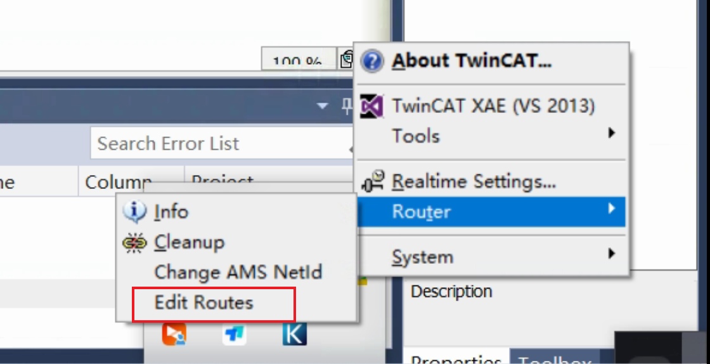

点击添加

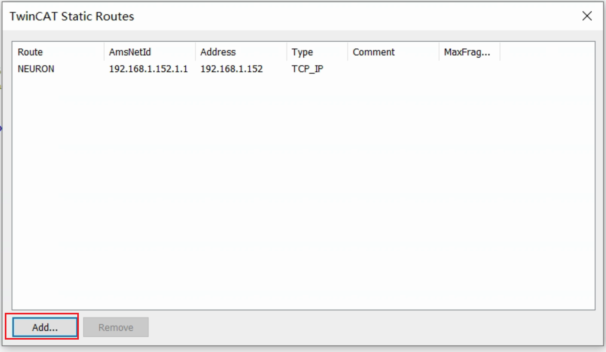

​		输入下图红框内容，其中Amsnetid，请输入Neuron所在机器与倍福PLC相连的网卡的ip地址加''.1.1''

​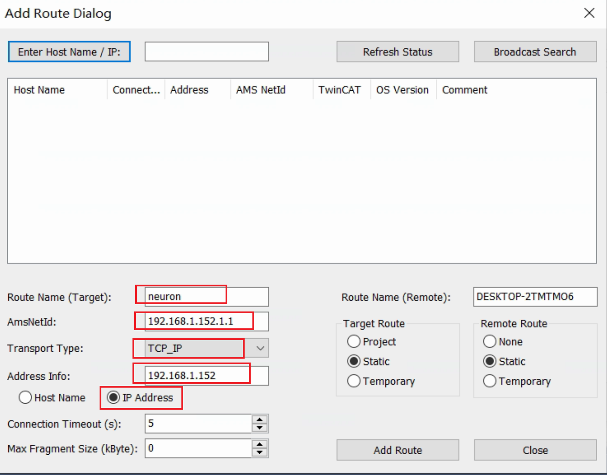

​		添加成功后，页面如下：

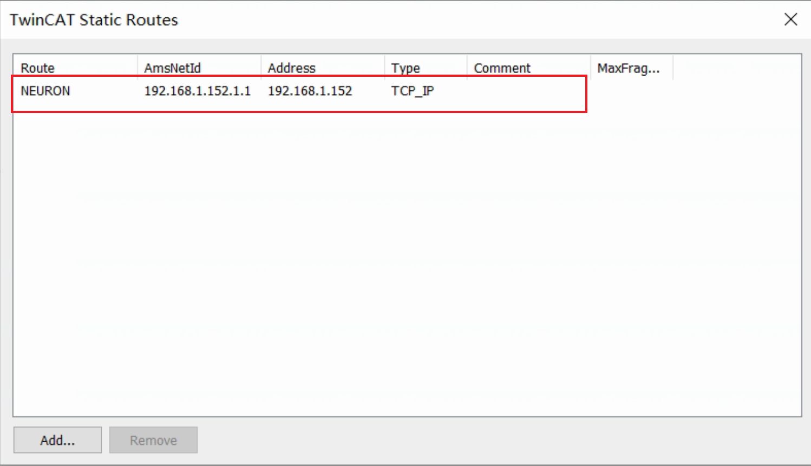

### 2.查看 PLC 的 Amsnetid 以及 Port

Amsnetid 如下：

TC3 PLC 默认端口号为 851

### 3.查找变量 index group 和 index offset

PLC 工程 main 程序中定义的相关数据点位如下图所示：

* 通过倍福官方文档查询数据点的 index group

  普通数据点（上图b、i8、u8、i16、u16、i32、u32、i64、u64、f32、f64、str）的 index group 为 0x4040

  MW 地址区数据点的 index group 为 0x4020

  MX 地址区数据点的 index group 为 0x4021

  

  其他地址区请查阅[倍福官网](https://infosys.beckhoff.com/)。

* 通过 tpy 文件查找 index group

  开启 tpy 存储

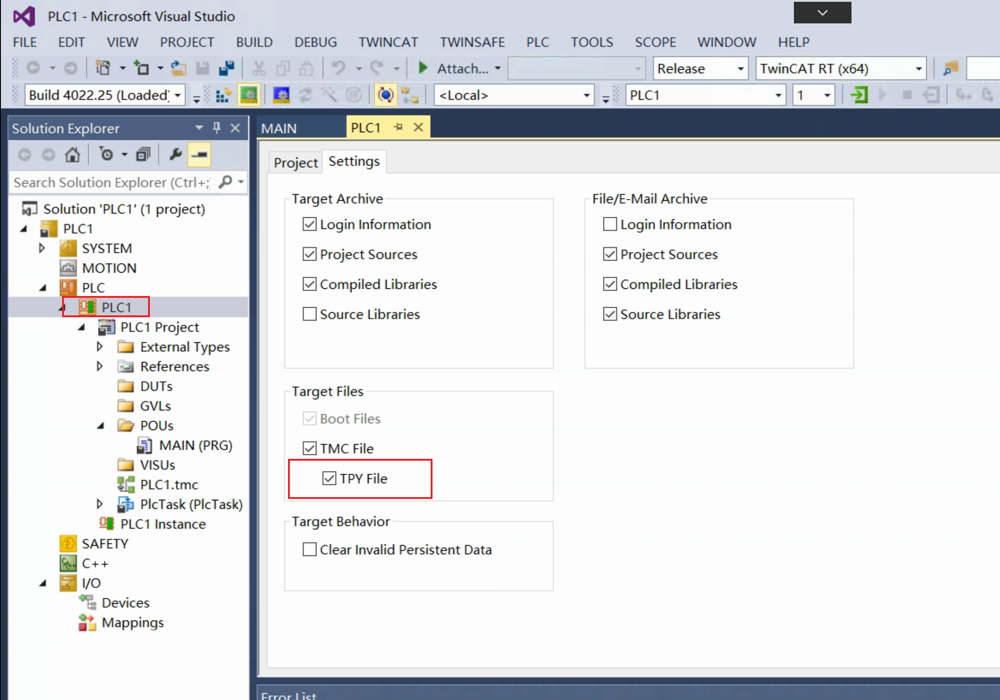

  项目路径打开 tpy 文件

  tpy 文件中包含了 plc 程序中所有变量的 index group 和 index offset 信息：

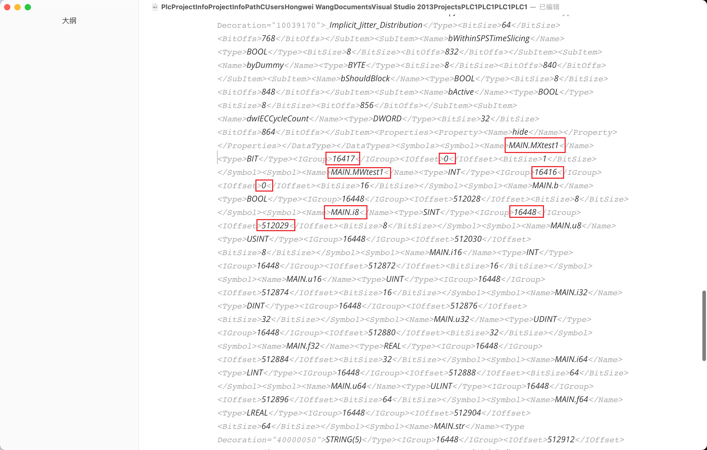

* 查询变量的 index offset

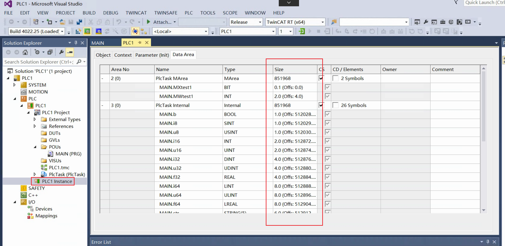

## Neuron 中的配置

### 1.Neuron 安装

请参考 Neuron 基础使用介绍。

### 2.Neuron 配置

* 新建南向 ADS 设备

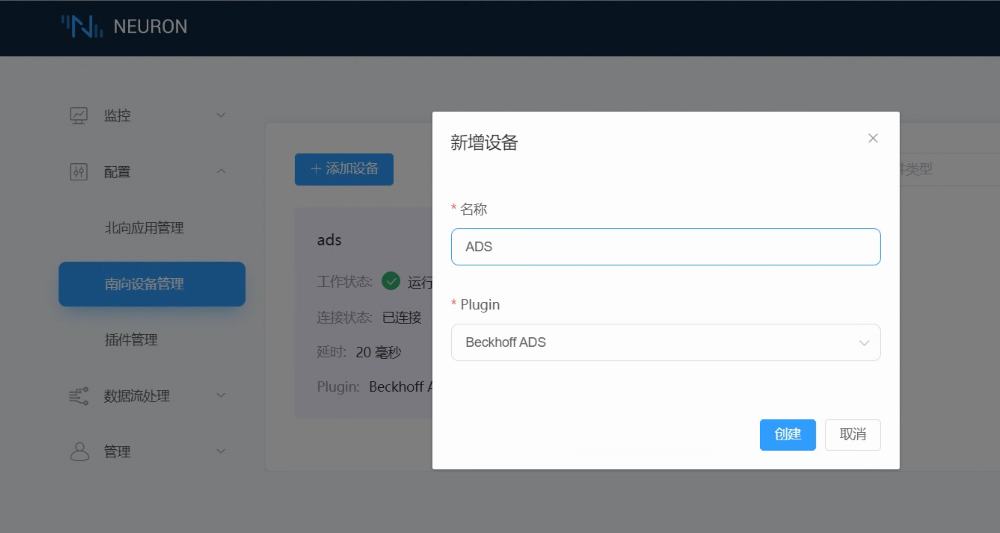

* 配置连接参数

  具体TwinCAT相关参数的获取，请看上一章节部分。

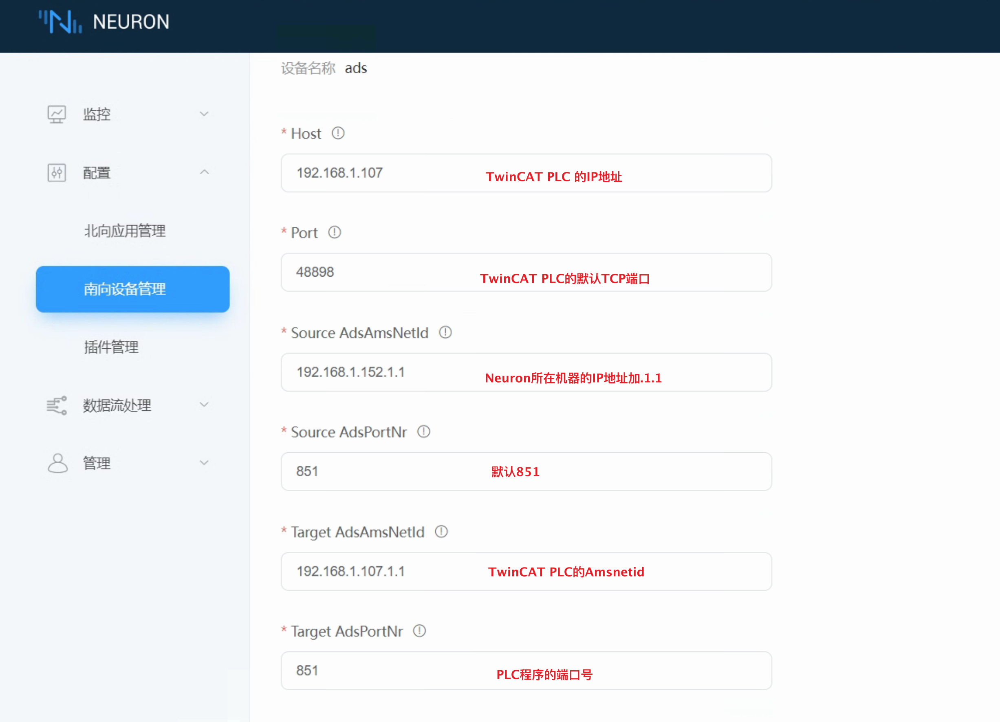

* 配置TAG标签

​		根据PLC地址，如下：

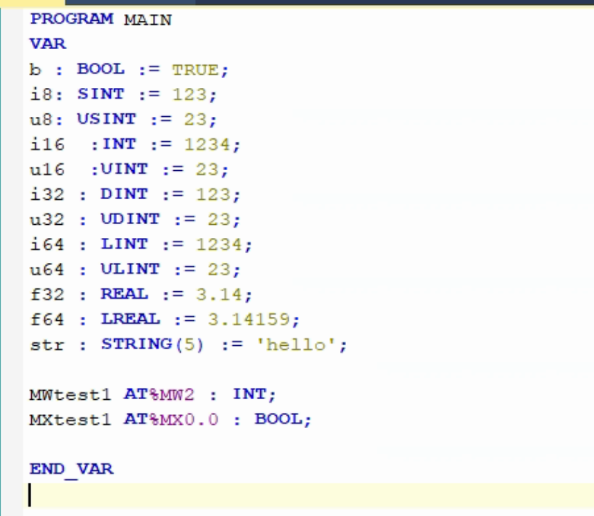

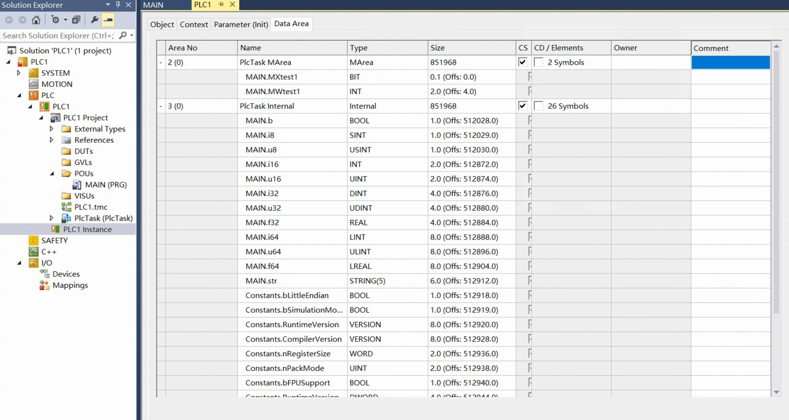		

在 Neuron 中添加如下标签：

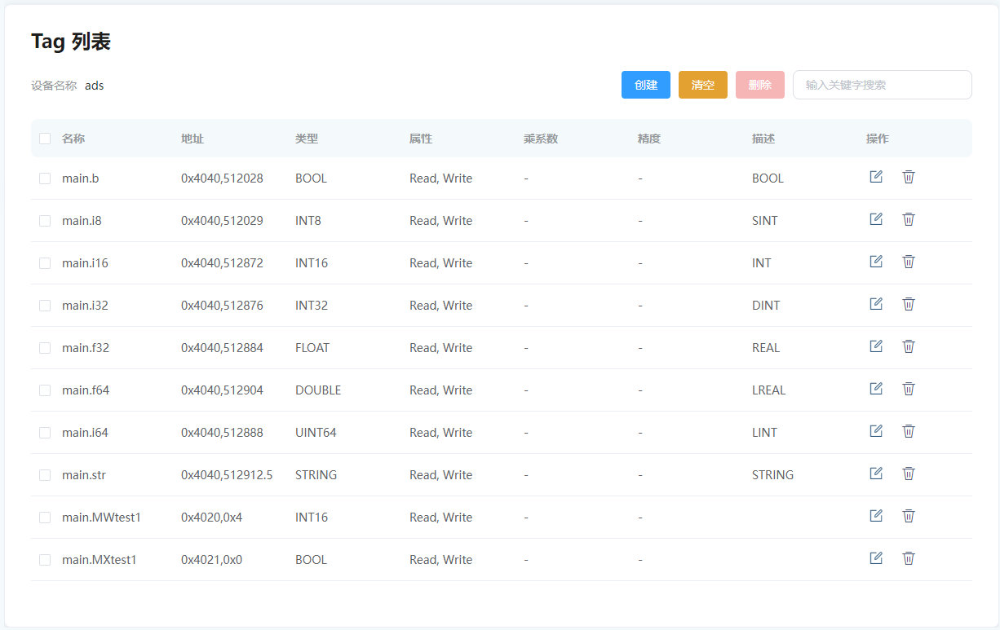

## 数据监控

### 1.TwinCAT PLC数据实时采集

TwinCAT PLC 中的变量信息：

Neuron 页面信息：

### 2.数据下发控制

Neuron 下发指令：

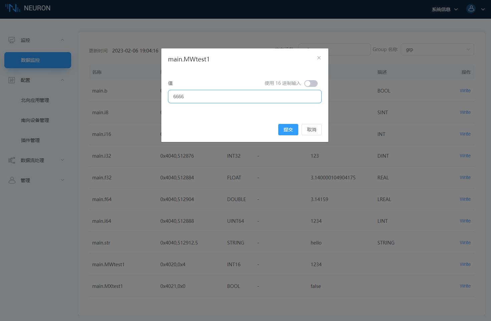

写入成功：

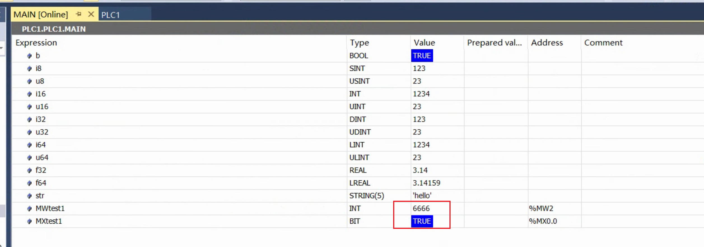