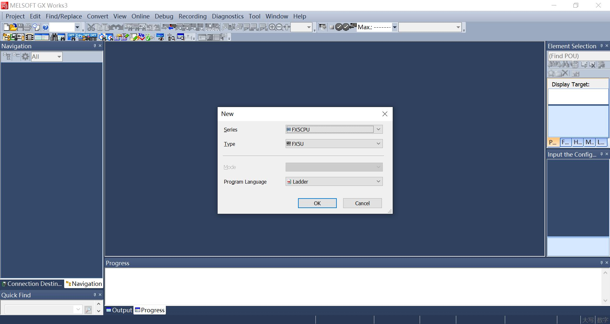
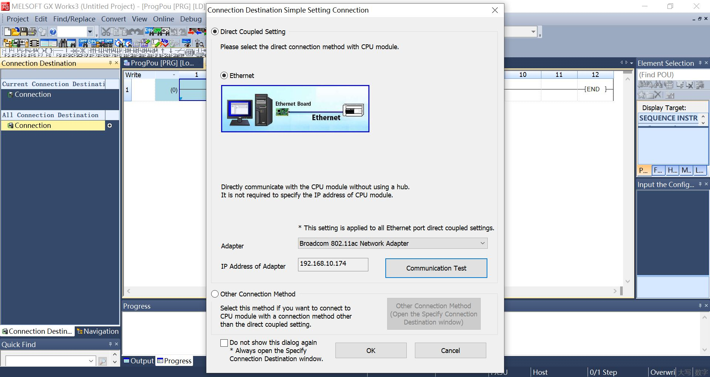
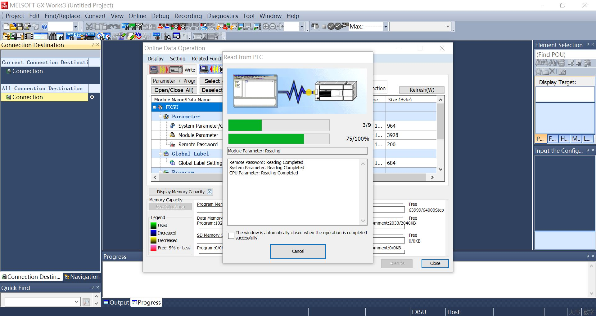
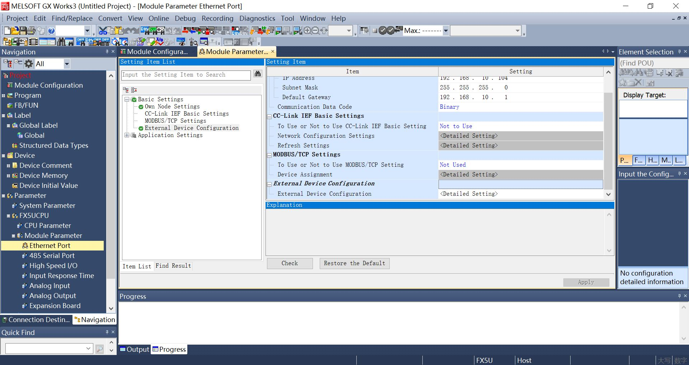
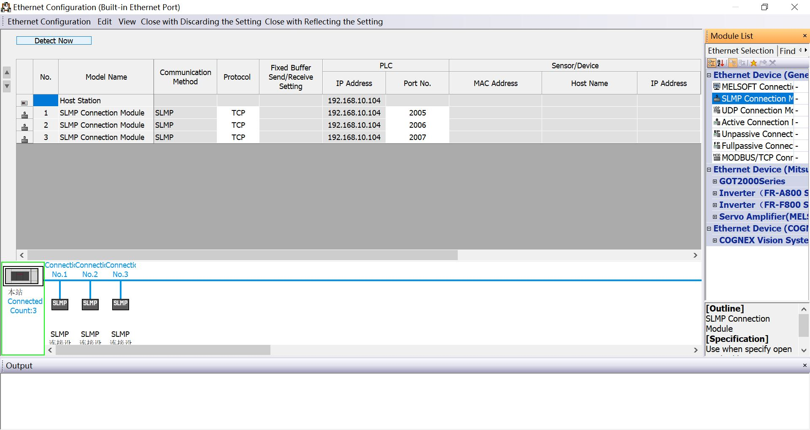
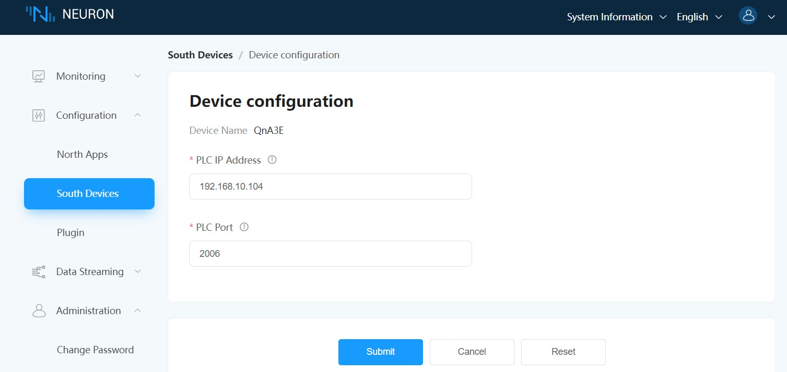

# Connect to FX5U

## PLC Setting

1. Open the GX Works3 PLC programming software and create a new project. `Series` Select `FX5CPU`,`Type` Select `FX5U`, Click `OK`.

2. Click `Connection Destination` -> `Connection`, Set `Adapter` and `IP Address of Adapter`, Click `OK`.

3. Click on the menu `Online` -> `Read frome PLC` -> `Select All` -> `Execute`.

4. Click `Navigation` -> `Parameter` -> `FX5UCPU` -> `Module Parameter` -> `Ethernet Port`, Check and confirm `IP Address`, Click `External Device Configuration`.

5. Drag `Ethernet Device(General)` -> `SLMP Connection Module` to list, `Protocol` select `TCP` and set `Port No.`, Click `Close with Reflecting the Setting`.

6. Click on the menu `Online` -> `Write to PLC` -> `Execute`.

## Neuron Setting

1. Add a Mitsubishi 3E device to Neuron Southbound Device Management.

2. Change the `PLC IP Address` to the target device IP address in the device configuration.

3. Modify `PLC Port` as the target device port in the device configuration and submit the setup form.

4. Add `Group`，Add test `tag`.

## Test Data List

| Name | Address    | Attribute | Data Type   |
| ---- | --------| ---- | ------ |
| DATA1  | D0    | Read Write | INT16  |
| DATA2  | D1    | Read Write | UINT16 |
| DATA3  | D2    | Read Write | INT32  |
| DATA4  | D4    | Read Write | UINT32 |
| DATA5  | D6    | Read Write | FLOAT  |
| DATA6  | D8    | Read Write | DOUBLE |
| DATA7  | X0    | Read       | BIT    |
| DATA8  | Y0    | Read Write | BIT    |
| DATA9  | D20.0 | Read       | BIT    |
| DATA10  | D100.16  | Read Write | STRING |
