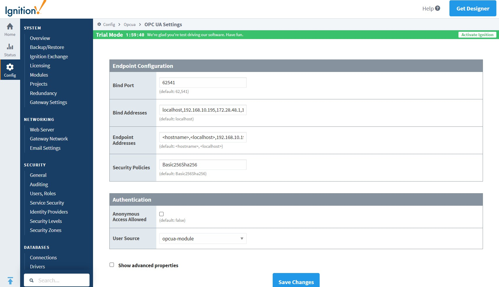
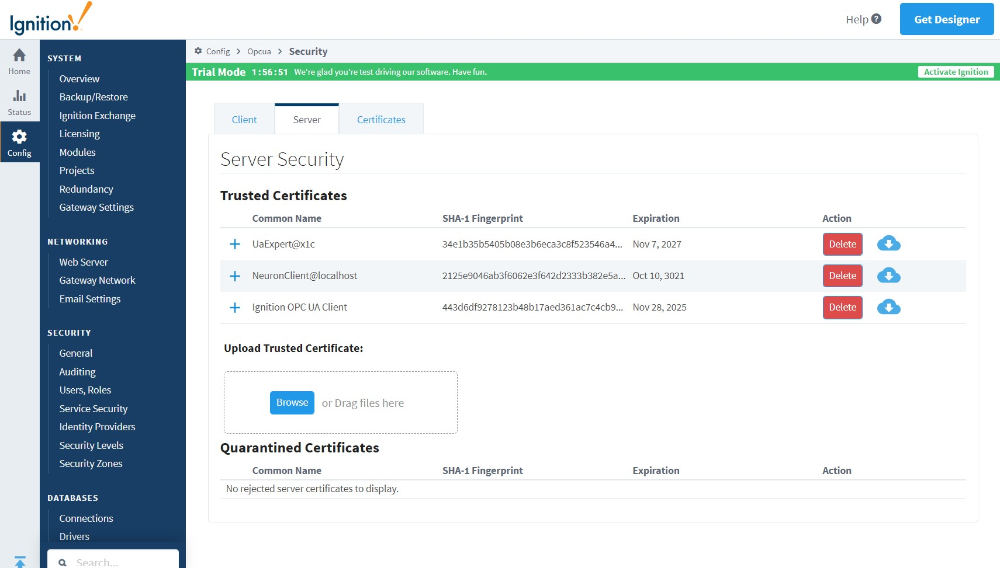

# Connect to Ignition 

## Username/Password Login

1. Open the Config page of Ignition's management interface, select OPC UA/Server Setting, add IP addresses that can be accessed by other hosts to Bind Addresses, and save the configuration;

2. Neuron adds a new southbound OPC UA device, open "Device Configuration", fill in the "Endpoint URL" of the target Ignition - opc.tcp://192.168.10.195:62541/discovery, username - opcuauser (Ignition default), password - password (Igniton default) without adding a certificate/key, start the device connection.

3. Open the Config page of Ignition's administration interface, select OPC UA/Security, switch to the Server tab, and set the NeuronClient certificate in the Quarantined Certificates list to trust.

## Certificate/key + username/password login

1. Refer to [parameter example](. /example.md) to generate or convert a certificate/key;

2. Open the Config page of Ignition's administration interface, select OPC UA/Security, switch to the Server tab, upload the client certificate and set it to Trust;

3. Neuron adds a new southbound OPC UA device, open "Device Configuration", fill in the "Endpoint URL" of the target Ignition - opc.tcp://192.168.10.195:62541/discovery, username - opcuauser (Ignition default), password - password (Igniton default) Add the certificate/key, and start the device connection.

## Test Data List

|  Name            | Address   | Attribute | Data type   |
| ---------------- | ------ | ---- | ------ |
| BuildDate        | 0!2266 | Read | UINT32 |
| BuildNumber      | 0!2265 | Read | STRING |
| ManufacturerName | 0!2263 | Read | STRING |
| ProductName      | 0!2261 | Read | STRING |
| ProductUri       | 0!2262 | Read | STRING |
| SoftwareVersion  | 0!2264 | Read | STRING |

