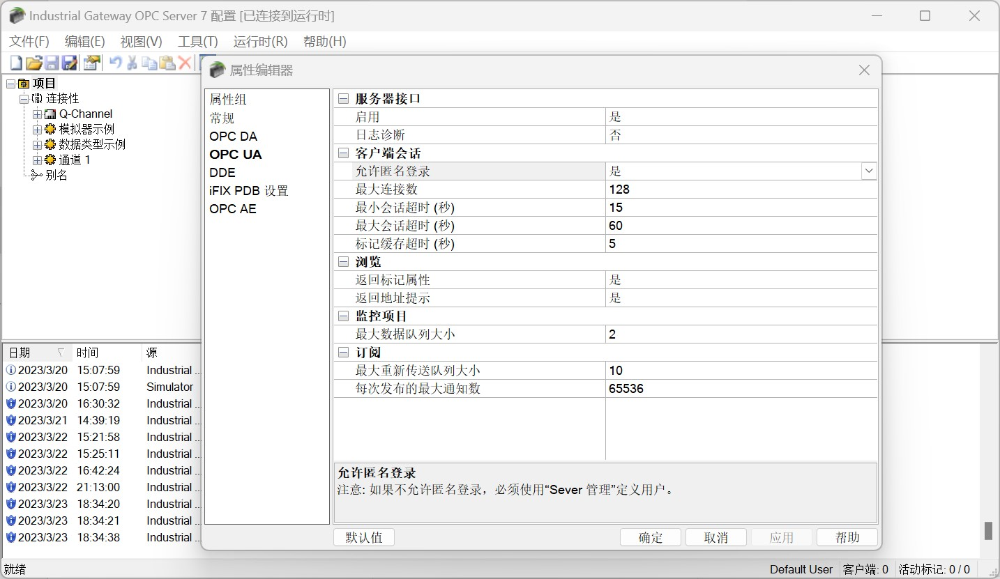
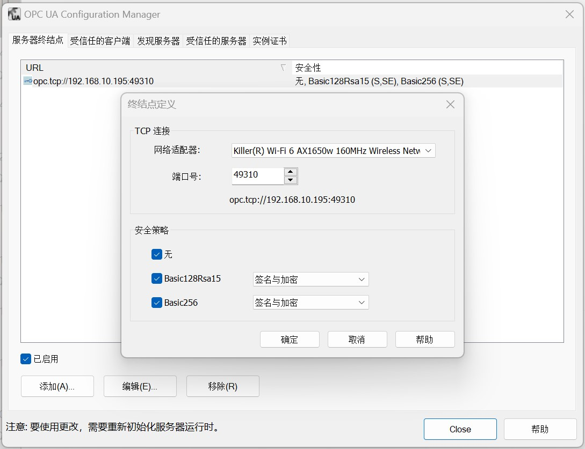
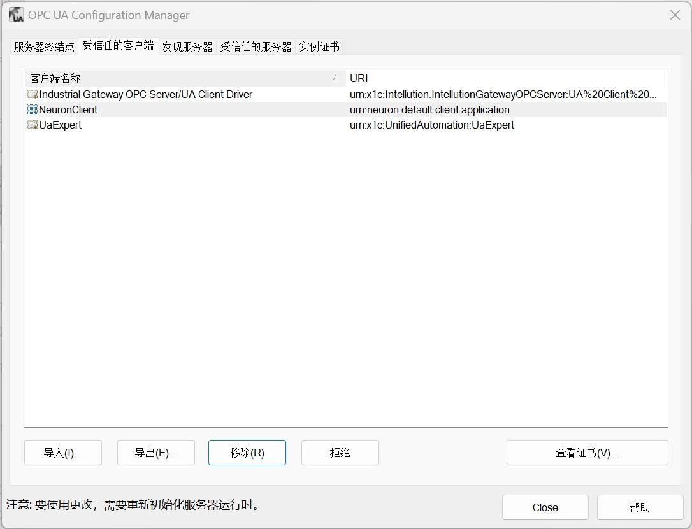

# Connect to Industrial Gateway OPC Server

## Anonymous login

1. Double click on the Industrial Gateway OPC Server icon in the system tray, open the "Properties Editor" of the "Project" in the main screen, and set OPC UA - "Allow Anonymous Login" to "Yes".

2. Right-click the Industrial Gateway OPC Server icon in the system tray, select "OPC UA Configuration" in the menu, switch to "Server Endpoint", double-click the endpoint entry, and check all security policies.

3. Right-click on the Industrial Gateway OPC Server icon in the system tray and select "Reinitialize" in the menu.

4. Neuron adds a new southbound OPC UA device, opens "Device Configuration", fills in the "Endpoint URL" of the target Server, without filling in username/password, without adding certificate/key, and starts the device connection;

## Certificate/Key + Anonymous Login

1. Set up an anonymous login as described above.

2. Refer to [parameter example](./example.md) to generate or convert a certificate/key;

3. Right-click the Industrial Gateway OPC Server icon in the system tray, select "OPC UA Configuration" in the menu, switch to "Trusted Clients", and import the client certificate in DER format into the list.

4. Right-click on the Industrial Gateway OPC Server icon in the system tray and select "Reinitialize" in the menu.

5. Neuron adds a new southbound OPC UA device, opens "Device Configuration", fills in the "Endpoint URL" of the target Server, does not need to fill in the username/password, adds the certificate/key and starts the device connection;

## Test Data List

|  Name    |  Address                                      |  Attribute      | Data type   |
| -------- | ------------------------------------------ | ---------- | ------ |
| Boolean1 | 2!数据类型示例.16 位设备.R 寄存器.Boolean1 | Read Write | BOOL   |
| DWord1   | 2!数据类型示例.16 位设备.R 寄存器.DWord1   | Read Write | UINT32 |
| Double1  | 2!数据类型示例.16 位设备.R 寄存器.Double1  | Read Write | DOUBLE |
| Float1   | 2!数据类型示例.16 位设备.R 寄存器.Float1   | Read Write | FLOAT  |
| LLong1   | 2!数据类型示例.16 位设备.R 寄存器.LLong1   | Read Write | INT64  |
| Long1    | 2!数据类型示例.16 位设备.R 寄存器.Long1    | Read Write | INT32  |
| QWord1   | 2!数据类型示例.16 位设备.R 寄存器.QWord1   | Read Write | UINT64 |
| Short1   | 2!数据类型示例.16 位设备.R 寄存器.Short1   | Read Write | INT16  |
| Word1    | 2!数据类型示例.16 位设备.R 寄存器.Word1    | Read Write | UINT16 |
| String1  | 2!数据类型示例.16 位设备.S 寄存器.String1  | Read Write | STRING |

