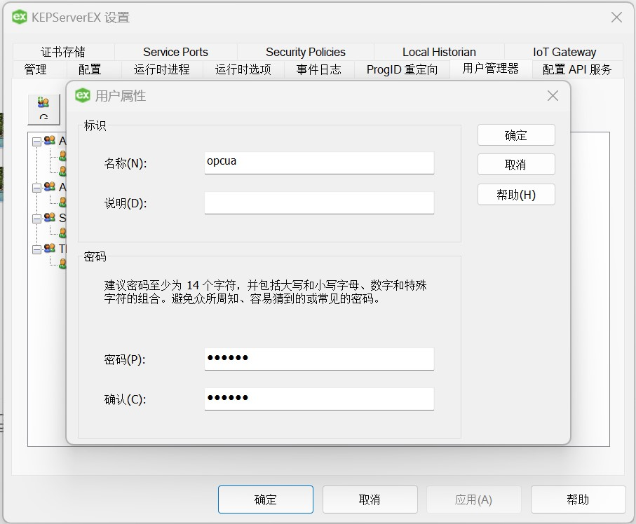
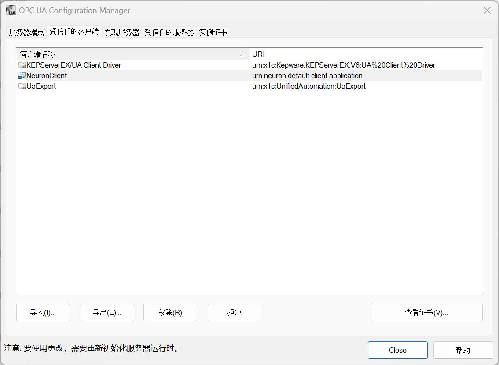

# Connect to KEPServerEX

## Username/Password Login

1. Right-click on the KEPServerEX icon in the system tray, select "Settings" in the menu, open "KEPServerEX Settings", switch to the "User Manager" card, create a new user under the Administrators group and set the username/password.

2. Double click on the KEPServerEX icon in the system tray, open the "Properties Editor" of the "Project" in the main screen and set OPC UA - "Allow Anonymous Login" to "No".

3. Right-click on the KEPServerEX icon in the system tray, select "OPC UA Configuration" in the menu, switch to "Server Endpoints", double-click on the endpoint entry and check all security policies.

4. Right-click on the KEPServerEX icon in the system tray and select "Reinitialize" in the menu;

5. Neuron adds a new southbound OPC UA device, opens "Device Configuration", fills in the "Endpoint URL" of the target Server, fills in the user name/password, no need to add certificate/key, and starts the device connection;

6. Right-click on the KEPServerEX icon in the system tray, select "OPC UA Configuration" in the menu, switch to "Trusted Clients" and set the NeuronClient certificate as trusted.

7. Right-click on the KEPServerEX icon in the system tray and select "Reinitialize" in the menu;

## Certificate/key + username/password login

1. Set the username/password as above;

2. Refer to [Connection policy](./policy.md) to generate or convert a certificate/key;

3. Right-click on the KEPServerEX icon in the system tray, select "OPC UA Configuration" in the menu, switch to "Trusted Clients" and import the client certificate in DER format into the list;

4. Right-click on the KEPServerEX icon in the system tray and select "Reinitialize" in the menu;

5. Neuron adds a new southbound OPC UA device, opens "Device Configuration", fills in the "Endpoint URL" of the target Server, fills in the user name/password, adds the certificate/key, and starts the device connection;

## Test Data List

|  Name    |  Address                                      | Attribute       | Data type   |
| -------- | ------------------------------------------ | ---------- | ------ |
| Boolean1 | 2!数据类型示例.16 位设备.R 寄存器.Boolean1 | Read Write | BOOL   |
| DWord1   | 2!数据类型示例.16 位设备.R 寄存器.DWord1   | Read Write | UINT32 |
| Double1  | 2!数据类型示例.16 位设备.R 寄存器.Double1  | Read Write | DOUBLE |
| Float1   | 2!数据类型示例.16 位设备.R 寄存器.Float1   | Read Write | FLOAT  |
| LLong1   | 2!数据类型示例.16 位设备.R 寄存器.LLong1   | Read Write | INT64  |
| Long1    | 2!数据类型示例.16 位设备.R 寄存器.Long1    | Read Write | INT32  |
| QWord1   | 2!数据类型示例.16 位设备.R 寄存器.QWord1   | Read Write | UINT64 |
| Short1   | 2!数据类型示例.16 位设备.R 寄存器.Short1   | Read Write | INT16  |
| Word1    | 2!数据类型示例.16 位设备.R 寄存器.Word1    | Read Write | UINT16 |
| String1  | 2!数据类型示例.16 位设备.S 寄存器.String1  | Read Write | STRING |

