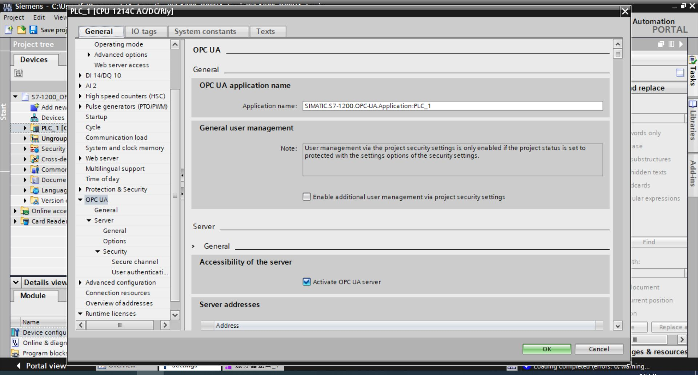

# Connect to Siemens S7-1200

## Username/Password Login

1. Select the target PLC in the TIA V16 programming software, right-click and open the "Properties" and under the "General" card open the "OPC UA" option group.

2. Open the "Activate OPC UA Server" option.

3. Check the required security policy in the "Security policies available on the server" list. If the security requirement is not particularly high, you can just check "No security", so that the speed of reading and writing requests will be faster.

4. Check "Automatically accept client certificates during runtime" in the "Trusted client" section.

5. Turn off "Enable guest authentication" in the "Guest authentication" section.

6. Check the "Enable username and password authentication" box in the "Username and password authentication" section.

7. Adding a user name and password to the "User Management" list.

8. Downloading programs to the PLC.

9. Neuron adds a new southbound OPC UA device, open "Device Configuration", fill in the "Endpoint URL" of the target PLC, user name/password, no need to add certificate/key.

## Test Data List

|  Name               |  Address                 | Attribute | Date type   |
| ------------------- | --------------------- | ---- | ------ |
| DeviceManual        | 3!DeviceManual        | Read | STRING |
| DeviceRevision      | 3!DeviceRevision      | Read | STRING |
| EngineeringRevision | 3!EngineeringRevision | Read | STRING |
| HardwareRevision    | 3!HardwareRevision    | Read | STRING |
| OperatingMode       | 3!OperatingMode       | Read | INT32  |
| OrderNumber         | 3!OrderNumber         | Read | STRING |
| RevisionCounter     | 3!RevisionCounter     | Read | INT32  |
| SerialNumber        | 3!SerialNumber        | Read | STRING |
| SoftwareRevision    | 3!SoftwareRevision    | Read | STRING |

