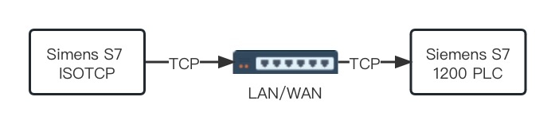
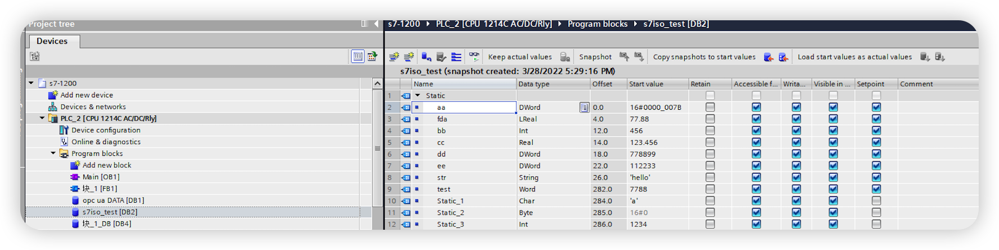

# Connect to Siemens S7-1200 PLC

This article will use the Siemens S7 ISOTCP plugin to connect to a Siemens S7-1200 PLC and read/write the tag values in the PLC.

The Siemens S7 ISOTCP plugin can connect to the PLC via the local network or the Internet, but note that if the PLC and the Neuron server are not on the same local network, you need to configure port mapping in the PLC.

## S7-1200 PLC Tags

This article assumes that you can connect to the PLC using the TIA Portal software.

* Use the TIA Portal software to open the PLC project, click the PLC project name to enter the PLC project configuration page.
* In the left menu, select the global data block tag table **Device -> Program Blocks -> Any Global Data Block (DB)** as shown in the following figure.

## Neuron Configuration

* In the southbound device, click `Add Device` to create a node that connects to the 1200 PLC by selecting the **Siemens S7 ISOTCP** plugin.
* After creating the node, click `Device Configuration` to enter the device configuration page and configure the node information according to the actual situation,
  * `PLC IP Address`: PLC IP address.
  * `PLC Port`: PLC port, the default is 102.
  * `CPU Rack Number`: PLC CPU Rack number, the default is 0.
  * `CPU Slot Number`: PLC CPU Slot number, the default is 1.
* In the created southbound device node, create a group, and create tags under the group.