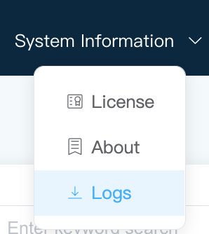

# Log Management

## Downloading Logs

Neuron supports one-click download of all log filed on web pages in version 2.3, as shown below.



The log download function bundles the /neuron/build/logs folder into neuron_logs.tar.gz file and downloads it to a web page. The file contains all the created driver and neuron log files.Directory level examples of files are shown below.


* data-stream-processing.log:data processing configuration;
* dlt645.log:northbound application configuration;
* modbus-plus-tcp.log:sorthbound application configuration;
* neuron.log:log of Neuron.

## Set The Debug Log Of The Node

Neuron supports the setting of printing debug logs of a node and automatically switching back to the default log level after approximately ten minutes. The Settings for each node are independent of each other.

Each node's `more` operation button has a `DEBUG log` operation button, as shown below.


When you click this button, a prompt like the one below appears.


In this case, the node starts to print debug logs. You can download the logs about ten minutes later to view the logs of the node, or view the logs under /build/logs.

:::tip
When the node debug log is printed, the neuron log will also be printed, and the default log level will be automatically switched back after ten minutes.
:::

## zlog.conf

Explanation of log configuration file.

```bash
[global]

file perms = 666

[formats]

simple = "%d [%V] %f:%L %m%n"

[rules]

*.*     "./logs/%c.log", 50MB * 1 ~ "./logs/%c.#2s.log"; simple
```

### Global

file perms: specify the default access permissions when creating a file.

* 600: only the owner has read and write permissions.
* 644: only the owner has read and write permissions, while group users and other users have only read permissions.
* 700: only the owner has read, write and execute permissions.
* 755: the owner has read, write and execute permissions, while group users and other users have only read and execute permissions.
* 711: the owner has read, write and execute permissions, while group users and other users have only execute permissions.
* 666: all users have read and write permissions for the file.
* 777: all users have read, write and execute permissions.

### Formats

Conversion format string: Conversion format string is similar to C's printf function.

* %d, print the log time;
* %V, log level, in uppercase;
* %f, source code file name;
* %L, source code line number;
* %m, user log, the log entered by the user from the zlog function;
* %n, newline character.

### Rules

Rules describe how logs are filtered, formatted, and outputted.
Grammar:

> (category).(level)    (output),(options, optional); (format name, optional)

#### category

Classification levels.

| Summary                      | Configuration file rule classification | Matching code classification               | Non-matching code classification         |
| --------------------------- | -------------- | ------------------------- | ---------------------- |
|*Match all                     | \*.\*            | aa，aa_bb，aa_cc，yy ...    | NONE                   |
| Categories ending with _ match the current and subcategories.  | aa_.*          | aa, aa_bb, aa_cc, aa_bb_cc | xx, yy                 |
| Categories not ending with _ match the exact category name.       | aa.*           | aa                         | aa_bb, aa_cc, aa_bb_cc |
| !Match categories with no rules found.        | !.*            | xx                         | aa                     |

#### level

zlog has six default levels: "DEBUG", "INFO", "NOTICE", "WARN", "ERROR", "FATAL". For example, *.DEBUG means any log level greater than or equal to DEBUG will be output.

| Expression  | Meaning               |
| -------- | ----------------- |
| \*.\*        | All levels            |
| *.debug  | Code internal level >= debug |
| *.=debug | Code internal level == debug |
| *.!debug | Code internal level != debug |

#### (output),(options, optional);

[output],[options, optional];

| Action                 | Output Field | Additional Options |
| ---------------------- | ------------ | ------ |
| Standard output        | >stdout      | N/A |
| Standard error output  | >stderr      | N/A |
| Syslog output          | >syslog      | Syslog facility (facility): LOG_USER (default), LOG_LOCAL [0-7] Required |
| Pipe output            | \|cat        | N/A |
| File                   | "File path"  | File rotation, 10M * 3 ～ "press.#r.log". For example, "./logs/%c.log", 50MB * 1 ~ "./logs/%c.#2s.log" means rotate every 50M, #2s means the length of the serial number is at least 2 digits, starting from 00.  |
| Synchronous IO file    | -"File path" | N/A |
| User-defined output    | $name        | "path" is used for record output, dynamic or static.|

#### (format name, optional)

[format name, optional]