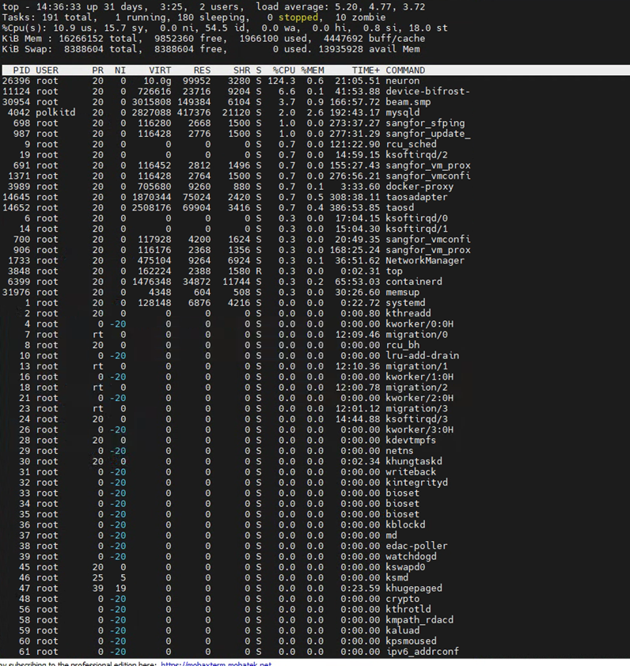
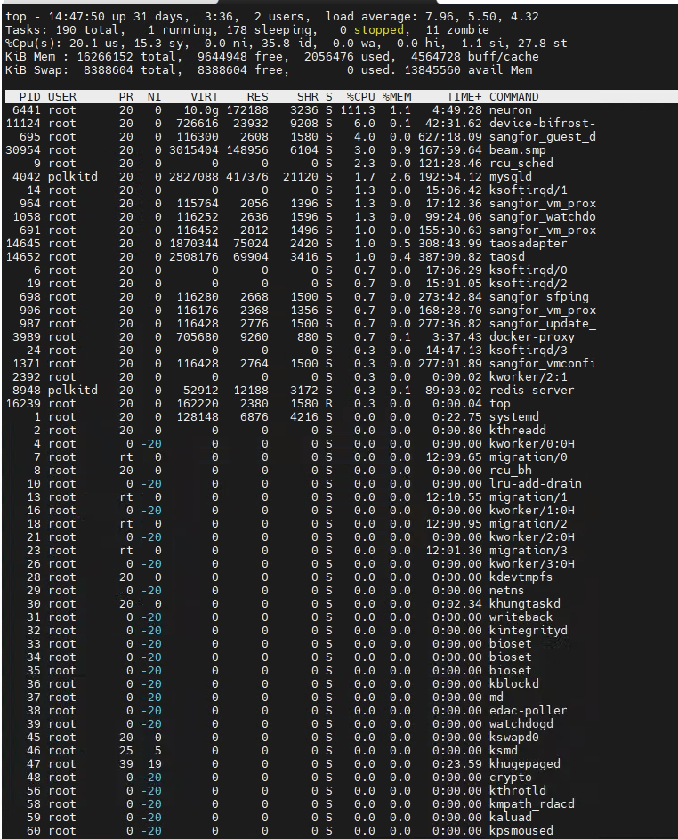

# Performance Test

Neuron performance verification tests for Neuron data collection, distribution, and storage capabilities. The tests also concurrently verify various functions, including the rule engine, edge computing, and cloud-edge collaboration. The tests monitor device connections, connection stability, message success rates, CPU usage, network IO, and memory status. Here are the detailed test scenarios.

## Test Scenarios

The following test scenarios have been planned according to the actual business needs:

### Data Collection Test 1

| Number of Devices | Number of Data Tags per Device | Collection Frequency | Total Data Tags |
| ----------------- | ------------------------------ | -------------------- | --------------- |
| 500               | 30                             | 1s                   | 15000           |

Utilizing the Modbus TCP protocol, Neuron establishes a simulated connection with 500 devices. It collects data from 30 data tags per device, at a rate of one collection per second. This results in an aggregate collection of 15,000 data tags.

### Data Collection Test 2

| Number of Devices | Number of Data Tags per Device | Collection Frequency | Total Data Tags |
| ----------------- | ------------------------------ | -------------------- | --------------- |
| 500               | 30                             | 0.5s                 | 15000           |

Utilizing the Modbus TCP protocol, Neuron establishes a simulated connection with 500 devices. It collects data from 30 data tags per device, at a rate of two collections per second. This results in an aggregate collection of 15,000 data tags.

### Data Distribution Test 1

| Number of Devices | Number of Data Tags per Device | Total Data Tags | Distribution Method |
| ----------------- | ------------------------------ | --------------- | ------------------- |
| 1                 | 50                             | 50              | Neuron API          |

Utilizing the Modbus TCP protocol, Neuron simulates a connection with a single device and writes 50 data tags to it via the Neuron API interface. The test measures the total time taken to complete this data distribution task.

### Data Distribution Test 2

| Number of Devices | Number of Data Tags per Device | Total Data Tags | Distribution Method |
| ----------------- | ------------------------------ | --------------- | ------------------- |
| 4                 | 50                             | 200             | Neuron API          |

Utilizing the Modbus TCP protocol, Neuron simulates connections with 4 devices and transmits a total of 200 data points to these devices via the Neuron API interface. The test aims to measure the total time required to accomplish this data distribution task.

### Bulk Write to TDengine

A simulation is run where Neuron collects data from 100 devices, each containing 100 data tags. This adds up to a total of 10,000 data tags being reported per second to the EMQX Enterprise Edition. This data is then written in real-time to the TDengine database using EMQX Rule Engine.

## 测试架构

1. 测试资源

Modbus 模拟器模拟现场 PLC 设备，Neuron 通过 Modbus TCP 连接模拟器，Neuron 采集到数据后通过 MQTT 协议发送至 EMQX 企业版，数据通过 EMQX 内置规则引擎写入涛思数据库。

所使用 Neuron EMQX 企业版、Modbus 模拟器资源如下：

服务1: 笔记本电脑
* Modbus 模拟器
* JMeter 软件

服务2: Linux 服务器 4C/16G
* Neuron V2.2.1
* EMQX 企业版
* TDengine 数据库
* 云边协同管理软件

2. 测试架构图

3. 测试工具介绍

<b>Modbus 模拟器</b>

[PeakHMI Modbus TCP slave simulator](https://www.hmisys.com)，是一款功能齐全、性能优秀的 Modbus 模拟器。

<b>性能测试工具 JMeter</b>

性能测试工具 JMeter 是一款基于 Java 的压力测试工具。它可以用于对服务器、网络或对象模拟繁重的负载来测试它们的强度或分析不同压力类型下的整体性能。

## 测试结论及报告

1. Neuron 数据采集测试一

Neuron 通过 ModbusTCP 协议，模拟连接 500 台设备，每台设备采集 30 个数据点，采集频率为 1 秒一次，总计Neuron 每秒采集 15000 个数据点位。
* Neuron 采集程序 CPU 使用率约为 124.3%，内存使用率约为 0.6%
* 服务器资源 CPU 空闲在 55% 左右，内存空闲在 9.8G 左右。

 

2. Neuron 数据采集测试二

Neuron 通过 ModbusTC P协议，模拟连接 500 台设备，每台设备采集 30 个数据点，采集频率为 0.5 秒一次，总计 Neuron 每 0.5 秒采集 15000 个数据点位。
* Neuron 采集程序 CPU 使用率约为111.3%，内存使用率约为 1.1%
* 服务器资源 CPU 空闲在 35% 左右，内存空闲在 9.5G 左右。

3. Neuron 数据下发测试一

Neuron 通过 ModbusTCP 协议，模拟连接 1 台设备，通过 Neuron API 接口向设备写入 50 个数据点，测试完成数据下发总计时间。
Neuron 对 1 个设备下发50个数据点位，最大响应时间 159 毫秒，最小响应时间 3 毫秒，平均响应时间 91 毫秒，总计耗时 159 毫秒。

4. Neuron 数据下发测试二

Neuron 通过 ModbusTCP 协议，模拟连接 4 台设备，通过 Neuron API 接口向设备总计写入 200 个数据点，测试完成数据下发总计时间。
Neuron 对 4 个设备下发共计 200 个数据点位，最大响应时间 107 毫秒，最小响应时间 3 毫秒，平均响应时间 52 毫秒，总计耗时 107 毫秒。

5. Neuron 采集数据批量写入涛思数据测试

模拟 Neuron 采集 100 个设备的数据，每个设备包含 100 个数据点位，每秒上报共 10000 个数据点位到 EMQX 企业版，通过 EMQX 内置规则引擎将以上数据实时写入涛思数据库。
* EMQX 软件 CPU 使用率约为 91.2%，内存使用率约为 1.2%
* 服务器资源 CPU 空闲在 13% 左右，内存空闲在 156M 左右。

	 

