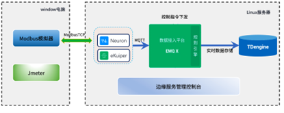

# Performance Test

Neuron performance verification tests for Neuron data collection, distribution, and storage capabilities. The tests also concurrently verify various functions, including the rule engine, edge computing, and cloud-edge collaboration. The tests monitor device connections, connection stability, message success rates, CPU usage, network IO, and memory status. Here are the detailed test scenarios.

## Test Scenarios

The following test scenarios have been planned according to the actual business needs:

### Data Collection Test 1

| Number of Devices | Number of Data Tags per Device | Collection Frequency | Total Data Tags |
| ----------------- | ------------------------------ | -------------------- | --------------- |
| 500               | 30                             | 1s                   | 15000           |

Utilizing the Modbus TCP protocol, Neuron establishes a simulated connection with 500 devices. It collects data from 30 data tags per device, at a rate of one collection per second. This results in an aggregate collection of 15,000 data tags.

### Data Collection Test 2

| Number of Devices | Number of Data Tags per Device | Collection Frequency | Total Data Tags |
| ----------------- | ------------------------------ | -------------------- | --------------- |
| 500               | 30                             | 0.5s                 | 15000           |

Utilizing the Modbus TCP protocol, Neuron establishes a simulated connection with 500 devices. It collects data from 30 data tags per device, at a rate of two collections per second. This results in an aggregate collection of 15,000 data tags within 0.5s.

### Data Distribution Test 1

| Number of Devices | Number of Data Tags per Device | Total Data Tags | Distribution Method |
| ----------------- | ------------------------------ | --------------- | ------------------- |
| 1                 | 50                             | 50              | Neuron API          |

Utilizing the Modbus TCP protocol, Neuron simulates a connection with a single device and writes 50 data tags to it via the Neuron API interface. The test measures the total time taken to complete this data distribution task.

### Data Distribution Test 2

| Number of Devices | Number of Data Tags per Device | Total Data Tags | Distribution Method |
| ----------------- | ------------------------------ | --------------- | ------------------- |
| 4                 | 50                             | 200             | Neuron API          |

Utilizing the Modbus TCP protocol, Neuron simulates connections with 4 devices and transmits a total of 200 data points to these devices via the Neuron API interface. The test aims to measure the total time required to accomplish this data distribution task.

### Bulk Write Test to TDengine

A simulation is run where Neuron collects data from 100 devices, each containing 100 data tags. This adds up to a total of 10,000 data tags being reported per second to the EMQX Enterprise Edition. This data is then written in real-time to the TDengine database using EMQX Rule Engine.

## Test Architecture

### Test Resources

The Modbus simulator emulates onsite PLC devices. Neuron connects to this simulator via Modbus TCP, collects data, and transmits it to the EMQX Enterprise Edition using the MQTT protocol. This data is then written into TDengine utilizing EMQX's built-in rule engine.

The Neuron, EMQX Enterprise Edition, and Modbus simulator resources used are as follows:

Setup 1: Laptop
* Modbus Simulator
* JMeter

Setup 2: Linux Server (4C/16G)
* Neuron V2.2.1
* EMQX Enterprise Edition
* TDengine
* Cloud-Edge Collaboration Management Software

### Test Architecture Diagram

### Test Tools

<b>Modbus Simulator</b>

[PeakHMI Modbus TCP slave simulator](https://www.hmisys.com) is a full-featured, high-performance Modbus simulator.

<b>JMeter</b>

 JMeter is a Java-based test tool to simulate a heavy load on a server, group of servers, network, or object to test its strength or to analyze overall performance under different load types. 

## Test Conclusion and Report

### Data Collection Test 1

Utilizing the Modbus TCP protocol, Neuron establishes a simulated connection with 500 devices. It collects data from 30 data tags per device, at a rate of one collection per second. This results in an aggregate collection of 15,000 data tags within one second.

* The Neuron collection program consumes about 124.3% of CPU resources and approximately 0.6% of memory resources.
*  As for the server, around 55% of CPU resources and approximately 9.8 GB of memory are free.

 

### Data Collection Test 2

Utilizing the Modbus TCP protocol, Neuron establishes a simulated connection with 500 devices. It collects data from 30 data tags per device, at a rate of two collections per second. This results in an aggregate collection of 15,000 data tags within 0.5s.
* The Neuron collection program consumes about 111.3% of CPU resources and approximately 1.1% of memory resources.
*  As for the server, around 35% of CPU resources and approximately 9.5 GB of memory are free.

### Data Distribution Test 1

Utilizing the Modbus TCP protocol, Neuron simulates a connection with a single device and writes 50 data tags to it via the Neuron API interface. The test measures the total time taken to complete this data distribution task.

Neuron writes 50 data tags to a single device, where the maximum, minimum, and average response times are 159 ms, 3 ms, and 91 ms, respectively. The total time taken to complete the operation is 159 ms.

### Data Distribution Test 2

Utilizing the Modbus TCP protocol, Neuron simulates connections with 4 devices and transmits a total of 200 data points to these devices via the Neuron API interface. The test aims to measure the total time required to accomplish this data distribution task.

Neuron writes 200 data tags to 4 devices, where the maximum, minimum, and average response times are 107 ms, 3 ms, and 52 ms, respectively. The total time taken to complete the operation is 107 ms.

### Bulk Write Test to TDengine

A simulation is run where Neuron collects data from 100 devices, each containing 100 data tags. This adds up to a total of 10,000 data tags being reported per second to the EMQX Enterprise Edition. This data is then written in real-time to the TDengine database using EMQX Rule Engine.
* EMQX consumes about 91.2% of CPU resources and approximately 1.2% of memory resources.
*  As for the server, around 13% of CPU resources and approximately 156 MB of memory are free.

	 

