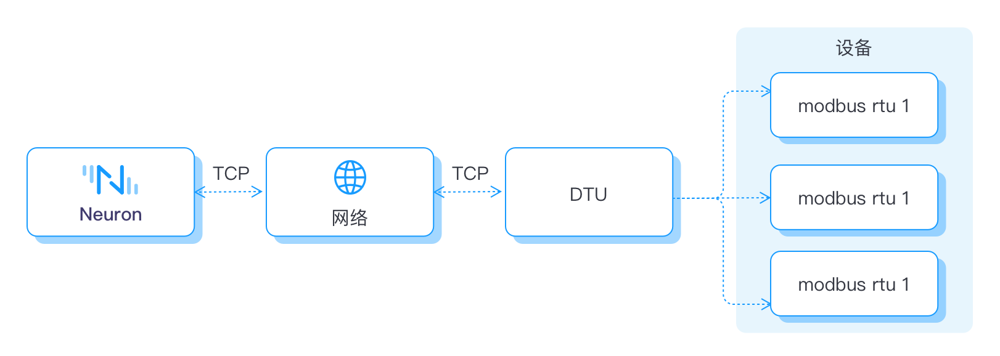

# Industrial Device Connectivity
Neuron is a versatile solution that offers a wide range of pluggable connectivity and processing modules for various industrial applications. These modules include protocols such as Modbus, OPC UA, Ethernet/IP, IEC104, BACnet, Siemens, Mitsubishi, and more. Each module enables seamless communication with specific types of devices, categorized into areas such as building automation, CNC machines, robotics, electricity, and various PLCs.

Neuron plays a crucial role in factory digitized transformation by connecting disparate devices with native protocols to both cloud-based and on-premise data centers. It acts as a bridge, enabling the transmission of data from these devices to the cloud or data center for further processing and analysis. This connectivity empowers businesses to unlock valuable insights and drive operational efficiency.

Moreover, Neuron enables bidirectional communication, allowing industrial applications to send commands back to the field devices. This capability facilitates monitoring, management, and control of these devices remotely, enhancing operational control and responsiveness.

In larger-scale deployments, multiple Neuron instances can be deployed at the edge of a district site. These instances facilitate real-time data collection from a diverse range of IIoT devices. Some devices may be connected directly to Neuron, while others might utilize a Data Transfer Unit (DTU) for connectivity. The collected real-time data is then reported to the data center or cloud infrastructure for analysis by relevant systems and applications. This data transmission is facilitated through the EMQX Broker, ensuring secure and efficient communication between Neuron and the data center/cloud.

For smaller local sites, a single Neuron instance deployed at the edge is typically sufficient to handle the data collection requirements. Neuron's flexibility allows it to adapt to the scale and complexity of the deployment, making it suitable for a wide range of industrial scenarios.

Neuron exhibits high scalability, supporting connections to thousands of devices and facilitating message forwarding to hundreds of industrial applications. This means that each application can access all device information through a single point of connection to the EMQX Broker. This unified access simplifies integration efforts, reduces complexity, and provides a streamlined interface for industrial applications to interact with and leverage data from multiple devices.

## DTU Connectivity
DTU is a device or module that is used to establish connectivity between remote devices and a central system, typically over a wide area network (WAN) or cellular network such as NB-IoT, LoRa, 3G, 4G, or 5G. DTUs provide a means of transmitting data from remote locations to a central data center or cloud infrastructure for further processing and analysis.

<b>Extended Reach</b>
DTU connections allow Neuron to establish connectivity with remote devices located in areas where direct wired or Wi-Fi connections may not be feasible or cost-effective. This extended reach enables the integration of devices situated in geographically dispersed locations, expanding the scope of data collection and enabling centralized monitoring and control.

<b>Flexibility and Mobility</b>
DTU connections provide flexibility and mobility in device deployment. As DTUs utilize cellular networks, they can be easily moved or relocated without the need for infrastructure changes or complex reconfigurations. This flexibility is especially valuable in dynamic industrial environments where devices may need to be relocated or added as operations evolve.
