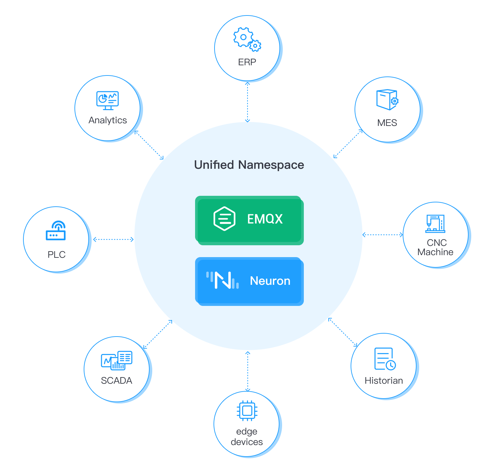

# Unified Namespace

The Unified Namespace (UNS) Solution is a comprehensive software suite that combines the power of EMQX Broker and Neuron to create a centralized repository for contextualized data. It provides a platform where any application or device can publish or subscribe to data that is tailored to their specific needs. By offering a unified namespace and communication interface, this solution simplifies data operations at scale and enables seamless interaction between different industrial applications.

The EMQX Broker serves as a communication bridge between different industrial applications, which function as both data producers and data consumers. Meanwhile, Neuron acts as the interface connecting to various Industrial Internet of Things (IIoT) devices to generate contextualized information. This contextualized data is subsequently published to the EMQX Broker. By establishing a single MQTT connection, all industrial applications, including SCADA tools, BI analytic software, MES, and ERP systems, can access and visualize this data.

## UNS Architecture

The UNS Architecture is designed as a 3-tier architecture. The bottom tier is the data producers that generate industrial automation data, while the top tier is the data consumers where analytical applications and AI/ML software reside. The middle tier is the centralized repository for contextualized data, where EMQX and Neuron facilitate data exchange between data producers and consumers.

## Benefits of using UNS

<u>Integration Simplification</u>
One of the advantages of the UNS is its ability to simplify integration. With the EMQX Broker, the solution facilitates communication between various industrial applications, acting as both data producers and data consumers. This means that different applications can easily exchange data, share information, and collaborate within a unified environment. By eliminating the need for multiple integration points and complex data mappings, the solution streamlines the integration process and reduces development time and effort.

<u>Easy Devices Additions</u>
Another benefit of the UNS is its capability to accommodate easy additions of devices. The Neuron component of the solution connects to a wide range of Industrial Internet of Things (IIoT) devices. It collects data from these devices. By leveraging this powerful combination, the solution can generate contextualized data that is tailored to the specific requirements of different applications. This contextualized data is then published to the EMQX Broker, making it accessible through a single MQTT connection across all industrial applications.

<u>Unified Data Presentation</u>
The UNS comes to collect all the unstructured data from the automation floor and adds context to it. This is the process of data normalization and contextualization which means bringing together data from many different sources into a single information source with a timestamp. All of this data is organized and accessible in a consistent and standardized way, regardless of the data source or format. This enables enterprise to make more informed decisions and optimize their processes for greater efficiency and profitability.

<u>Data Quality Improvement</u>
Contextualized data can improve the quality of data used in AI/ML models. By providing additional context and metadata, AI/ML models can better understand and interpret data, reducing errors and improving accuracy. In addition, contextualized data also enhance the predictive capabilities of AI/ML models. By providing additional context, models can make more accurate predictions about future events or outcomes.
