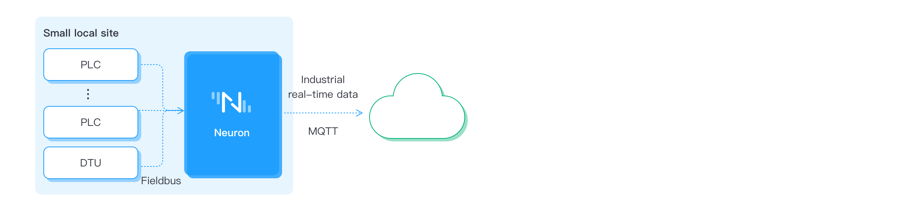
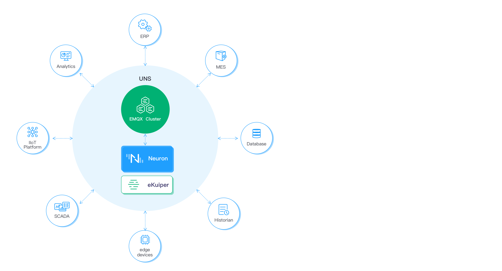

# Use Cases

Neuron is an Industrial IoT connectivity solution capable of meeting the requirements of several data acquisition and manipulation use cases for discrete, and process manufacturers.

## Industrial Device Connectivity
Neuron is usually used for factory digitized transformation, connecting disparate native protocol devices to multiple industrial information applications that support MQTT or API, such as MES, ERP, SCADA, IIoT platform and analytics system. Neuron also allows these industrial applications send back command to monitor, manage and control the field devices. 

Multiple Neuron can be deployed on the edge side of the district site for real-time data collection of various equipment. Some equipment are connected directly, others may be connected via DTU. Real-time data are reported to the data center, through EMQ X Broker. After filtering through the rule engine, data are stored or forwarded to the relevant analysis system and application.

Single Neuron can be depolyed on the edge side of the small local site.

Neuron can support connections up to thousands of devices and forward messages to hundreds of industrial applications. Each application can access to all devices information in a single point of connection to EMQX broker.

As Neuron may contains up to ten thousands of data tags, tools must be provided to accelerate deployment. So, Neuron provides Excel file configuration capability, users can export, and import to define the data tags. Neuron also provides API configuration for applications to manage data tags. 

## MQTT SparkplugB Solution
Sparkplug B is an extended open interoperability protocol based on MQTT. It enables devices and applications to send and receive messages over MQTT in a stateful way. MQTT doesn't ensure that all message received by device or application is valid and current. Sparkplug improve this by using "last will" mechanism for ensuring the message is valid and current. This make it possible to use MQTT in industrial environment.

MQTT SparkplugB offers below advantages:
* Plug and Play IIoT Solution
* High scalability
* Unified Infrastructure

Neuron is a EoN nodes of Sparkplug solution in the below infrastructure. Its roles is to implement EoN nodes gateway to convert various diverse industrial data to Sparkplug message and deliver to industrial application through EMQX MQTT broker. The second reason to use Neuron in Sparkplug solution is to assist some “data polling” devices to be smarter and to report data in asynchronous way.

 
EMQX MQTT broker or cluster is the main compoenet of infrastruture to manage all MQTT message traffic. Devices and sensors through the Neuron (EoN node) can communicate with application node such as SCADA systems, data historians and analysis programs.

## Unified Namespace
Unified namespace is a suit of software solution (EMQ X broker + Neuron) that acts as central repository where any application and device can publish or subscirbe contextualized data for a specific need. This simplifies dataops at scale since it is possible to interact with different industrial applications using the same namespace and communication interface. This makes your industrial information system to scale up easily.

Unified Namespace Solution offers below advantages:
* Integration Simplification
* Easy Devices Additions

The EMQ X broker allows the communication between the various industrial applications, which are data producers and data consumers at the same time. Neuron will connect to various IIoT devices and process the collected data in eKuiper stream processing engine to produce contextualized data. This contextualized data will be published to EMQ X broker and can be visualized in all industrial applications such as SCADA tools, BI analytic software, MES, ERP. 

That is EMQ X broker and Neuron together can form an UNS for various industrial applications to uitilize the benefits of UNS. For example, UNS eliminates massive point to point connections and minimizes the load on data transmission. 
