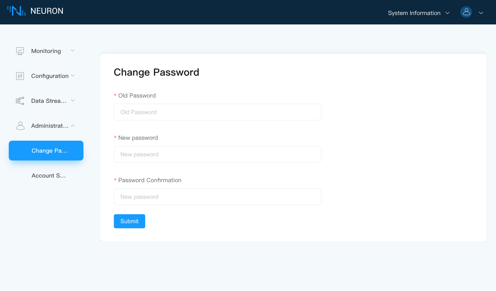

# Change password

Select the function of `Change Password` in `Administration` to change the login password, as shown in the figure below.



If the user forgets the changed password, the user can reset the password by executing the command.

```shell
./neuron --reset-password
```
