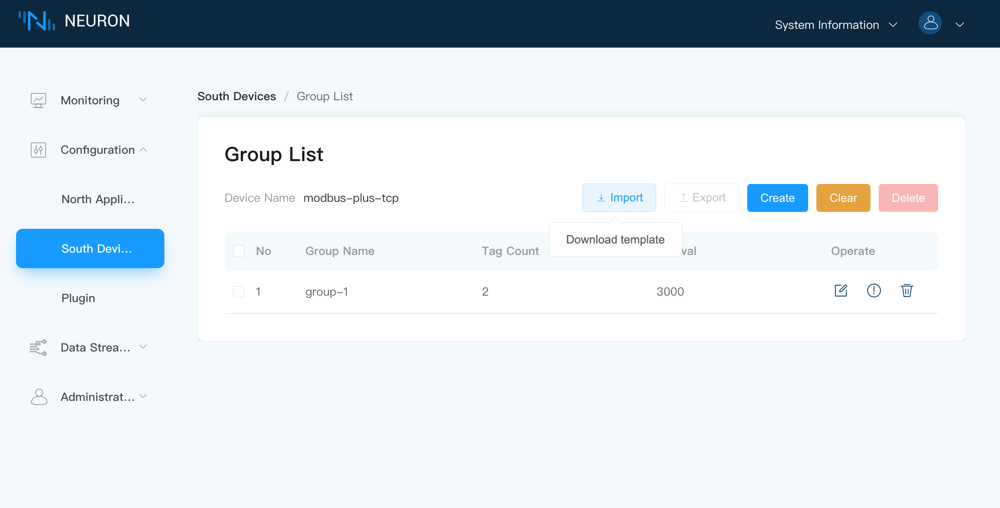

# Tag Configuration Import/Export

Neuron provides the function of batch import and export of label configuration information in Excel form, which can speed up the configuration of data labels, and can easily export the created data label information to external storage.

## Data Tags Import

### Step 1 Download Template

Hover the mouse over `Import` and the button `Download Template` will appear, as shown below.

Click the `Download Template` button to download the Excel sheet.

### Step 2 Fill in the Excel Sheet

Fill in the relevant information according to the Excel sheet format as shown below.

The following items must be filled accordingly.

* Fill in the Group name, when the name of the entered group does not exist, a new group will be created automatically with the name of this group;
* Fill in the Tag name;
* Fill in the address of the Tag;
* Select the attribute from the drop-down box;
* Select the data type from the drop-down box;
* Fill in the description, which can be left blank;
* Optional, used to set the multiplier of the read value, can be empty;
* Optional, when the data type is float or double, it is used to set the precision;

### Step 3 Import the Excel Sheet

Click on the `Import` button and select the Excel file to be imported.

## Data Tags Excel sheet Export

* Select the group to be exported, you can select all with one click;
* Click the `Export` button, the information in the group, including the label information under the group, will be exported to an Excel table.
