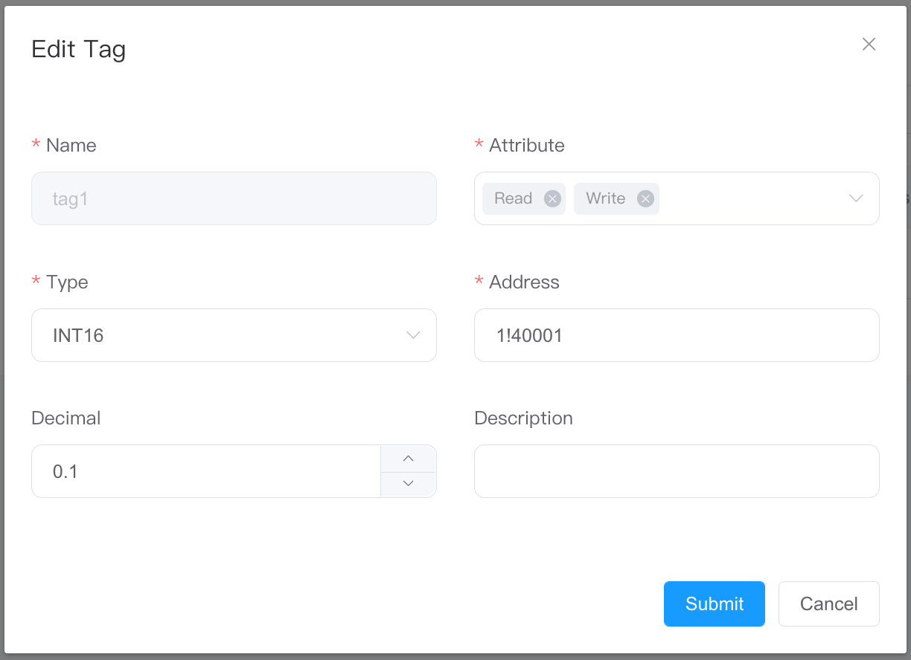

# Configure Tag

## Usage Of Decimal

Device value * Decimal = Display value

When configuring the decimal at the tags, the write attribute supports the writing of the multiplication factor, E.g.

The value of decimal is 0.1, and write display value on the dashboard , such as 23.4, the dashboard display value is 23.4, and the value written into the device is 234, as shown in the figure below.

* tag1 is the display value configured with 0.1 decimal.
* tag2 is the display value without decimal configured (i.e. device value).

:::tip
If the configured decimal is 0.1 and the input value exceeds one decimal place, it will be rounded up automatically. E.g, if you enter 23.56, 23.6 is displayed, and the value written to the device is 236.
:::
