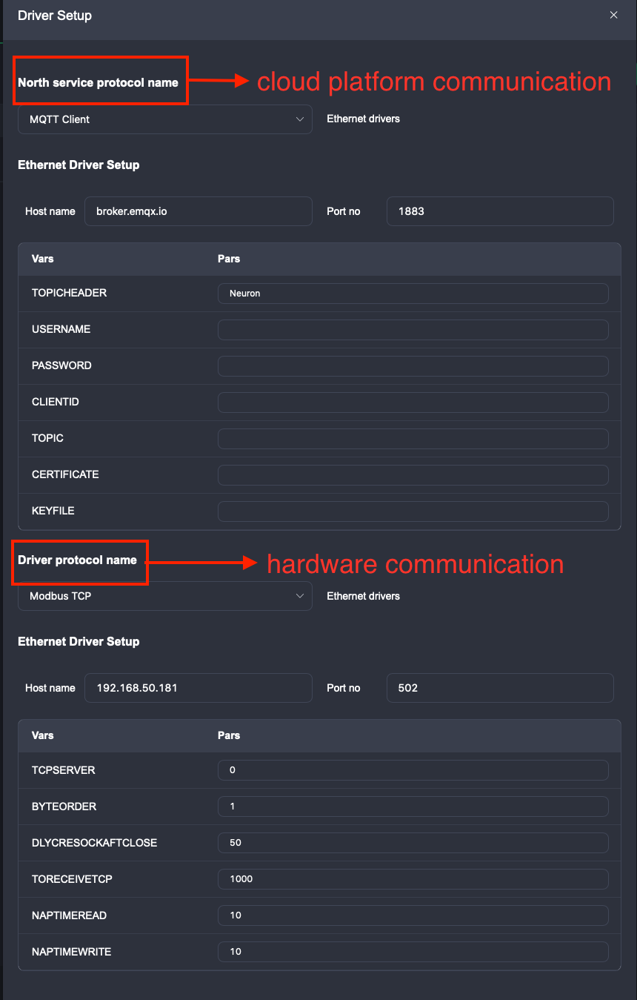
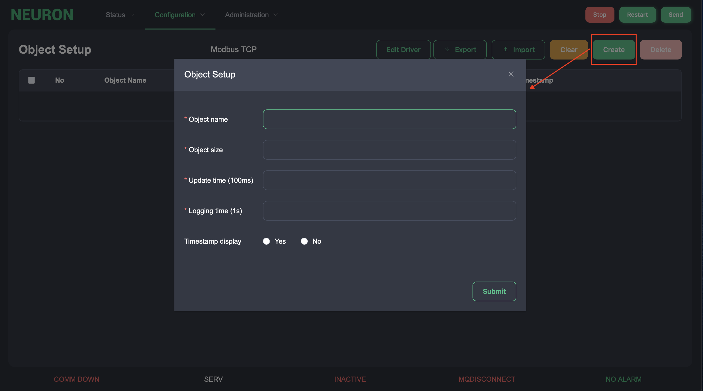
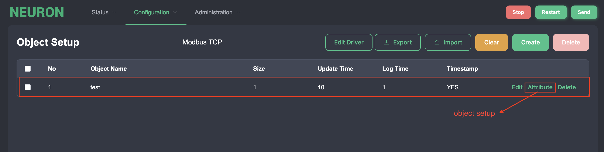
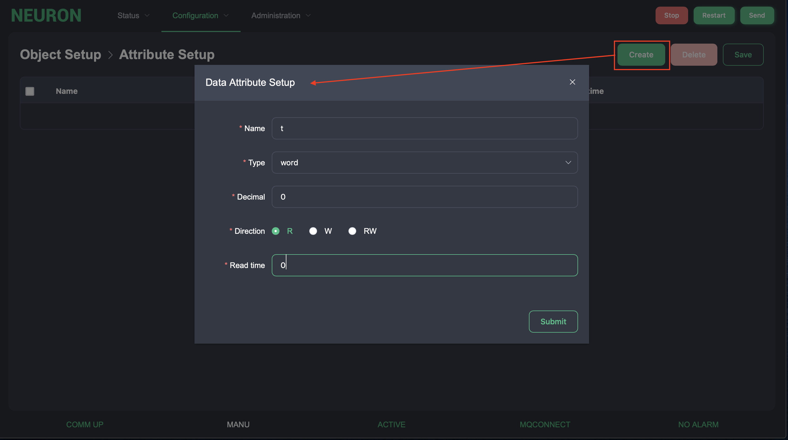
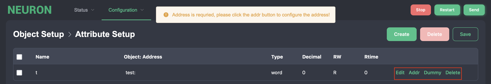
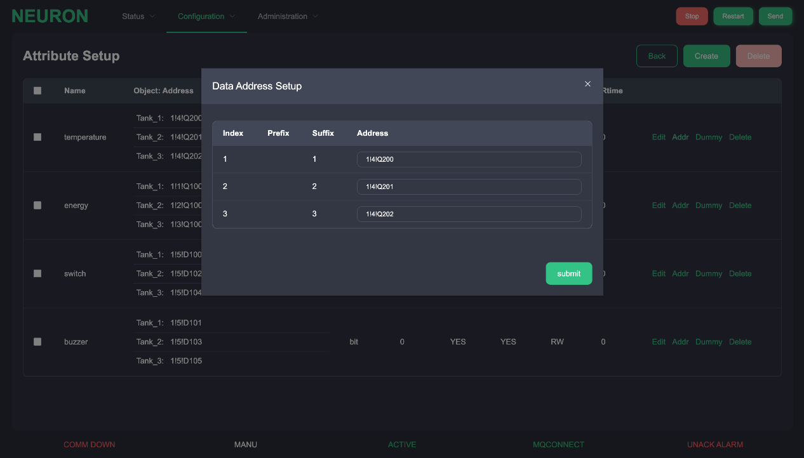
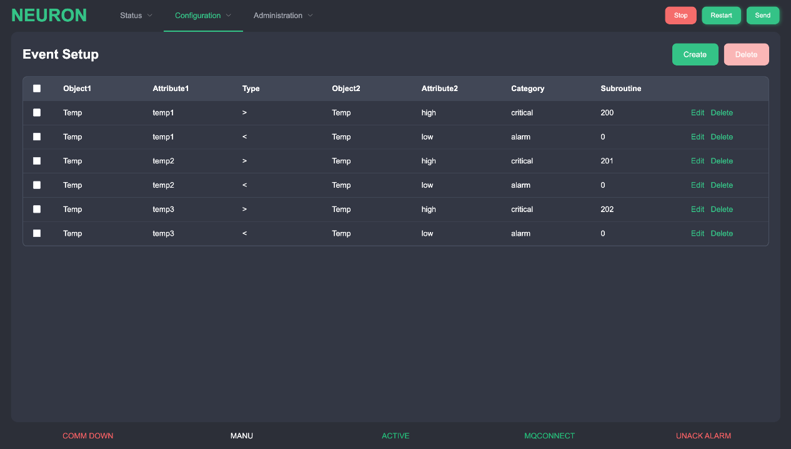
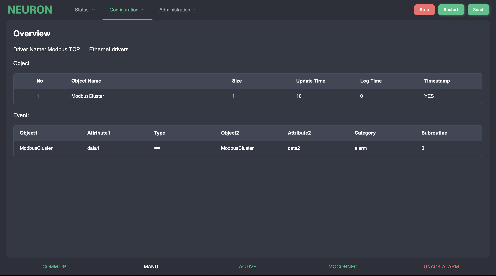

# Configuration Setup

These functions are used to setup the protocol communication details in terms of channel, object, attributes and tag address for data exchange with machine. Events and alarms are also defined in configuration for advance functions.

## Object Setup

Select the object settings option under the configuration menu. This option contains settings for protocol communication details in terms of channels, objects, attributes, and tag addresses.

### Channel Setup

Select &quot;New Driver&quot; button on the page, there are two kinds of channels, hardware communication channel and cloud platform communication channel, as shown in the figure.

Driver communication are used to setup the details for hardware device or PLC communication. Cloud communication are used to setup the communication with cloud platform. MQTT is the only selection at the moment. However, both channels have its own specific communication parameters in a list box.

For driver communication, there are two types communication driver.

| Type            | Description                                                         |
| --------------- | ------------------------------------------------------------------- |
| Ethernet driver | IP address/hostname and port number.                                |
| Serial driver   | Device file location, baud rate, data bit, stop bit and parity bit. |

Here are some notes on the specific parameters of the northbound protocol.

| Variables/Paramters   | Description                     | Binding                                          |
| :------------| :--------------------------------------- |:-----------------------------------------------  |
| TOPPICHEADER | MQTT Subscribe to the topic prefix name  |Alphabet、Number、-、/,No more than 20 characters in length   |
| USERNAME     | MQTT Username                    | NONE，No more than 14 characters in length                |
| PASSWORD     | MQTT Password                    | NONE，No more than 20 characters in length                |
| CLIENTID     | UUID                             | Alphabet start,Alphabet,number,-,Length 36                |
| TOPIC        | MQTT Subscribe to the theme      | Alphabet,number,-, /,No more than 20 characters in length |
| CERTIFICATE  | Certificate file path            |/ start,Alphabet、number、/,No more than 254 characters in length   |
| KEYFILE      | Key file path                    |/ start，Alphabet、number、/,No more than 254 characters in length   |

Here are some notes on the specific parameters of the southbound driver.

| Variables/Paramters  | Description                     | Binding                                          |
| :------------------- | :------------------------- |:---------------------|
| DLYCSCLOSE=5         | Wait time for creating a serial connection, in ms      |  0-max(int),No more than 65535  |
| TIMEOUT=20           | Timeout time for connecting to the serial port,in ms  |  0-max(int)，No more than 65535  |
| SRC_ABKG             | Source address                                        |   0,8                           |
| PROC3964R            | Block check character                                 |   0,1                           |
| BYTEORDER=1          | endian，four cases：0 -> BE4321,1 -> BE3412,2 -> LE1234,3 -> LE2143  |   0，1，2，3       |
| DLYCRESOCKAFTCLOSE=50| Create network port connection wait time,in ms        | 0-max(int)，No more than 65535   |
| TORECEIVETCP=0       | Receive data timeout time,in ms                       | 0-max(int)，No more than 65535   |
| NAPTIMEREAD=10       | Wait time before read data,in ms                      | 0-max(int)，No more than 65535   |
| NAPTIMEWRITE=10      | Wait time before writing data,in ms                   | 0-max(int)，No more than 65535   |
| S7P_SRCTSAP          | Source slot number                                    | Number of hexadecimal digits     |
| S7P_DSTTSAP          | Destination slot number                               | Number of hexadecimal digits     |
| USERNAME             | User name（opc）                                   | Character length not to exceed 254  |
| PASSWORD             | Password（opc）                                    | Character length not to exceed 254 |
| CERTIFICATE          | Certificate path                                  | Character length not to exceed 254 |
| KEYFILE              | Key Path                                          | Character length not to exceed 254  |
| ADDRSUFFIX           | NODEID                                            | Character length not to exceed 254  |
| TCPSERVER            | NO.TCP Serve                                      | 0，1                   |

### Object Setup Details

After finishing the setup of Channel, start to setup object details.

To add an object to the list, press the &quot;Create&quot; button on the right. An object settings dialog will appear.

| Column    | Description                                                                       |
| :--------- | :--------------------------------------------------------------------------------- |
| Name      | This is the name of the object. (30 characters)                                   |
| Size      | This is the number of objects that share the same attributes and characteristics. |
| Time      | This is time interval of data transmission rate. (in second)                      |
| Log Time  | This is time interval of data logging on the disk. (in second)                    |
| Timestamp | A flag that whether transfer timestamp with data. (Y/N)                           |

After finishing the object setup, the following figure shows.

### Attribute/Tag Setup

After finishing the object settings, press the &quot;Properties&quot; button to enter the property settings.
Press the &quot;Create&quot; button and an input dialog box for property settings will be displayed, as shown in the following figure. You can set the name, property type and details, and click Submit to complete the settings. You can also modify them by using the "Edit" button. After modifying, press "Submit" to save the changes.

| Column   | Description                                                                           |
| :-------- | ------------------------------------------------------------------------------------- |
| Name     | This is the name of the attributes.                                                    |
| Type     | This is data type of the attributes. It includes word – 2 bytes integer uword – 2 bytes unsigned integer dword – 4 bytes integer udword – 4 bytes unsigned integer bit – Boolean (Y/N) datetime – Unix timestamp value float – IEEE floating value double – IEEE double floating value   |
| Decimal  | This is a decimal point for data type for word, uword, dword, udword only. Other data type will display &#39;-&#39;.            |
| RW       | Read/Write direction for PLC, this represents the direction of read or write, or both read/write for PLC                             |
| Rtime    | This is read polling time interval for PLC when RW is read or                           |

The following figure is shown after the setup is completed.

Then follow the prompts to set the address. After clicking the "Address" button, a dialog box will be prompted. Set the hardware address in this dialog box. Please refer to the address setting documentation for details of the address string for each driver. If no address is specified or if it is a dummy address, use &quot;-&quot; to indicate that '-' will be displayed in the field.

## Alarm/Event Message Setup

Select the &quot;Event Settings&quot; option under the configuration menu for alarm/event settings.Some object attribute values can be setup to trigger an alarm or event by checking up its condition or comparing its own value with other preset values.

| Column     | Description                                                                                       |
| :--------- | :------------------------------------------------------------------------------------------------ |
| Object1    | This is first object of the message.                                                              |
| Attribute1 | This is first attribute of the message.                                                           |
| Type       | This is the operation type of message. It indicates whether bit operation, value operation, or text operation of an alarm.          |
| Object2    | This is second object of the message.                                                             |
| Attribute2 | This is second attribute of the message.                                                                                            |
| Cat        | This column is to distinguish the level of importance of each alarm such as, alarm, warning, event, log, command, etc.              |
| Sub        | If the field has Tag type, it would store the subroutine number of being called when there is a change to this tag in running mode. |

## Configuration Overview

The configuration overview page is only for overall configuration checking.

## Save New Configuration

After finishing the configuration setup, press the &quot;Send&quot; button to transfer the configuration settings the Neuron system would check up. If it passes the checkup, it would restarts the system to initiate the new configuration. The web interface would be forcibly to logout once system restarts.
